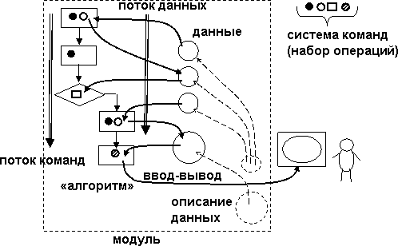

Изучение программирования нельзя начать, не ответив на ряд вопросов: а что же такое программа, алгоритм, данные, язык программирования. В этом списке основным термином является **алгоритм,** который, как и большинство понятий общего вида, имеет множество определений. Например:

«Алгоритм — это конечный набор правил, который определяет последовательность операций для решения конкретного множества задач и обладает пятью важными чертами: конечность, определённость, ввод, вывод, эффективность». \(**Д. Э. Кнут**\)

«Алгоритм — это точное предписание, определяющее вычислительный процесс, идущий от варьируемых исходных данных к искомому результату». \(**А. Марков**\).

В самых общих чертах **алгоритм – это однозначное описание порядка \(последовательности\) выполнения действий из заданного набора, позволяющее получить требуемый результат за конечное число шагов**. Можно сказать, что компьютерная программа – это один из способов реализации понятия алгоритма, а язык программирования – средство описания алгоритмов. Однако в определении алгоритма не говорится, над чем производятся действия., выполняемые в нем. В принципе, это могут быть управляемые объекты внешней среды, но тогда они тоже входят в состав понятия алгоритм.

Компьютерная программа, в отличие от абстрактного алгоритма, имеет собственные элементы, над которыми она совершает действия, и которые являются ее составной частью. Это – данные. Таким образом, она представляет собой замкнутую систему, отделенную от внешней среды. Посмотрим, из каких еще частей состоит компьютерная программа. Все они должны выражаться в соответствующих компонентах языка программирования:

- прежде всего, программа работает не с пользователем, а с **данными**. Эта первая и основная компонента программы – предметы \(объекты\), над которыми реализуется алгоритм. Данные состоят из отдельных **переменных,** связанных как между собой непосредственно \(через указатели\), так и косвенно \(как входные данные – результат\);
- в языке программирования имеются средства **описания данных,** которые позволяют программисту конструировать различные формы их представления – **типы данных;**
- программа базируется на **наборе операций \(системе команд\),** которые можно выполнять над данными. В этот набор входят арифметические операции, присваивание \(сохранение результата в переменной\), ввод-вывод, проверка значения переменной и т.п..;
- вторая основная компонента программы – описание порядка, последовательности выполняемых действий, также называется **алгоритмом** «в узком смысле», или алгоритмической компонентой. Она обычно состоит из двух частей. Первая часть – **выражения**, представляет собой описание линейной последовательности выполнения простейших действий из набора операций \(арифметические операции, присваивание, условные выражения\). Они включаются во вторую компоненту – **операторы,** которые задают ту или иную последовательность действий;
- как уже отмечалось, программа работает исключительно с данными, что и определяет сущность алгоритма. В наборе операций имеются команды ввода-вывода, осуществляющие обмен данными между переменными и внешней средой \(посредством устройств ввода-вывода\). С «программно-эгоцентрической» точки зрения это выглядит чистой формальностью и не является существенной частью программы;

Любая программа выполняется в компьютере. Посмотрим, как соотносятся между собой компоненты программы и компьютерной архитектуры:

- компоненты программы находятся **в памяти.** В принципе, память является общей для них всех, но логически она разделяется на области, именуемые **сегментами.** Прежде всего, это **сегмент данных,** содержащий, естественно, данные программы. Алгоритмическая компонента \(выражения, операторы\) также находится в памяти в собственном **сегменте команд;**
- одновременное нахождение в памяти «алгоритма» и данных соответствует принципу **хранимой программы.** Перед загрузкой в память эти же компоненты находятся в **программной файле,** который представляет собой точную копию представления программы в памяти – «**образ памяти**». Это позволяет рассматривать всю программу \(в том числе и алгоритм\) как данные для работы других программ, например, трансляторов;
- набор операций, выполняемый в программе, соответствует **системе команд** процессора, на котором она выполняется. Сюда же входят команды, которые обеспечивают заданный в программе порядок действий \(операторов\).

И, наконец, язык программирования также содержит в себе компоненты, предназначенные для описания соответствующих частей программы:

- средства описания данных: определение типов данных \(форма представления\) и переменных;
- набор операций над основными типами данных \(включая ввод-вывод\), а также средства записи выражений;
- набор операторов, определяющих различные варианты порядка выполнения выражений в программе \(последовательность, условие, повторение, блок\);
- средства разбиения программы на независимые части – модули \(функции, процедуры\), взаимодействующие между собой через программные интерфейсы.

&nbsp;<YinAndYang/> Определение программы уже давно дано в простой формуле: **«Программа = алгоритм + данные»**. Но в ней алгоритм и данные не просто «складываются» в одно целое как независимые части, но являются двумя взаимозависимыми элементами. Это своего рода «Янь и Инь» программы, олицетворяющие единство и борьбу двух противоположных начал \(в философии этот принцип положен в основу диалектики – учения о развитии\). Попробуем привести несколько аналогий, поясняющих сущность взаимодействий в этой «парочке»:

- если данные можно в какой-то мере обладают свойствами пространства \(объем, протяженность\), то алгоритм – свойствами времени \(эффективность, быстродействие\). Тезис «проигрывая в пространстве, выигрываем во времени» здесь также уместен: эффективность программ может быть принципиально повышена за счет использования дополнительных структур данных в памяти;
- cинтаксически данные являются аналогом существительных \(объектов, над которыми производятся действия\), набор операций – аналогом глаголов \(выполняемых действий\). Программа в целом аналогично предложению, описывающему процесс – последовательность действий над заданными предметами с целью получения результата

Взаимосвязь алгоритма и данных в программе не является простой и линейной. Процесс выполнения любой программы можно рассматривать с двух точек зрения: как последовательность выполнения операций \(команд\), в которых содержится информация об операндах \(данных\), которые они обрабатывают – **поток команд \(поток управления\).** С другой стороны – любой элемент данных можно рассматривать как результат выполнения действий над исходными данными и как источник данных \(операнд\) для последующих результатов. Т.е. в программе также присутствует логическая последовательность вычислений \(преобразований данных\), называемая **потоком данных.** Исторически сложилось, что в традиционной \(фон Неймановской\) архитектуре в программе в явном виде задается последовательность команд, т.е. программа выглядит как **поток управления,** в котором алгоритмическая компонента является первичной \(ведущей\), а данные – вторичной \(ведомой\).

&nbsp;<YinAndYang/> Для начинающего программиста непривычным является «программный эгоцентризм»: ввод-вывод инициализируется не пользователем, а программой, которая является активной компонентой и инициатором диалога. Т.е. не пользователь ведет диалог с программой, а программа запрашивает у него необходимые данные. Другое дело, что «правильные» программные системы работают в режиме «всегда готов», но очевиден и другой факт: если программа не требует ввода, а «крутится где-то в другом месте», то принудить ее в приему данных ничем нельзя.

&nbsp;<Smile/> Уравнение «Программа = алгоритм + данные» можно разрешить и по-другому: «Алгоритм = программа - данные», что также имеет некоторый смысл, несмотря на явную натяжку. Например, **конечный автомат \(**см**.3.8\)** как раз и является программой, лишенной данных, т.е. алгоритмической компонентой, взаимодействующей с внешней средой без сохранения результатов во внутренних данных. Также и «Данные = программа - алгоритм» определяют их как пассивную программную систему, лишенную действий.
