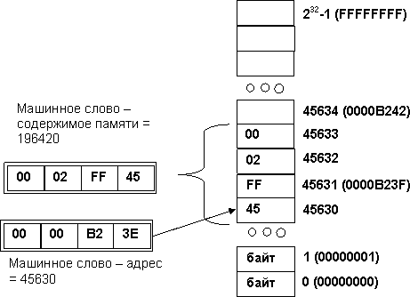
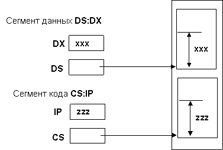
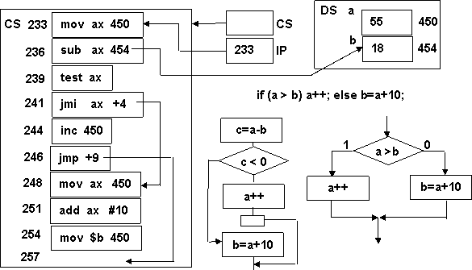

Для понимания и осознанного использования многих особенностей языка программирования полезны знания о внутреннем представлении программы и принципах ее исполнения. Преобразование текста программы и нечто «удобоваримое» с точки зрения компьютера включает в себя два процесса:

- **компиляция –** перевод текста программы с исходного формального языка на другой, более простой язык;
- **интерпретация –** непосредственное выполнение инструкций \(команд, операторов\) формального языка над образами языковых объектов программы \(обозначенных в программе именами\).

Различные языки программирования включают процессы компиляции и интерпретации в разных пропорциях и сочетаниях \(подробнее см. **1.7**\). Разберемся, в каких взаимоотношениях находятся язык Си и компьютерная архитектура:

- компьютерная архитектура тоже обеспечивает язык программирования, именуемый **программным** \(**машинным\) кодом.** Данные в этом языке представлены **машинными словами,** хранящимися в памяти и в регистрах процессора, а выполняемые действия – **системой команд;**
- язык **Ассемблера** представляет собой язык программирования, в котором система команд, способы адресации и машинные слова и их адреса обозначаются **символическими именами.** Таким образом, Ассемблер работает с компьютерной архитектурой, но ее элементы представлены не во внутренней \(двоичной\) форме, а в обычной текстовой;
- язык Си является **«чистым компилятором».** Результатом трансляции является программный код, в который транслятор не включает никаких «лишних» команд \(например, проверки установленных ограничений или обнаружения ошибок\). Поэтому в Си \(по крайней мере, без объектно-ориентированных компонент\) имеется возможность гарантировать эффективность и независимость программного кода, что делает его единственных \(кроме Ассемблера\) языком системного программирования, на котором пишутся такие вещи, как ядро операционной системы, драйверы и т.п..;
- язык Си имеет прямой выход на компьютерную архитектуру, многие его компоненты напрямую на нее отображаются. Базовые типы данных совпадают с основными формами представления данных в процессоре, имеется прямое соответствие между переменными и машинными словами \(см. **1.3**\), набор операций соответствует общепринятому минимуму для системы команд, указатели интерпретируются как адреса \(см. **5.2**\), имеется возможность работы с памятью на низком \(архитектурном\) уровне \(см.**9.2**\). Поэтому Си можно назвать **машинно-независимым Ассемблером**;

Поэтому для программирования на Си необходимы хотя бы минимальные представления о компьютерной архитектуре. Попробуем это сделать на самой примитивной модели.

Основу компьютерной архитектуры составляет **прямо адресуемая память.** Она представляет собой множество элементарных ячеек памяти \(массив\), номера которых называются **адресами.**

Все данные представляются в двоичной системе счисления в виде **машинных слов –** наборов двоичных разрядов. Минимальный размер машинного слова для хранения, обработки и передачи данных – 8 разрядов \(1 байт\). Все остальные слова кратны ему. **Стандартное машинное слово** имеет разрядность, соответствующую разрядности процессора \(32 разряда или 4 байта\). Для представления содержимого машинных слов используется эквивалент двоичный системы - шестнадцатеричная \(подробнее см. **1.3**\). В дальнейшем описании мы будем применять более привычные десятичные значения, не забывая, что в реальности имеем дело с двоичными \(шестнадцатеричными\) эквивалентами.

Как адрес памяти, так и ее содержимое представляют собой машинные слова. Поэтому на самом низком уровне адрес можно рассматривать как целое число. Все формы представления данных \(целые со знаком и без него, вещественные, символы\) так и иначе проецируются в двоичное представление и в машинные слова. Еще одна особенность: числовые значения хранятся в памяти, начиная с младшего байта \(в порядке, обратном к привычному нам при записи чисел\).

Процессор имеет в своем составе набор машинных слов – **регистров.** В зависимости от назначения они могут хранить как данные, так и адреса памяти.

Следующий важный принцип организации памяти – сегментация. **Сегментом** называется непрерывная область памяти, хранящая данные одного вида \(назначения\) и имеющая собственную систему относительной адресации и ограничения доступа. К программированию это имеет отношение потому, что при трансляции разные компоненты программы попадают в различные сегменты программного кода.

В процессоре сегментация поддерживается при помощи регистров двух видов. **Базовый регистр сегмента** содержит его начальный адрес. Регистры, работающие с данными сегмента, содержат относительный адрес данных от начала сегмента, или **смещение.** Результирующий адрес получается путем сложения содержимого этих регистров. Таким образом, каждый сегмент имеет собственную «систему координат», связанную с его началом. Если программа использует только сегментную адресацию, то сегменты можно перемещать по памяти при сохранении работоспособности программы: достаточно перенастроить соответствующие им базовые регистры.

Выполняемая программа состоит из нескольких сегментов. Некоторые из них создаются при трансляции, другие – при загрузке и при работе программы. В принципе, программа может иметь несколько сегментов одного вида.

| Сегмент                                    | Регистры                              | Что содержит                                              | Когда создается          |
| :----------------------------------------- | :------------------------------------ | :-------------------------------------------------------- | :----------------------- |
| Сегмент команд                             | CS - сегментный, IP - адрес команды   | Программный код \(операции, операторы\)                   | Трансляция               |
| Сегмент данных                             | DS – сегментный                       | Глобальные \(статические\) данные                         | Трансляция               |
| Сегмент стека                              | SS – сегментный, SP - указатель стека | Локальные данные функций, «история» работы программы      | При загрузке             |
| Динамическая память                        | DS – сегментный                       | Динамические переменные, создаваемые при работе программы | При загрузке, выполнении |
| Динамически связываемые библиотеки \(DLL\) | CS - сегментный, IP - адрес команды   | Программный код разделяемых библиотек                     | При загрузке             |

**Принцип хранимой программы** заключается в том, что программный код хранится в той же самой памяти, что и обрабатываемые данные, и в свою очередь сам представляет собой специфические данные, с которыми работает процессор во время выполнения программы. В настоящее время применяется **немодифицируемый программный код.** Это, в свою очередь, означает, что несколько программ могут его читать и исполнять, не мешая друг другу \(DLL\), в том числе и на физически параллельных процессорах.

Следующий элемент архитектуры тоже имеет отношение к внутреннему представлению программы – **виртуальное адресное пространство \(виртуальная память\).** Его идея состоит в том, что каждая программа имеет свое, независимое от других, виртуальное адресное пространство \(виртуальную память\). В нем размещаются сегменты программы, определяются адреса и т.п.. В процессоре имеется скрытая от программ система отображения виртуальных адресов на архитектурные \(физические\) адреса. Находясь под управлением операционной системы, оно реализует защиту памяти программ, ее разделением \(сегменты динамически связываемых библиотек\), загрузку программы в память «по частям» и иллюзию наличия неограниченной памяти. Для нас из всего этого важно то, что внутренне представление программы в виртуальной памяти занимает все адресное пространство, как будто других программ и операционной системы в памяти нет вовсе.

И, наконец, посмотрим, как в общих чертах выглядит процесс исполнения программного кода. Действующими лицами этого процесса являются:

- программный код – последовательность **команд,** размещенная в сегменте команд \(**CS**\), на начало которого ссылается одноименный регистр процессора;

- каждая команд имеет в сегменте свой относительный адрес \(от его начала\), регистр процессора **IP** **\(Instruction Pointer\)** содержит адрес очередной выполняемой команды. В программировании на языках высокого уровня с **IP** ассоциируется очень важное понятие – **текущая точка выполнения программы;**
- команда представляет собой машинное слово, обычно переменной длины, и состоит из нескольких полей. Обязательным полем является **код операции,** который указывает на выполняемое командой действие. Совокупность команд процессора называется **системой команд.** В системе команд обязательно присутствуют следующие виды операций:

1. команды **перемещения и обработки данных** выполняют перенос данных между ячейками памяти и регистрами данных процессора, а также все действия по их обработке \(**mov,add,sub**\);
2. команды **проверки состояний \(условий\)** проверяют результат выполнения операций, состояния регистров процессора, устройств ввода-вывода и т.п. \(**test**\);
3. команды **условного и безусловного переходов** определяют адрес следующей команды \(выполняют переход в программе\) в зависимости от результата проверки некоторого условия. Если условие выполняется, то происходит переход, иначе выполняется следующая за ней команда.

- Вторым элементом команды являются операнды. Это могут быть регистры процессора, содержащие данные и ячейки памяти. В команде в явном или неявном виде должны содержаться их адреса. В ряде случаев операнды берутся «по умолчанию». Имеются различные **способы адресации операндов,** которые позволяют использовать различные способы доступа к данным, а также сократить размер поля адреса в команде;
- переменные, используемые в программы, при трансляции «становятся» областями памяти в различных сегментах данных \(сегменты данных, стека, динамической памяти\), где получают свои адреса. В командах, работающих с памятью, в том или ином виде имеется информация, позволяющая вычислить \(или просто взять\) этот адрес;
- в нашем примере большинство команд переноса и обработки данных являются двухадресными – результат операции совпадает с первым операндом \(команду сложения **add ax, 454** следует понимать как **ax=ax+b**\). В принципе, регистр процессора **ax** можно было бы сделать операндом «по умолчанию» и не упоминать его в команде \(если бы операция не использовалась с другими регистрами\);
- в нашем примере используется **непосредственная адресация** для констант \(их значение находится в самой программе, **add ax, \#10**\) и **прямая адресация** для ячеек памяти \(в команде содержится их адрес, **add** **ax, 454**\);
- в командах безусловного \(**jmp**\) и условного \(**jmi** - «переход, если меньше нуля»\) должен быть определен адрес следующей команды. В нашем примере он задан в относительной форме – в виде смещения \(расстояния\) от следующей команды до той, куда производится переход.
-

Выполнение программы происходит, в общих чертах, таким образом:

- процессор, используя регистры **CS:IP** выбирает из памяти очередную команду и расшифровывает ее. После этого **IP** увеличивается и ссылается на следующую команду \(в зависимости от длины текущей, например, **IP=IP+3**\);
- если это команда переноса или перемещения данных, то процессор формирует адреса операндов в зависимости от способа адресации, после чего выполняет действия, указанные в команде;
- если это команда проверки условия, то проверяется указанный операнд, и устанавливаются признаки выполнения различных условий \(равно 0, не равно 0, больше 0 и т.п.\);
- если в команде условного перехода проверяемое условие выполняется, то программа
- «переходит» по адресу, содержащемуся в команде. В нашем примере это смещение из команды просто добавляется к **IP** \(**IP=IP+&lt;смещение&gt;**\). Иначе ничего не происходит и выбирается следующая команда.

Сравнивая систему команд компьютера с другими способами представления программ в известных технологиях программирования \(**3.2, 3.3, 10.1**\), можно заметить, что внутреннее представление программы в большей степени соответствует блок-схеме, имеющей те же самые составные элементы – действие, проверка условия и переход. В языках программирования используются более абстрактные и более удобные системы представления, но в процессе трансляции они все равно превращаются в **линеаризованную блок-схему,** элементы которой размещены в линейной памяти.
