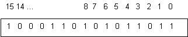

<Pre>
  «Но дружбы нет и той меж нами. <br />
  Все предрассудки истребя, <br />
  Мы почитаем всех нулями, <br />
  А единицами себя».
  <br />
  <b>А.С.Пушкин «Евгений Онегин»</b>
</Pre>

Изучение языка программирования резонно начать со средств описания данных.
Для этого сначала необходимо ввести понятия, касающиеся данных.
При изучении Си нам периодически придется опускаться на уровень их машинного представления.
Но при первоначальном знакомстве это материал можно пропустить (кроме п. **«Типы данных и переменные»**.),
довольствуясь общими представлениями – целое, вещественное, символ, массив.

## Системы счисления

Начнем издалека и посмотрим свежим взглядом на то, к чему давно привыкли. Вот число 1256.
Что такое цифры? Можно сказать, что это числа, из которых строится это число.
Но, кроме значения самой цифры еще важным является положение (позиция), которая определяет ее вес,
отчего системы счисления называются позиционными. Величина, на которую следующая цифра тяжелее предыдущей,
называется основанием системы счисления $P$. В системе с основанием $P$ должны быть цифры от 0 до $P-1$.
В общем виде значение числа вычисляется как $W = ΣR_i p^i$. Например, то же самое $1256 = 1*10^3 + 2*10^2 + 5*10^1 + 6*10$.
Кстати, от арабов нам достались не только цифры, но и порядок их нумерации, места (позиции) разрядов считаются справа налево.


Младший разряд – это своего рода начало координат,
от которого начинается выполнение всех операций (например, сложение идет от младших цифр, аналогично распространяется и перенос).
Поэтому естественно, что в памяти компьютера числовые данные хранятся, начиная с младших разрядов.
Точнее, **младшими байтами вперед** (хотя история знает и противоположные примеры).
Точно так же хранятся и элементы массивов, но в отличие от чисел мы их изображаем по-европейски, т.е. слева направо.

Но это еще цветочки. В шестнадцатеричном дампе памяти цифры в байте читаются справа налево, а сами байты целого числа – наоборот. Налицо конфликт цивилизаций.

В понимании взаимоотношения систем счисления важно то, что когда мы говорим о представлении числа в виде цифр, число воспринимается как величина, над которой можно делать какие-то операции, например, складывать с другими. И эта величина не зависит от формы ее представления. Например, мешок сахара остается таковым, независимо от того, как считать его содержимое, в килограммах, пудах или фунтах. Значение сохраняется, а его представление будет разным. Как говорил удав в известном мультике «А в попугаях я значительно длиннее». То же самое касается и операций. Семь спичек плюс семь спичек равно четырнадцати, потому что четырнадцать это десяток и еще четыре (вспомните себя в первом классе).

## Преобразование чисел /из одной системы счисления в другую

На самом деле алгоритмы, используемые для перевода чисел из одной системы счисления в другую,
применяются для преобразования данных из внешней формы представления во внутреннюю (см. **4.5**). «Родная» десятичная система счисления, в которой производятся преобразования, играет роль внутреннего представления, в ней мы оперируем числом как величиной или значением, а «посторонняя» система счисления рассматривается нами как состоящая из отдельных цифр.

**Преобразование целого в десятичную систему счисления.** Для перевода целого числа,
представленного в системе счисления с основанием $P$, нужно воспользоваться формулой определения значения числа в этой системе счисления,
выполнив соответствующие действия над цифрами (в родной десятичной системе) - $W = ΣR_i p^i$.

$2C5_{16} = 2 * 16^2 + 12(C) * 16^1 + 5 = 512 + 192 + 5 = 709_{10}$

$4375_8 = 4 * 8^3 + 3 * 8^2 + 7 * 8 + 5 = 2048 + 192 + 56 + 5 = 2301_{10}$

**Преобразования дробной части числа в десятичную систему счисления.**
Для дробной части числа нужно использовать ту же самую формулу с учетом отрицательных степеней основания
для разрядов дробной части - **W= ΣRi p^-i**.

$0.3F5_{16} = 3/16 + 15(F)/16^2 + 5/16^3 = 0.18750 + 0.05859 + 0.00122 = 0.24731_{10}$

$0.524_8 = 5/8 + 2/8^2 + 4/8^3 = 0.6250 + 0.0312 + 0.0078 = 0.6640_{10}$

**Преобразование целого из десятичной системы счисления в систему с основанием P**. Идея алгоритма заключается в том,
что остаток от деления исходного числа на **P** дает нам младшую цифру числа в этой системе счисления.
Последовательность остатков от деления исходного числа на основание системы счисления образует цифры числа, но в обратном порядке, начиная с младшей.

$2301 / 8 = 287~(5)$ <br/>
$287 / 8 = 35~~~~~(7)$ <br/>
$35 / 8 =  4~~~~~~~~~(3)$ <br/>
$4 / 8 =  0~~~~~~~~~~~(4)  = 4375_8$ <br/>

$709 / 16 = 44~(5)$ <br/>
$~~44 / 16 = 2~~~(12=C)$ <br/>
$~~~~2 /  16 = 0~~~(2) = 2C5_{16}$ <br/>

**Преобразование дробной части из десятичной системы счисления в систему с основанием P**.
При умножении дробной части на основание системы счисления **P** очередная цифра дробной части «выдвигается» в целую часть числа. Если ее отбросить и повторить процесс, то получим последовательность цифр дробной части (в прямом порядке).

$0.24731 * 16 = 3.95696~~~(3)$ <br/>
$0.95696 * 16 = 15.31136~(15(F))$ <br/>
$0.31136 * 16 = 4.98176~~~(4)$ <br/>
$0.98176 * 16 = 15.70816~(15(F)) = 0.3F4F_{16} ≈ 0.3F5_{16}$ <br/>

$0.6640 * 8 = 5.312~(5)$ <br/>
$0.312 * 8 = 2.496~~~(2)$ <br/>
$0.496 * 8 = 3.968~~~(3)$ <br/>
$0.968 * 8 = 7.744~~~(7) = 0.5237_8 ≈ 0.524_8$ <br/>

Обратите внимание, что при преобразовании дробной части сначала в десятичную систему а затем обратно в исходную получаем значение, меньшее исходного, которое только при округлении становится «правильным». Это связано с тем, что при первом преобразовании мы оставили только четыре десятичных цифры, отбросив «хвост».

**Двоичная система счисления. Бит, байт, машинное слово**

<Pre>
  «Но дружбы нет и той меж нами<br />
  Все предрассудки истребя,<br />
  Мы почитаем всех <b>нулями</b>,<br />
  А <b>единицами</b> себя».
  <br />
  <b>А.С.Пушкин «Евгений Онегин»</b>
</Pre>

Общеизвестно, что компьютеры используют двоичную систему. А что это значит, и почему именно ее? Давайте подробнее уточним все «за». Во-первых, она самая технологичная, поскольку элементы с двумя устойчивыми состояниями (да-нет, включено-выключено) самые простые и самые надежные. Во-вторых, алгоритмы выполнения операций в этой системе тоже самые простые. Например, таблица умножения в десятичной системе имеет размерность 10х10, т.е. содержит 100 произведений всех пар цифр, а в двоичной системе всего 4.

Посмотрим, например, что происходит при переводе двоичного числа в десятичную систему счисления.
Для этого берется формула определения его значения **W= ΣRi 2^i**. При наличии 1 в двоичном разряде соответствующая степень двойки добавляется к сумме, при наличии 0 – пропускается.

$8 7 6 5 4 3 2 1 0$ <br/>
$100101101 = 2^8 + 2^5 + 2^3 + 2^2 + 2^0 = 256 + 32 + 8 + 4 + 1 = 301_{10}$

Естественно, что за простоту эту приходится платить. Как мы уже выяснили, чем меньше основание системы счисления, тем больше цифр требуется для представления заданной величины. Поэтому в двоичной системе число будет иметь максимальную разрядность.

Но двоичная система интересует нас не сама по себе, а как основа внутреннего представления данных в компьютере. Поэтому и появляется соответствующая терминология.

**Бит** – количество информации, содержащееся в одном разряде двоичной системы счисления. Здесь мы сознательно отступим от теории информации, где это понятие введено строго и формально. Для нас достаточно, что один бит – это данные, передаваемые значением 1 или 0.

**Двоичный разряд** – элемент архитектуры, хранящий один бит данных (двоичный разряд). Заметим, что речь идет о различных понятиях. Двоичный разряд и бит соотносятся между собой так же как стакан и его содержимое.

К сожалению, узкотехнический термин «информация» в настоящее время настолько размыт как научными интерпретациями,
так и псевдонаучными спекуляциями (типа «ля-ля, тополя, торсионные поля»), поэтому отныне мы будем использовать
термин **данные. Данные – это такая информация, которую можно представить в компьютере.**

«Информация – это такие данные, которые нельзя представить в компьютере». (Утверждение, обратное предыдущему).

**Машинное слово** – упорядоченное множество двоичных разрядов. Количество разрядов в машинном слове называется его **размерностью**. Разряды нумеруются справа налево, начиная с 0. Самый правый разряд называется младшим, самый левый – старшим.



**Байт** – машинное слово минимальной размерности, используемое для хранения, передачи и обработки данных. В настоящее время размерность байта равна 8 двоичных разрядов. Как правило, размерности всех других машинных слов кратны байту.

Размерность байта - 8 бит - принята не только для представления данных в большинстве компьютеров, но и в качестве стандарта для хранения данных на внешних носителях, для передачи данных по каналам связи, для представления текстовой информации. Кроме того, байт является универсальным "измерительным инструментом" - размерность всех форм представления данных устанавливается кратной байту. При этом машинное слово считается разбитым на байты, которые нумеруются, начиная с младших разрядов.

**Стандартное машинное слово** - машинное слово, размерность которого совпадает с разрядностью процессора.
Большинство команд процессора использует его для обработки данных. Кроме того,
используется укороченного машинное слово и двойное машинное слово (обозначаемое в языках программирования терминами **short** и **long**).

Далее уместно ввести понятие **информационной емкости** машинного слова. Т.к. каждый двоичный разряд может принимать два значения,
два разряда – четыре и т.д., то для n-разрядного слова получим $W=2^n$ сочетаний (или возможных значений). Причем это не зависит от формы представления данных, будь то символы текста, цветовая палитра или диапазон целого числа. Например, кодовая таблица представления символов текстового файла в формате один символ – один байт содержит 2^8=256 значений, 32-разрядное машинное слово представляет целое без знака в диапазоне 0… 232-1, т.е. 232 значений. Кстати «сколько это будет в граммах»? Точнее в десятичной системе.

Совсем необязательно для этого считать степени двойки. Информационная емкость трех десятичных цифр (разрядов) примерно соответствует аналогичной емкости десяти двоичных разрядов. Это можно использовать для оценки информационной емкости машинных слов. Например, для 32-разрядного слова $W=2^{32}=2^2 * 2^{10} * 2^{10} * 2^{10} ≈ 4 * 10^3 * 10^3 * 10^3=4 * 10^9$

$2^{10} = 1024 ≈ 1000 = 10^3$

«Чайник – это тот, кто думает, что в килобайте 1000 байтов, а программист – это тот, кто считает, что в килограмме 1024 грамма».
**Анекдот (Здесь на самом деле больше смысла, чем юмора).**

**Эквиваленты двоичной системы**
До сих пор мы говорили о системах счисления применительно к представлению и преобразованию в них целых чисел. Поскольку двоичная система – родная для компьютера, как для нас – десятичная, то такие преобразования происходят при вводе и выводе числовых данных. Когда же речь идет о компьютерной архитектуре, внутреннем представлении команд, данных и адресов, десятичная система в общем-то не нужна. Более того, она вредна, потому что размерности данных все равно остаются двоичными. Например, приложение, выполняясь на 32-разрядном процессоре, обращается к памяти, используя адрес – такое же 32-разрядное машинное слово. Кстати, примерно оценить значение адреса можно, подсчитав количество значащих разрядов (отбросив незначащие нули слева).

Например, примерное значение адреса 00000001101010001100110000111101 можно оценить, отбросив 7 нулей слева.
Для оставшихся 25 значащих цифр, а $2^{25} = 2^5 * 2^{20} = 64 * 10^6$ – примерно в районе 64 мегабайт, если речь идет об адресации к байтам.

Не правда ли, напоминает современные банковские реквизиты. К счастью, программисты избавлены от муторной процедуры записи нулей и единичек. Восьмеричная и шестнадцатеричная системы счисления хороши как раз тем, что кратны двоичной. Одна восьмеричная цифра кодирует три двоичных разряда, одна шестнадцатеричная – четыре (тетрада). При этом сама цифра раскладывается как число в двоичное представление по степеням двойки:

|     | 8421 |     | 8421 |     | 8421 |     | 8421 |
| :-: | ---: | --: | ---: | --: | ---: | --: | ---: |
|  0  | 0000 |   4 | 0100 |   8 | 1000 |   C | 1100 |
|  1  | 0001 |   5 | 0101 |   9 | 1001 |   D | 1101 |
|  2  | 0010 |   6 | 0110 |   A | 1010 |   E | 1110 |
|  3  | 0011 |   7 | 0111 |   B | 1011 |   F | 1111 |

Попробуем преобразовать к шестнадцатеричному виду приведенное выше число. В синтаксисе Си шестнадцатеричные числа имеют префикс «0х».

| 0000 | 0001 | 1010 | 1000 | 1100 | 1100 | 0011 | 1101 |          = |
| :--: | ---: | ---: | ---: | ---: | ---: | ---: | ---: | ---------: |
|  0   |    1 |    A |    8 |    C |    C |    3 |    D | 0x01A8CC3D |

А теперь попробуем разобраться еще и с байтным представлением. Кстати, сколь цифр необходимо для представления байта. Видимо две, два по четыре разряда – всего восемь. Тогда получится, что в памяти это машинное слово разместится побайтно так 01_A8_CC_3D.

На самом деле не совсем так. Мы забыли, что размещение производится младшими байтами вперед, поэтому в любом дампе (**dump** – вывод содержимого памяти во внутреннем представлении) Вы увидите все в обратном порядке 3D_CC_A8_01

Получается, что нужно перевернуть не весь дамп, а по отдельности каждую часть, относящуюся к машинному слову. Тут то мы и подходим к фундаментальному свойству памяти: по формальному ее содержимому нельзя определись, что там находится. Все зависит от формата – последовательности размещения данных и их интерпретации. Грубо говоря, на байте или машинном слове не написано, чем они являются.

Например, байт 0хF8 интерпретируется в формате целого числа со знаком как значение -8, без знака – как 248, как символ текстового файла «ш» в кодировке Windows-1251, или просто как машинное слово, в котором 5 старших разрядов – единичные, а три младших – нулевые. Кстати, машинное слово с заданным размещением нулевых и единичных разрядов называется маской. Также это может быть частью машинной команды, элементом битового растра, да мало ли еще чем.

## Форматы базовых типов данных

Возникает резонный вопрос: зачем при программировании на языке высокого уровня и работе с переменными знать их форматы представления в памяти. При программировании на Си/Си++ для этого имеются определенные основания:

- для понимания сущности преобразовании целого со знаком в беззнаковое (и наоборот) требуется иметь представление об их форматах;

- при управлении памятью на низком (физическом) уровне возможен доступ к «составным частям» формата представляемых данных, а также переход от одного типа данных к другому при сохранении содержимого памяти;

- при отладке программ, работающих с двоичными файлами, требуется просматривать двоичные файлы на физическом уровне, при этом форматы представляемых данных в нем идентичны внутренним.

Максимально, что при этом может потребоваться, - это умение «видеть» граничные значения формата (0,1,-1, максимально возможное и т.п.), а также переводить эти значения в ограниченном диапазоне в «естественный» вид.

**Целое без знака.** Форма представления целого числа без знака использует естественную интерпретацию разрядов машинного слова как цифр числа в двоичной системе счисления (см. выше). Все разряды являются значащими, вес каждого определяется соответствующей степенью 2. Диапазон значений $n$-разрядного числа $0..2^n - 1$. При использовании шестнадцатеричного эквивалента

**Целое со знаком. Прямой и дополнительный код.** Для представления данных половина информационной емкости
отводится под отрицательные значения. Поэтому общий диапазон выглядит $-2^{n-1}-1…2^{n-1} - 1$ при любом формате их представления.
**В прямом коде** абсолютное значение числа представлено в той же форме, что в целом без знака, в $n-1$ разрядах,
а старший разряд содержит знак числа: 0 – для положительного, 1 – для отрицательного. Рассмотрим, как выглядит представление граничных значений диапазона в шестнадцатеричной системе:

| 0000003F |        63        |
| :------: | :--------------: |
|    …     |                  |
| 7FFFFFFF |   $2^{n-1}-1$    |
| 80000000 |   -0 (минус 0)   |
| 80000001 |        -1        |
| 80000002 |        -2        |
|    …     |                  |
| FFFFFFFF | $ -(2^{n-1}-1) $ |

**Дополнительный код** не столь «прямолинеен». Его основное свойство – применение операции обычного беззнакового сложения к числам, представленным в этом формате, дает корректный результат (причем также в дополнительном коде). Если же быть более точным, то отрицательные числа определенным образом отображаются на диапазон положительных (беззнаковых) так, что для всего диапазона начинает выполняться указанное свойство.

Дополнительный код может быть введен в любой системе счисления. Рассмотрим его работу на привычной нам десятичной:

- вместо знака вводится еще одна цифра слева со значением 0;

- положительные числа представляются обычным образом;

- каждая цифра v отрицательного числа заменяется на дополнение ее до $n-1$, т.е. $n-1-v$, где $n$ - основание системы счисления. Для десятичной системы - это дополнение до 9, то есть цифра, которая в сумме с исходной дает 9;

- к полученному значению добавляется 1.

Обратный перевод числа в дополнительном коде происходит тем же самым образом: если старшая цифра – 0, то число положительное и перевод не требуется, иначе число считается отрицательным и для него выполняются два последних пункта процедуры перевода. Рассмотрим пример:

**-386 - отрицательное число** <br/>
**0386 - абсолютное значение с лишним 0** <br/>
**9613 - дополнение каждой цифры до 9** <br/>
**9614 - добавление** 1 <br/>

**512 - 386 = 0512 + 9614 = (1)0126 = +126** <br/>
**119 - 386 = 0119 + 9614 = 9733 = 0266+1 = -267** <br/>

Если внимательно присмотреться, то дополнение каждой цифры до 9 имеет некоторую аналогию с вычитанием. Но как бы там ни было, получаем следующий результат: вычитание или же сложение чисел со знаком заменяется операцией сложения, выполненной для беззнаковых чисел.

> Дополнительный код - беззнаковая форма представления чисел со знаком.

В двоичной системе счисления дополнение каждой цифры выглядит как инвертирование двоичного разряда, то есть замена 0 на 1 и наоборот. Тогда получается простой способ представления отрицательного числа:

- абсолютное значение числа в двоичной системе должно занимать все разряды, кроме старшего, последний должен быть 0;

- инвертировать все разряды, включая знаковый;

- добавить 1.

Ту же самую последовательность операций нужно выполнить, чтобы получить из дополнительного кода абсолютное значение отрицательного числа. В Си это можно сделать и при помощи поразрядных (машинно-ориентированных) операций:

`int a=5; a = (~a)++; // получим -5`

Старший разряд в таком представлении также играет роль знакового. Для отрицательных чисел он равен 1. Рассмотрим, как выглядит представление граничных значений диапазона в шестнадцатеричной системе:

|          |                |
| -------- | -------------- |
| 00000000 | 0              |
| 00000001 | 1              |
| 00000002 | 2              |
| …        |                |
| 0000003F | 63             |
| …        |                |
| 7FFFFFFF | $2^{n-1}-1$    |
| 80000000 | -0 (минус 0)   |
| 80000001 | $-(2^{n-1}-1)$ |
| 80000002 | $-(2^{n-1}-2)$ |
| …        |                |
| FFFFFFF0 | - 16           |
| FFFFFFF1 | - 15           |
| …        |                |
| FFFFFFFF | -1             |

Особенным является значение **80000000**. Оно называется «минус 0», поскольку является дополнительным кодом самого себя (как и обычный 0). Оно используется для специальных целей, например, для обозначения неинициализированных переменных или недопустимых результатов.

Все эти нюансы вообще-то не важны для программиста,
поскольку ему нет нужды вручную выполнять сложение или вычитание ни в двоичной ни в шестнадцатеричной системах,
за него это сделает компьютер. На самом деле от программиста даже при работе на уровне внутреннего представления данных
достаточно знать правила отображения диапазонов положительных и отрицательных значений знаковых чисел на диапазон беззнаковых.
Используемая форма преобразования приводит к тому, что отрицательные числа отображаются на вторую половину диапазона
беззнаковых целых, причем таким образом, что значение –1 соответствует максимальному
беззнаковому (т.е. **0xFFFFFFFF** во внутреннем представлении), а минимальное отрицательное – середине интервала
(т.е. **0x80000001**). Значение **0x80000000** является «водоразделом» положительных и отрицательных и называется «минус 0».
Все отрицательные числа имеют старший (знаковый) бит, установленный в 1.

**Вещественное число.** Вещественное число (число в формате с плавающей запятой или с плавающей точкой)
при его внешнем представлении может состоять из двух компонент: мантиссы – и порядка: $bbbb.bbbb * 10^p$.
Одно и то же значение может быть представлено в разных видах, представление называется нормализованным,
если мантисса не имеет целой части и все ее цифры в дробной части – значащие, например, $35.76 = 0.3576 * 10^2$.

Во внутренним представлении дело обстоит аналогичным образом, но только с учетом двоичного представления всех данных:

- внутренний порядок основывается на степени 2, а не на степени 10, т.е. число выглядит как $0.b_1b_2b_3b_4…b_{n-1} * 2^p$.
  Порядок $p$ является обычным целым числом со знаком.

- мантисса представляет собой дробное нормализованное двоичное число. Разряды машинного слова,
  которые его содержат, нумеруются слева направо (от старшего к младшему).
  Значение мантиссы в таком представлении $W= Σb_i 2^{-i}$. Точка находится перед старшим разрядом, а сами разряды имею веса 1/2 , 1/4, 1/8, 1/16 и т д. слева направо.

На самом деле реальный формат вещественного числа типа double имеет несущественные отличия:

- вместо порядка в формате 11-разрядного беззнакового целого хранится значение $p+1023$ (всегда положительное);

- в нормализованной мантиссе отбрасываются не только незначащие 0, но и первая значащая 1 (например: 0.0000001**011011**… ). Мантисса имеет 52 разряда;

- знак мантиссы представлен отдельным разрядом.

Из формата вещественного числа следует, что **вещественное число по своей природе не всегда представлено точным значением**. То есть оно имеет ограниченное количество точных значащих цифр, но при этом не всякое точное десятичное число имеет соответствующее точное внутреннее представление (условно говоря, значение 0.1 окажется представленным ближайшими к нему 0.099999997… или 0.100000001…), имеющими точное внутреннее представление.

**Представление символьных данных**. Представление и обработка символьных данных в Си, как и в других языках программирования,
основаны на исторически сложившихся стандартных представления текста, известных как **текстовый файл** (подробнее см. **4.5**).
Каждый символ текста представляется отдельным байтом. Как известно, информационная емкость байта равна $2^8=256$,
каждому значению байта как целого числа (**коду символа в диапазоне 0..255 или 00..FF**) ставится в соответствие символ текста.
Кроме того, имеются различные **кодовые таблицы**, работа с которыми не поддерживается языками программирования.

Для работы с текстом используется базовый тип данных **char**, размерность которого всегда равна байту. Соответственно,
его можно интерпретировать либо как целое число, либо как символ текста. Обработка символьной информации в Си основана на том,
что над переменной типа **char**, хранящей код символа, можно выполнять любые операции как над целой переменной, начиная от сравнения и присваивания и кончая арифметическими операциями и операциями над отдельными разрядами. Обычно знание кодов отдельных символов не требуется, так как можно использовать соответствующие символьные константы.

**Тип данных и переменная**
В языках программирования такие свойства данных, как форма их представления и занимаемая ими память сознательно отделены друг от друга
и представлены в виде понятий **тип данных** и **переменная**.

Под **типом данных (ТД)** понимается описание данных определенного вида, для которых известен их способ представления в памяти (формат), следующие из него размерность и диапазон значений, а также определен набор операций. Т.е. тип данных – это «идеи» о представлении переменных определенного вида, и они должны быть известны транслятору (для генерации необходимого кода) и программисту.

> Тип данных = формат + размерность, диапазон значений + операции

Типы данных бывают двух видов – базовые и производные. **Базовые типы данных (БТД)** – это типы данных,
заложенные в транслятор «от рождения». Они обычно ориентированы на область применения языка.
В Си с его «архитектурной зависимостью» - **БТД совпадают с основными форматами представления данных в компьютерных архитектурах**,
т.е. операции над ними «один в один» транслируются в соответствующие машинные команды.
Естественно, что БТД обозначаются в любом языке **ключевыми словами**.

**Производные типы данных (ПТД)** конструируются программистом из уже известных в программе базовых и производных типов. В результате в программе возникает иерархия типов, некоторые из них могут обозначаться дополнительными именами, которые можно использовать синтаксически как базовые. В объектно-ориентированном программировании (Си++) таковыми являются имена классов. Дальнейшее изложение идей проектирования данных – в гл.**5,11**.

Переменная в ее первичном архитектурном понимании – это область памяти, в которой содержатся данные определенного типа. Имя переменной напрямую ассоциируется с ее адресом, содержимое памяти – со значением переменной.

> Переменная = память (имя, адрес,ссылка) + ТД + значение

В Си используется **статическое** связывание переменной с ее типом. Это значит,
что тип данных назначается переменной при трансляции единожды и не может быть впоследствии изменен.
Строка в программе, где содержится описание переменной, по которой транслятор создает ее внутреннее
(компьютерное) представление, называется **определением переменной**.

Си является языком строго типизированным. Это означает, что использование предварительно не определенных программных объектов, в том числе переменных, не допускается (т.е. невозможна привязка типа автоматически, по умолчанию и т.п).

Имеется дуализм (двойственность) в использовании имени переменной (кстати, во всех языках программирования):
в одних случаях имя обозначает хранимое **значение**, а в других – память, его хранящее (адрес, ссылка, место размещения). Наиболее яркий пример – присваивание. Выражение a=b в правой части подразумевает значение переменной b, а в левой части – ссылку на a. В программировании на Си/Си++ имеется большая свобода выбора при передаче переменных в процессе их обработки между модулями программы как по ссылке, так и по значению, поэтому понимание двойственности, заложенной в имени переменной, здесь крайне важно.

&nbsp;<Icon name="Smile"/>Разница между ссылкой и значением переменной такая же, как между стаканом и его содержимым.

&nbsp;<Icon name="YinAndYang"/>Некоторые аналогии для пары тип данных - переменная можно найти, как ни странно, в философии объективного идеализма (Платон, Гегель). Согласно ей существует мир идеальный - совершенных идей и мир материальный - несовершенных предметов. Кроме того, есть косная материя, проецируясь (отражаясь) в которую, идея порождает предмет. В качестве «косной материи» выступает в данном случае память, лишенная соответствующей интерпретации. Тип данных играет роль «идеи» переменных определенного вида, отображение которой на эту память порождает переменную.

## Базовые типы данных целых чисел

В Си имеется возможность использовать машинные слова различной размерности для определения целых переменных как в знаковой, так и в беззнаковой форме. Для этого используются следующие служебные слова:

- **char** - размерность переменной - байт;

- **int** - размерность переменной - стандартное машинное слово;

- **short** - укороченная размерность, меньшая либо равная int;

- **long** - размерность переменной - двойное слово;

- **signed** - форма представления целого со знаком;

- **unsigned** - беззнаковая форма представления целого.

Из этих служебных слов можно составить определение типа данных целой переменной. При этом **signed** считается заданным по умолчанию, а **unsigned int** сокращается до **int**:

```c
int i;            // целое со знаком, слово
char c;           // целое со знаком, байт
unsigned char uc; // целое без знака, байт
unsigned u;       // целое без знака, слово
long l;           // целое со знаком, двойное слово
unsigned long ul; // целое без знака, двойное слово
short s;          // целое со знаком, короткое слово
                  // (слово или байт)
```

Для определения размерности различных переменных и типов в Си имеется специальная операция, которая возвращает размерность типа данных, переменной и значения выражения, подсчитанную в байтах:

```c
sizeof (int)  // размерность типа данных int - 4
sizeof l      // размерность переменной типа long - 4
sizeof (i+2.0)// размерность значения выражения типа double - 8
```

По умолчанию константы считаются десятичными целыми со знаком. Восьмеричные константы начинаются с 0. Шестнадцатеричные константы имеют префикс 0x. Для длинных целых и беззнаковых целых используются модификаторы констант – L(l) и U(u).

В заключение еще раз вернемся к знаковой и беззнаковой форме представления и к взаимоотношениям между ними и транслятором. Для транслятора обе они - суть машинные слова одинаковой или разной длины. Поэтому когда речь идет о записи (присваивании) значения беззнаковой переменной в переменную со знаком (или наоборот), транслятор просто рассматривает это как копирование машинных слов без каких-либо преобразований. Например, знаковое **-1** превращается в беззнаковое **0xFFFFFFFF**. Поэтому когда в программе меняется форма представления целого со знаком в беззнаковую (и наоборот), то это не сопровождается абсолютно никакими действиями (машинными командами).

Одной из форм представления целого является также перечислимый тип enum. Переменная такого типа принимает ряд значений, которые перечислены в отдельном определении типа enum в виде идентификаторов (имен). Каждому идентификатору соответствует явно заданное или неявно полученное при перечислении значение:

```c
enum BOOL { FALSE, TRUE}; // 0,1
enum digit { four=4,one=1,two,three }; // 4,1,2,3.
BOOL x; ... if (x==FALSE) ...
digit D; ... D = ten; ...
```

В данном примере перечислимый тип BOOL имеет два значения - 0 и 1, которые обозначаются соответственно как FALSE и TRUE. Имя BOOL затем используется для определения переменной этого типа с именем x, которая может принимать указанные значения. То же самое производится в типом digit и переменной D. Как видим, перечислимый тип не выходит за рамки обычного целого. Более того, любая переменная такого типа в трансляторе реализуется как обычное целое и в процессе выполнения программы не проверяется на допустимость тех или иных значений. Например, можно написать:

`x = 3; // Присвоить 3 переменной типа digit`

Тогда зачем же они нужны? Для придания большей ясности программе: обозначения ограниченного количества вариантов, признаков и т.д..

В Си имеется три типа данных для чисел с плавающей точкой: обычной (float), двойной (double) и повышенной (long double) точности. Тип float используется, в основном, при вводе-выводе. Тип double обеспечивает стандартную точность вычислений в арифметических выражениях. Поэтому любая переменная типа float перед использованием в выражении автоматически преобразуется к double. Кроме того, если в операции присутствует одна переменная типа double, а вторая является целым числом, то последняя также преобразуется (приводится) к double.

Вещественные константы могут содержать как дробную часть с десятичной точкой, так и показатель степени. Символ перед показателем степени определяет точность константы (E,e -для double, F,f -для float, L,l -для long double).

0.4 .665 3.1415926 1.17e2 -176E-3 1.1F5 3.33L 15L

## Массив как производный тип данных

> Массив - последовательность переменных одного и того же типа, имеющая общее имя.

Номер элемента в последовательности называется **индексом**.
В языке Си количество элементов в массиве должно быть определено во время трансляции (задано константой) и
не может быть изменено в процессе выполнения программы.
Элементы массива размещаются в памяти последовательно и нумеруются от **0** до **n-1**, где **n** - их количество в массиве. Пример определения массива :

```c
int а[20] = {1,5,4,7}; // где
// int - тип данных элементов массива
// a - имя массива
// 20 - количество элементов массива
// 1,5,4,7 - инициализация (начальные значения первых 4 элементов, остальные 0)
```

Важная особенность массивов в Си: во время работы программы контроль за нахождением индексов в пределах размерности массива не производится. В случае выхода за пределы массива будут использованы значения переменных в соседних областях памяти и результат работы программы будет непредсказуем.
