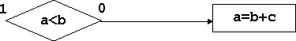

Следующий «слой» конструкций языка программирования – операторы. Они создают то, что в обыденном сознании ассоциируется с понятием алгоритм – описание последовательности действий, выполняемых программой, или логика ее работы. Это, в свою очередь, ассоциируется с понятием «блок-схема», что, в целом, довольно близко к истине. На этом уровне языки программирования проявляют завидное единообразие, поскольку количество видов управляющей логики программы ограничено. В Си/Си++ реализован общий для большинства языков программирования «джентльменский набор» управляющих конструкций:

- линейная последовательность действий;

- условная конструкция (если-то-иначе);

- конструкция повторения (цикл);

- переход (и его разновидности).

Сразу же отметим, что этот набор является функционально избыточным, и для записи любого алгоритма достаточно только три вида.

Описание управляющих конструкций языка (операторов) удобнее всего делать с помощью блок-схем. Хотя на самом деле блок-схема тоже представляет собой средство описания логики алгоритма, так что мы вроде как меняем «шило на мыло». Но все-таки для такого представления есть два основания:

- элементы блок-схемы соответствуют основным компонентам системы команд компьютера с размещением программы в линейной памяти (см.1.2) – командам обработки данных, проверки условий и безусловных (условных) переходов;

- блок-схемы являются естественным инструментом технологии «исторического» программирования, базирующейся на развертке процесса выполнения проектируемой программы во времени (см.3.2).

Блок-схема содержит элементы трех видов:

- действие, связанное с обработкой данных, в том числе последовательность операций (выражение), присваивание и ввод-вывод. Изображается прямоугольником, имеющим один вход и один выход;

- проверка условия. Изображается ромбом, в котором записано условие, и который имеет один вход и два выхода в зависимости от результата (0 – ложь, 1 –истина);

- переход явно связывает последовательно выполняемые действия (связь по управлению, поток команд) и обозначается стрелкой.

## Принцип вложенности и структурированные блок-схемы

Управляющие конструкции языка являются структурированными, если эквивалентная им блок-схема имеет один вход и один выход. Тогда ее можно представить как элементарное действие в конструкции более высокого уровня. Возникает «матрешка», в которой логическая и синтаксическая вложенность операторов идентичны друг другу: каждый оператор «не выходит за рамки», т.е. не передает управления вне той синтаксической конструкции, в которую он вписан. Блок-схема, состоящая из таких структурированных конструкций, также является структурированной. В структурированной блок-схеме элемент-прямоугольник «действие» может содержать как элементарное действие (выражение, простой оператор), так и вложенную управляющую конструкцию.


**Принцип вложенности и операторы перехода**. Группа операторов перехода (goto, continue, break, return, throw) также могут быть синтаксически вложенными, т.е. являться составной частью (действием) операторов более высокого уровня. Но при этом логическая вложенность (структурированность) не соблюдается: оператор «выводит» поток управления за пределы той конструкции, в которую он вписан (см.ниже). Все остальные виды управляющих конструкций (последовательность, ветвление и цикл) являются структурированными.

## Операторы линейной последовательности действий

Основным «источником» операторов в программе являются выражения. Любое из них, ограниченное символом «;-точка с запятой», превращается в оператор. По аналогии символ «;», встречающийся в программе «сам по себе» обозначает пустой оператор, не производящий никаких действий. Пустой оператор используется там, где по синтаксису требуется наличие оператора, но никаких действий производить не нужно. Например, в цикле, где все необходимое делается в его заголовке:

```c
for (i=0; i<n; i++) s = s + A[i]; // Обычный цикл

for (i=0; A[i]!=0 && i<n; i++); // Цикл с пустым оператором
```

Управляющая конструкция - линейная последовательность действий является основной в языках программирования, но в синтаксисе она, как правило, задается неявно. Банальность, о которой даже неудобно говорить, звучит так: последовательно записанные действия одного уровня выполняются последовательно.



В соответствии с принципом вложенности элементами последовательности могут быть не только элементарные действия (простые операторы), но и вложенные синтаксические конструкции, которые на текущем уровне также выполняются последовательно друг за другом.

В связи с этим для любой последовательности действий в языке программирования важно только обозначить ее начало и конец. Во многих языках программирования для этой цели используются ключевые слова-ограничители, которые содержатся в конструкции верхнего уровня, куда заключена последовательность. Например, а Бейсике тело цикла представляет собой конструкцию do-последовательность операторов – loop.

В Си используется другой принцип: если составной частью управляющей конструкции является единственный оператор, то он никак синтаксически не выделяется. Если же составной частью является последовательность операторов, то она заключается в фигурные скобки ({}) и образует блок.

Блок, или составной оператор выступает как единая синтаксическая единица, вложенная в конструкцию верхнего уровня. В начале его могут быть определены собственные переменные блока, действие которых не распространяется за его пределы, а время существования совпадает с временем его выполнения. Операторы, составляющие блок, выполняются последовательно друг за другом.

```c
for (i = 0; i < n-1; i++)
{ // Составной оператор - блок
  int c;
  c = A[i];

  A[i] = A[i+1];
  A[i+1] = c;
}
```

## Условные операторы

Единственный условный оператор имеет две разновидности: с else и без него.


В качестве условия выступает выражение, которое может иметь любой целый результат и интерпретируется в соответствии с принятыми в Си соглашениями о логических значениях: 0 –«ложь», не 0 – «истина». Круглые скобки являются частью синтаксиса (потому что отсутствует другой ограничитель выражения, например ключевое слово then). Действует он как и во всех языках программирования: если значение выражения есть «истина», то выполняется первый оператор, если «ложь» - второй (после else). Конструкция является структурированной, обе ветви – прямая и альтернативная – «сливаются» в одну

## Операторы цикла

В Си имеется три вида циклических конструкций. Общее у них одно: все условия в них являются условиями продолжения, то есть циклы продолжаются, пока значение этих условных выражений – «истина». Операторы цикла состоят из заголовка, в котором определяется характер циклического процесса и оператора - тела цикла. Скобки в заголовке цикла являются неотъемлемым элементом синтаксиса языка. Первые два вида циклов отличаются временем проверки условия продолжения - до или после очередного шага цикла:


Наиболее универсальный цикл for имеет полный эквивалент в цикле while, поэтому его блок-схему можно и не приводить.

```c
for (выражение 1; условие; выражение 2) оператор
```

```c
выражение 1;
while (условие) { оператор выражение 2; }
```

Цикл for включает в себя четыре обязательные компоненты каждого цикла:

- выражение_1 однократно вычисляется перед началом цикла и устанавливает его начальное состояние;

- условие является условием продолжения цикла. Оно проверяется перед каждым шагом цикла, и при его истинности цикл повторяется. В соответствии с соглашениями, принятыми в Си, в качестве условия может выступать любое выражение со значением 0 – «ложь», не 0 – «истина»;

- на каждом шаге цикла выполняется оператор (тело цикла) и выражение_2, оба они являются повторяющейся частью цикла. Выражение включает в себя необходимые действия для перехода к следующему шагу.

Цикл for не накладывает никаких ограничений на вид выражений в его заголовке (отсутствует понятие «переменная цикла», все значения, изменяемые в цикле, сохраняются после выхода, количество и способы изменения переменных могут быть различными). Самый распространенный вариант, в котором переменная пробегает ряд последовательных значений от 0 до n-1 включительно, выглядит так:

```c
for (i=0; i<n; i++) ...тело цикла для i…
```

## Операторы перехода

Простая последовательность, условный оператор и цикл составляют «прожиточный минимум» операторов, при помощи которых можно написать любую программу. Они соблюдают строгую иерархию синтаксической и логической вложенности операторов одного в другой. Но существует оператор, нарушающий этот установленный порядок, который позволяет из любой точки программы переместиться в другую, разумеется, в пределах одной функции. Это действие называется «переходом» («передачей управления»), а сам оператор - оператором перехода (goto). Для указания оператора, к которому производится переход из данной точки программы, используется метка. Метка - это идентификатор, ограниченный двоеточием и поставленный перед оператором, который в таком случае называется помеченным:

```c
оператор

goto mmm:

...

mmm: оператор
```

Оператор **goto** дает программисту большую свободу связывать между собой различные части программы. Как осознанно пользоваться этой свободой и не злоупотреблять ей, обсуждается в 3.3. Операторы **break**, **continue**, **return**, **throw** являются вариантами оператора перехода, действующими в рамках текущего цикла и функции. Поэтому они в меньшей мере нарушают естественную логику работы программы, заданную другими операторами:

- оператор **continue** выполняет переход из тела цикла к его повторяющейся части, то есть досрочно завершает текущий шаг и переходит к следующему;

- оператор **break** производит альтернативный выход из самого внутреннего цикла, то есть переходит к первому оператору, следующему за текущим оператором цикла. Заметим, что «покинуть» одновременно несколько вложенных друг в друга циклов при помощи break не удается;

- оператор **return** производит досрочный выход из текущей функции. Он, кроме всего прочего, возвращает значение результата функции (см. 1.6);

- оператор генерации исключения **throw** используется в Си++ как средство обработки ошибок, выполняя, в том числе, и действия, эквивалентные оператору return **(см. 12.2)**

```c
void F() { // Не совсем синтаксически корректная
  for (i=0; i < n; m1: i++) {   // иллюстрация выполнения continue, break, return
    if (A[i] == 0)  continue;   // goto m1;
    if (A[i] == -1) return;     // goto m2;
    if (A[i] < 0)   break;      // goto m3;
  }

  m2: // продолжение тела функции

  ...

  m3: // завершение функции
}
```

Операторы **continue**, **break** и **return** должны завершаться ограничителем "**;**".

## Оператор switch

Оператор **switch** – «синтаксический монстр» языка Си, по существу является множественным переходом по группе значений заданного выражения.

```c
switch (выражение) {
  case константа1: последовательность операторов_1

  case константа2: последовательность операторов_2

  case константа3: последовательность операторов_3

  default: последовательность операторов
}
```

Выполняется он следующим образом. Вычисляется значение выражения, стоящего в скобках. Затем последовательно проверяется его совпадение с каждой из констант, стоящих после ключевого слова case и ограниченных двоеточием. Если произошло совпадение, то производится переход на идущую за константой простую последовательность операторов. Отсюда следует, что если не предпринять никаких действий, то после перехода к n-ой последовательности операторов будет выполнена n+1-ая и все последующие. Чтобы этого не происходило, в конце каждой из них явным образом помещается оператор break, который в данном случае производит выход за пределы оператора switch. Метка default обозначает последовательность, которая выполняется «по умолчанию», то есть когда не было перехода по какому-либо case. Все эти нюансы отражены в примере, содержащем полный программный эквивалент оператора switch с использованием операторов goto.

```c
switch (n) { // Эквивалент
  // if (n == 1) goto m1;
  // if (n == 2) goto m2;
  // if (n == 4) goto m3;
  // goto mdef;

  case 1: n=n+2; break; // m1: n=n+2; goto mend;
  case 2: n=0; break;   // m2: n=0; goto mend;
  case 4: n++; break;   // m4: n++; goto mend;
  default: n=-1;        // mdef: n=-1;

} // mend: ...
```

Оператор switch обычно используется при анализе значений переменной, когда он заменяет группу условных операторов:

```c
switch (c) { // Эквивалент
  case ' ': ... break; // if (c==' ') {...}

  case '+': ... break; // if (c=='+') {...}

  case '-': ... break; // if (c=='-') {...}

}
```

Если несколько ветвей оператора switch должны содержать идентичные действия (возможно, с различными параметрами), то можно использовать общую последовательность операторов в одной ветви, не отделяя ее оператором break от предыдущих:

```c
sign = 0; // Ветвь для значения c, равного '+',

switch (c) { // используется и предыдущей ветвью

  case '-': sign=1; // для значения '-'

  case '+': Sum(a,b,sign);

  break;
}
```

## Еще один «джентльменский набор»

Набор управляющих конструкций алгоритма может быть различным и избыточным. Но минимально необходимой является триада: для архитектурно-ориентированной логики – это действие, условие, переход. Структурированные конструкции – последовательность, выбор (ветвление), повторение (цикл) – также обладают необходимой полнотой. Но на практике встречается еще одна, довольно экзотическая триада: последовательность, ветвление и рекурсия. Являясь технологическим приемом программирования (см.7.1), она способна, как минимум, заменить конструкцию повторения (цикл). Существуют языки программирования (ПРОЛОГ), а также математические формализмы (формальные грамматики, частично-рекурсивные функции), опирающиеся на эту триаду.

| Логика алгоритма             | Набор конструкций                                                                        | Применение                                                                                                                                                  |
| ---------------------------- | ---------------------------------------------------------------------------------------- | ----------------------------------------------------------------------------------------------------------------------------------------------------------- |
| Архитектурно-ориентированная | <ul><li>действие</li><li>условие</li><li>переход</li></ul>                               | «Историческое» программирование, программирование на уровне архитектуры (системы команд) - Ассемблер                                                        |
| Структурированная            | <ul><li>последовательность</li><li>выбор (ветвление)</li><li>повторение (цикл)</li></ul> | Технология структурного программирования                                                                                                                    |
| Рекурсивная                  | <ul><li>последовательность</li><li>выбор (ветвление)</li><li>рекурсия</li></ul>          | Функциональное программирование (ПРОЛОГ), представление синтаксиса в формальных грамматиках (трансляторы), частично-рекурсивные функции (теория алгоритмов) |

## Подводные камни

Особенность синтаксиса Си состоит в том, что последовательности управляющих конструкций, отличающиеся буквально на один символ, могут быть синтаксически правильными, но давать различные последовательности выполнения действий в программе. Это касается, прежде всего, тела цикла, где обнаруживается максимальное количество ошибок программирования (но то же самое можно отнести и к составным частям условного оператора). Итак, тело цикла может иметь четыре различных варианта реализации:

- пустой оператор – символ «; - точка с запятой»;

- простой (первичный) оператор – выражение, ограниченное символом «;»;

- единственный оператор, имеющий произвольную внутреннюю структуру своего тела – условный, цикл, переключатель;

- составной оператор – блок, содержащий последовательность операторов, объединенную скобками «{}».

Отсюда следует, что символ «точка с запятой» нельзя расставлять «для надежности», он может выступить в качестве пустого оператора, отрезав заголовок цикла от его настоящего тела. Аналогично, при усложнении тела цикла в процессе модификации программы (вместо одного оператора – последовательность из нескольких) не нужно забывать объединять получающиеся последовательности в блоки. Иначе к телу цикла будет отнесен только первый из них.

Следующий фрагмент показывает, к чему приводит привычка – ставить символ «;» для надежности. Все выполняется в соответствии с песней: «Лучше сорок раз по разу, чем ни разу сорок раз». Лишняя точка с запятой создает пустой оператор, который является телом цикла. А настоящее тело цикла выполняется один раз и «после», причем с некорректным значением индекса.

```c
for (int s = 0, i = 0; i < 40; i++) // Сорок раз по разу
  s=s+A[i];

for (int s = 0, i = 0; i < 40; i++); // Ни разу сорок раз
s = s+A[i]; // Один раз – после (со значением A[40] вне массива)
            // «Гильотина» - тело цикла отдельно от «головы»
```
