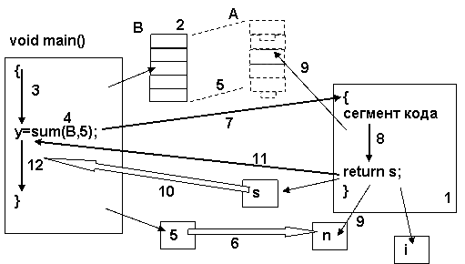
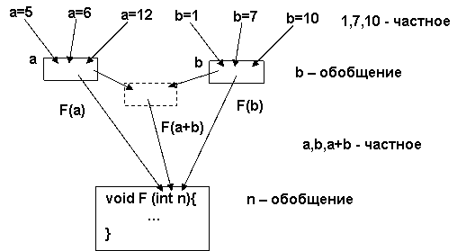

Следующим уровнем в синтаксической структуре программы за выражениями и операторами является уровень функций. В отличие от предыдущих он является не только средством описания некоторой части программы, но и служит для оформления логически завершенного действия с собственным набором входных и выходных параметров. Термин функция, принятый в Си, имеет в других языках программирования родственные термины - процедура, модуль. Функция является основной программной единицей уже потому, что вся программа представляет собой множество вызывающих друг друга функций. Часть из них может быть получена «со стороны» - из библиотек или из программ, написанных в другое время, в другом месте, другими людьми и даже на другом языке программирования. То есть на уровне функций осуществляется «сборочный процесс» программы из отдельных составляющих.

## Синтаксис определения и вызова функции

Синтаксис функций \(определения и вызова\) включает в себя до десятка терминов и определений, поэтому придется сначала договориться о терминологии, не вникая в суть, а затем обсуждать механизмы ее работы.


Функция состоит из заголовка \(**1**\) и тела \(**2**\). **Заголовок функции –** это ее интерфейсная \(описательная\) часть, которая не дает программного кода, а содержит описание входных и выходных параметров, необходимых при ее выполнении \(вызове\). **Тело функции –** это программный код \(блок\), ограниченный фигурными скобками. Тело функции при трансляции преобразуется во внутреннее \(двоичное\) представление и размещается в сегменте команд программы \(см.**1.2**\). Существует также синтаксис, в котором присутствует только заголовок, ограниченный символом «**;**». В этом случае речь идет об **объявлении** функции – информировании транслятора о ее наличии и интерфейсе.

В заголовке находится **имя функции** \(**3**\), после которого в скобках – **список формальных параметров,** разделенных запятыми \(**4**\)**.** Список может быть и пустым. Синтаксис формального параметра \(**5**\) – это синтаксис определения переменной \(см.**1.3**\), что наводит на мысль, что формальные параметры – это особого рода переменные, которые используются для передачи параметров \(значений\) при вызове \(выполнении\) функции.

Внутри тела функции могут находиться определения обычных переменных \(**7**\), которые называются **локальными** \(в терминологии Си - автоматическими\). Тело каждой функции представляет собой отдельное изолированное пространство, в котором допустимо использование собственных переменных \(**9**\), составляющих неявное окружение – **контекст функции.** В него входят вышеуказанные формальные параметры и локальные переменные. Кроме того, контекст функции является короткоживущим: он создается при входе в функцию и разрушается при завершении ее выполнения.

Формальные параметры используются для передачи входных и выходных данных в функцию. Кроме них функция имеет еще одну неявную выходную переменную – **результат функции.** Результат функции - это временная переменная, которая возвращается функцией и может быть использована как операнд в той части выражения \(**13**\), где был произведен ее вызов \(**10**\).Как любая другая переменная, результат функции относится к определенному типу данных, который указан в заголовке функции \(**6**\). Это делается тем же способом, что и для обычных переменных. Используется тот же самый синтаксис, в котором имя функции выступает в роли переменной-результата. Тип результата может быть любым, за исключением функции или массива.\`\`

```c
int sum(...  // Результат - целая переменная
char *FF(... // Результат - указатель на символ
```

Значение переменной - результатa устанавливается в операторе **return \(8\)**, который производит это действие наряду с завершением выполнения функции и выходом из нее. Между ключевым словом **return** и ограничивающим символом ";" может стоять любое выражение, значение которого и становится результатом функции. Если вспомнить еще и о преобразованиях типов, то при таком «присваивании» результата таковое должно производиться от типа, соответствующего выражению к типу результата функции:

```c
double FF() {
    int nn;        // Эквивалент
    return (nn+1); // FF = (double)(nn + 1)
```

Имеется специальный пустой тип результата - **void**, который обозначает, что функция не возвращает никакого результата и, соответственно, не может быть вызвана внутри выражения. Оператор **return** в такой функции также не содержит никакого выражения. При вызове этой функции ее результат не может быть использован.

Определение функции представляет собой всего лишь статическую «заготовку» программы. Выполнение ее происходит тогда, когда в процессе вычисления выражения встречается вызов функции. Синтаксически **вызовом функции** называется упоминание имени этой функции в выражений \(**10**\), причем после имени функции в скобках следует список **фактических параметров \(12\).**

Фактические параметры – переменные, константы и выражения, которые ставятся в соответствие формальным параметрам при текущем вызове функции. По поводу них можно сказать следующее:

- между формальными и фактическими параметрами устанавливается «один-один» соответствие, которое действует только в течение текущего вызова функции \(динамически\);
- существуют различные способы установления соответствия, на настоящий момент реально распространенными в языках программирования являются способы передачи параметров **по ссылке** и **по значению;**
- фактические параметры имеются синтаксис выражения \(см **1.4**\). Это значит, что в них не определяются, а используются переменные и их сочетания, определенные в текущем контексте \(**11**\). Например, если определение массива имеет вид **int A\[\],** и в таком виде оно будет присутствовать в списке формальных параметров, то при вызове функции фактическим параметром может быть имя массива **C** определенного аналогичным образом \(т.е. переменная **C,** являющаяся массивом\).

В программе должна присутствовать функция \(**14**\), которая автоматически вызывается при загрузке программы в память и ее выполнении. Более никаких особенностей, кроме указанной, эта функция не имеет. Ее вид:

```c
void main() {...}
void main(void) {...}
void main(int narg, char *argv[]) {...}  // с интерфейсом командной строки
```

Способы соответствия формальных и фактических параметров

В настоящее время в большинстве языков программирования используются два способа передачи параметров: по ссылке и по значению. Особенностью Си является то, что он имеет возможность использовать ссылки не только неявно, но и с использованием такого архитектурно-ориентированного средства как указатель Кроме того, указатель и ссылка могут быть не только формальным параметром, но и результатом функции \(**5.2**\). Пока же мы ограничимся общепринятыми для всех языков программирования рамками.

**Передача параметра по значению** представляет собой **копирование** значения фактического параметра в формальный, т.е. является неявным присваиванием фактическому параметру значения формального. Этот способ обладает следующими свойствами:

- формальные параметры являются собственными переменными функции, аналогом локальных переменных;
- при вызове функции происходит присваивание формальным параметрам значений фактических \(копирование вторых в первые\);
- при изменении формальных параметров значения соответствующих им фактических параметров не меняются;
- передача параметров по значению используется для задании функции входных данных.

  **Передача параметра по ссылке** осуществляется **отображением** формального параметра в фактический:

- формальные параметры существуют как синонимы фактических, в этом смысле они не являются «настоящими» переменными, под которые отводится память, а реализуется как элемент отображения;
- при изменении значений формальных параметров эти изменения проецируются на соответствующие им фактические;
- передача параметров по ссылке может использоваться для данных, которые являются либо чисто выходными \(неявный результат функции\), либо представляют собой внешние для функции данные, которые она должна изменить.

&nbsp;<Icon name="Science"/>Доступ к объекту в виде значения \(копии\) и ссылки на оригинал широко используются в информационных технологиях. Для любого набора данных можно создать копию, передав ее пользователю, либо создать ссылку на оригинал. Например, на рабочем столе можно разместить копию файла \(аналог передачи по значению\), либо его ярлык \(аналог передачи по ссылке\).

В Си приняты следующие правила передачи, которые определяются синтаксическим видом формальных параметров в заголовке функции:

- по умолчанию \(т.е. при отсутствии явных символов обозначения\) все параметры, кроме массивов, передаются по значению, т.е. копируются;
- массивы передаются исключительно по ссылке, т.е. отображаются;
- для явного указания способа передачи параметра по ссылке служит символ «**&**», который записывается перед именем формального параметра.

## Механизм вызова функции

Механизм вызова функции является динамическим, т.е. действия, связанные с его реализацией, осуществляются при выполнении программы. Именно поэтому текст программы и его «развертка» во времени представляют для функции «две большие разницы». Это касается двух вещей:

- последовательность выполняемых действий \(поток управления\) при вызовах функций:
- соответствие между формальными и фактическими параметрами.

Именно поэтому мы и рассмотрим процесс вызова вышеприведенной функции в «исторической перспективе»:

1. результатом трансляции функции является программный код, размещенный в сегменте команд;

2. в вызывающей функции \(**main**\) определяются переменные, используемые в качестве фактических параметров вызова функции \(массив **B**\);

3. выполняется программный код вызывающей функции, пока в ней не встретится выражение, содержащий вызов функции;

4. в соответствии со списком фактических параметров устанавливается соответствие между элементами контекста вызывающей функции и формальными параметрами;



5. формальный параметр – массив **A** передается по ссылке - отображается на фактический параметр, аналогичный массив **B**, определенный в контексте вызывающей функции;

6. формальный параметр **n** – размерность массива **A** передается по значению, т.е. копируется, в качестве копируемого значения выступает константа;

7. сохраняется точка возврата в вызывающую функцию, после чего происходит переход к началу блока программного кода функции **sum**;

8. выполняется программный код функции **sum;**

9. в контексте вызываемой функции используются локальные переменные и формальные параметры, в соответствии со способами передачи параметров массив **A** отображается на исходный массив **B** в контексте **main;**

10. оператор **return** возвращает значение локальной переменной **s** в качестве переменной – результата в выражение, где находится вызов;

11. одновременно **return** производит переход в вызывающую функцию **main** в точку возврата;

12. продолжается выполнение программного кода вызывающей функции.

## Области действия функций. Определения и объявления

До сих пор мы ничего не говорили ни о взаимном расположении в программе определения функции и ее вызова, ни о соответствии формальных и фактических параметров, ни о контроле такого соответствия. Конечно, нельзя считать, что транслятор «знает» о всех функциях, когда либо написанных, либо находящихся в библиотеках, текстовых файлах и т.д.. Каждая программа должна сама сообщать транслятору необходимую информацию о функциях, которые она собирается вызывать. Перечислим, какую именно:

- имя функции;

- тип результата;

- список формальных параметров (переменные и типы).

При ее наличии транслятор может корректно сформировать вызов функции, даже если текст ее (определение) отсутствует в программе. Вся перечисленная информация о функции находится в ее заголовке. Таким образом, достаточно этот заголовок привести отдельно, и проблема корректного вызова решается. Такой заголовок называется **объявлением** или в рассматриваемом нами варианте синтаксиса **прототипом функции**

Теперь перечислим причины такого «незнания» транслятора. Во-первых, трансляторы обычно используют довольно простые алгоритмы просмотра текста программы, «не заглядывая» вперед. Поэтому обычно на данный момент трансляции содержание текста программы за текущим транслируемым оператором ему неизвестно. Во-вторых, функция может быть в библиотеке. В третьих - в другом текстовом файле (модуле), содержащем часть Си-программы. Во всех этих случаях необходимо использовать объявления. Единственный случай, когда этого делать не надо, когда определение функции присутствует ранее по тексту программы.

```c
int B[10];
int sum(int s[],int n); // Объявление функции,
                        // определенной далее по тексту
extern int printf(char *,...); // Объявление библиотечной функции
                               // с переменным числом параметров
extern int other(void); // Объявление функции без
                        // параметров из другого
void main()             // файла программы
{ sum(B,10); other(); } // Вызовы объявленных функций
int sum(int s[], int n) {...} // Определение ранее объявленной функции
```

Из примера видно, что объявление функции практически дублирует заголовок, отличаясь в некоторых деталях:

- объявление заканчивается символом ";" ;

- если функция находится вне текущего файла, то объявление предваряется служебным словом extern;

- имена переменных в списке формальных параметров объявления могут отсутствовать;

- если функция не имеет формальных параметров, то в объявлении присутствует формальный параметр типа void.

Имея предварительно определенную функцию или ее объявление, транслятор в состоянии проверить соответствие формальных и фактических параметров как по их количеству, так и по типам. При этом транслятор может выполнить неявные преобразования типов фактических параметров к типам формальных, если это потребуется:

```c
extern double sin(double);
int    x; double y;
y = sin(x); //------Неявное преобразование (double)x
```

## Глобальные переменные. Инициализация

Программа в целом представляет собой набор вызывающих друг друга функций с обязательной функцией main, имеющих собственные наборы локальных переменных.

Но кроме этого в ее состав включаются еще переменные, доступные сразу нескольким функциям. Такие переменные называются глобальными (в терминологии Си – **внешними**). Будучи определенными в любом месте программы вне тела функции, они становятся доступными любой функции, следующей за ней по тексту программы:

```c
int         B[10];                  // B

int  sum()                      // B

            { ...B[i]... }               // B

int n;                         // B,n

void nf()                       // B,n

{...B[i]...n...}              // B,n

char c[80];                     // B,n,c

void main()                     // B,n,c

{...B[i]...n...c[k]...}          // B,n,c
```

Глобальные (внешние) переменные являются «стабильными» данными в программе. Транслятор переводит их во внутреннее представление, в котором им соответствуют определенные адреса памяти в сегменте данных (см.1.2). Можно сказать, что эти переменные находятся в программе (программном файле) еще до загрузки ее в память. Такое присваивание начальных значений переменным при их трансляции называется **инициализацией**. Инициализация включается в синтаксис определения переменной:

`Int a=5, B[10]= {1,5,4,2}, C[]={ 0,1,2,3,4,5 };`

Инициализатор отделяется от переменной в ее определении знаком «=». Для простой переменной - это обычная константа, для массива - список констант, заключенных в фигурные скобки и разделенных запятыми. Заметим, что размерность массива может отсутствовать, если транслятор в состоянии определить ее из инициализирующего списка.

&nbsp;<Icon name="Smile"/> Использование глобальных переменных в программе «не есть хорошо». Во-первых, оно ограничивает возможность работы функции одним и тем же набором параметров, Во-вторых, создает неявные связи через данные между различными функциями. Поэтому предпочтительнее передавать данные между функциями через формальные параметры. Иначе говоря, программисты по своей природе должны быть «антиглобалистами».

##Попытка собрать все в кучу

После такого количества определений и терминов не грех рассмотреть различные варианты организации интерфейса функции и ее вызова.

**«Процедура» без параметров.** Функция, не имеющая формальных параметров и результат типа void (в традиционных терминах - процедура), выполняет некоторый набор фиксированных внутренних действий.

```c
//-------------------------------------------------
void Hello(){ printf("Hello, Im here"); }
void main(){ Hello(); }
```

**Входные параметры-значения.** Параметры-значения, используемые как входные, используются для вычисления результата – наименьшего общего кратного.

```c
//-------------------------------------------------
int nod(int a,int b) {
  for (int n=a; !(n%a==0 && n%b==0);n++);
  return n; 
}
void main() { int y=nod(36,54); }
```

**Ссылка на внешнее значение.** Функция не имеет явного результата. Параметр, передаваемый явно по ссылке, используется для изменения (инкремента) внешнего значения, на который отображается ссылка.

```c
//-------------------------------------------------
void inc(int &n){ n++; }
void main(){ int m=6; inc(m); }      // Значение m=7 после вызова
```

**Обмен значений с использованием двух ссылок.** Функция не имеет явного результата. Два формальных параметра, передаваемых по ссылке, используются для обмена значений в тех переменных, на которые они ссылаются.

```c
//-------------------------------------------------
void swap(int &a, int &b){
            int c=a; a=b;b=c; }
void main(){ int m1=5,m2=7; swap(m1,m2); }        // m1=7, m2=5 после вызова
```

**Обмен значений в массиве.** Во внешнем массиве, передаваемом по ссылке, производится обмен значениями попарно от краев к середине. Размерность массива передается по значению. Явного результата функция не имеет.


```c
//-------------------------------------------------
void swap(int A[],int n){
            for (int i=0,j=n-1;i<j;i++,j--)
                        { int c=A[i];A[i]=A[j];A[j]=c; }
            }
void main(){
            int B[]={3,6,4,5,7};
            swap(B,5); }
```

**Результат функции – максимальное значение массива.** Функция получает массив по ссылке (единственно допустимый способ), используя его как входные данные. Находит максимальное значение и возвращает его в качестве переменной-результата.


```c
//-------------------------------------------------

int max(int A[],int n){

            for (int i=1,s=A[0];i<n;i++)

                        if (A[i]>s) s=A[i];

            return s; }

void main(){

            int m,B[]={3,6,4,5,7};

            m=max(B,5);}
```


**Максимальное значение массива, возвращаемое по ссылке.** Вариант, аналогичный предыдущему, но функция, не имея явного результата, возвращает максимальное значение по ссылке.


```c
//-------------------------------------------------

void max(int &s,int A[], int n){

            int i;

            for (i=1,s=A[0];i<n;i++)

                        if (A[i]>s) s=A[i];

}

void main(){

            int m,B[]={3,6,4,5,7};

            max(m,B,5); }
```


**Массив как результат функции.** Функция не может возвратить массив в качестве переменной-результата. Для того, чтобы это сделать, необходимо передать «пустой» внешний массив по ссылке, который заполняется в процессе вызова функции.


```c
//-------------------------------------------------

int pull(int v,int A[],int n){

            int i=0,m=2;

            while(v!=1 && i!=n){

                        if (v%m==0) { A[i++]=m; v/=m; }

                        else m++;

                        }

            return i; }

void main(){

            int k,B[10];

            k=pull(1275,B,10); }
```


**Функция с двумя результатами.** Функция, определяющая в массиве первую последовательность одинаковых значений, возвращает в качестве результата индекс начала и длину такой последовательности. Индекс возвращается в виде явного результата, длина – через формальный параметр – ссылку.


```c
//-------------------------------------------------

int len(int &k,int A[],int n){

            for (int i=0;i<n;i++){

                        for (k=1;i+k<n && A[i]==A[i+k];k++);

                        if (k>1) return i;

                        }

            return -1;}

void main(){

            int k1,m1,B[10]={5,7,6,6,6,6,6,6,5,7};

            k1=len(m1,B,10); }
```

В заключение отметим ряд типичных ошибок, допускаемых при определении и вызове функции:

- «вилка и розетка» - несоответствие количества и типов формальных и фактических параметров равносильно использованию в электротехнике розеток и вилок с разным числом и размерами контактов.


```c
void F(int a, int b) {…}

void main(){

            n=5;                              // «Две дырки и один штырек»

            F(n);}
```
- «функция функции рознь» - то, что выполнение вызываемой функции «вкладывается» в последовательность выполнения вызывающей, вовсе не означает, что они должны быть записаны одна внутри другой. Синтаксически функции являются независимыми друг от друга единицами;


```c 
void F() {

            void G(){ }                    // Вложенное определение

                                                // вместо вызова одной функции из другой

}
```
- «Алиса в Зазеркалье» -  каждая функция имеет свой контекст, в вызывающей функции – свой, в вызываемой – свой. Попытки использовать контекст одной функции, находясь в другой, сравнимы с попыткой схватить собственное отражение в зеркале. Связь между контекстами устанавливается только через взаимодействие формальных и фактических параметров;

```c 
void F(int n) {

            int a=5;

}

void main(){

            n=5;                             // Использование контекста вызываемой функции

            F(n);

}```

- «путаница в синтаксисе». Синтаксис формальных и фактических параметров принципиально различны. Если формальный параметр задается как определение особой интерфейсной переменной, то фактический параметр имеет синтаксис использования или обозначения уже определенной переменной или выражения – последовательности действий, выполненных над несколькими такими переменными.

```c 
void F(int A[], int n) {

            int a=5;

}

void main(){ int B[]={1,5,6};

            F(B[],3);                        // B должно быть без скобой -

}                                   // обозначение объекта, который является МАССИВОМ
```


&nbsp;<Icon name="Smile"/>Прекрасной иллюстрацией механизм вызова функции и передачи ее результата служит «Сказка о петушке и бобовом зенышке»: петушок подавился зернышком, курочка побежала к корове за маслом, корова отправила ее к косцам за сеном, косцы отправили к кузнецу за косой. Кузнец отковал косу и т.д. в обратном порядке. Корова, косцы и кузнец – это в терминологии программирования функции, коса, сено и масло – результаты функций, а курочка – процессор.

&nbsp;<Icon name="YinAndYang"/>Понятия функции и ее формальных параметров – это еще один уровень абстрагирования. Формальный и фактический параметр относятся друг к другу как категории «общее-частное». Аналогичное соотношение имеет место между переменной и ее значением. Любая переменная в каждый момент времени может хранить одно из значений, но как элемент программирования рассматривается как некоторое «обобщенное» значение. Точно так же формальному параметру при каждом вызове ставится в соответствие конкретный фактический параметр, а при разработке функции формальный параметр является обобщением, обозначающим любой возможный фактический параметр.


