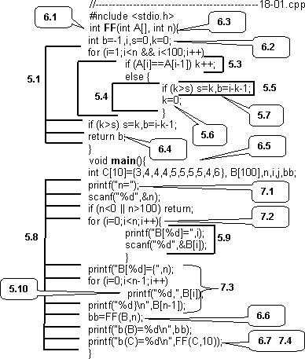

«При трогании с места на ровном участке дороги в безветренную погоду необходимо преодолеть лишь силу сопротивления качению колес и силу инерции». С.Сабодахо. За рулем легкового автомобиля.

С чего начать практическое программирование на не вполне знакомом языке? Можно со справочника: идентификаторы, константы, служебные слова. Скучно. Можно с примера: написать бесполезную программу из одного оператора, выводящего «Hello, world», а затем долго ее обсуждать. Поступим по-другому. В следующей главе мы будем заниматься анализом и проектированием простых программ. Попробуем представить одну из них в «товарном виде» - в виде готового консольного приложения, и сказать все, или почти все, о ее составных частях.

Программа нарочно построена «без единого гвоздя», то есть без единого комментария, поскольку на первый раз их потребуется слишком много и малая их часть проблемы не решит. Попробуем разобрать эту программу сначала «чисто синтаксически», а затем по содержанию выполняемых действий.

Шаг 1. Модульная структура программы. Прежде всего, программа представляет собой набор функций (модулей), вызывающих друг друга. В простейшем случае она состоит из единственной функции main (см. 1.6, 1.7).

1.       Программа состоит из двух функций – синтаксически независимых модулей FF и main.

2.       При выполнении программы исполнительной системой (оболочкой) вызывается главная функция main, в процессе ее выполнения два раза вызывается функция FF.

3.       Из main вызываются также функции стандартной библиотеки ввода вывода – scanf и printf, обеспечивающие ввод-вывод числовых данных в режиме консольного приложения (командной строки).

4.       Директива подключения заголовочного файла #include <stdio.h> включает в текст программы заголовочный файл описания стандартной библиотеки ввода-вывода. Без него транслятор «не знает» о существовании функций ввода-вывода, не имеет описания их интерфейса и не может сформировать их корректный вызов  (подробнее см. 1.7,5.7).

Шаг 2. Определение переменных. Все переменные, используемые в программе, должны быть определены. При определении переменная получает имя, форму представления (тип данных) и, возможно, начальные значения (см. 1.2, 1.6). Переменные, определенные в теле функции, называются локальными. Они создаются в момент входа в функцию (начало ее выполнения) и уничтожаются при выходе. В каждой функции имеется собственный набор переменных, необходимый для «внутреннего употребления» и невидимый извне. В принципе, возможно использование общих (глобальных) переменных, определенных вне функций, но в данной программе они не используются (см. 1.6).

При определении переменных им могут быть присвоены начальные значения (инициализация):

1.       в функции FF определяются и инициализируются целые переменные;

2.       в функции main определяются и инициализируются массивы. Размерность переменных задается при определении и не может быть изменена при выполнении программы. Для массивов она задается целой константой. Поэтому при работе программа должна следить за количеством заполненных элементов массива. В Си элементы массива нумеруются, начиная с 0, поэтому массив размерности n содержит элементы с номерами от 0 до n-1;

Шаг 3. Операции и выражения. Выражение представляет собой линейную последовательность операций доступа к данным или их преобразования. «Участниками» операций являются переменные и константы, а также результаты предыдущих операций. Большинство операций совместимо между собой по типу результата, поэтому они могут встречаться в различных фантастических сочетаниях. В Си набор операций довольно широк и включает в себя те действия, которые в других языках программирования реализуются операторами:

1.       операция присваивания (=) сохраняет значение вычисленного выражения в переменной (адресном выражении), находящейся в левой части. Присваивание является операцией, она может быть использована многократно и в последовательности других операций. Ее результатом является значение левого операнда (это свойство в данном примере не используется);

2.       в арифметических, а также во всех других бинарных операциях (в том числе и при присваивании) существуют правила преобразования (приведения) типов, если они различны. В нашем примере все значения целого типа (int), поэтому преобразование типов отсутствует;

3.       операция «запятая» формально объединяет несколько независимых выражений в одно (перечисление);

4.       результатом операции сравнения является целое значение 1 (истина) или 0 (ложь), специального типа данных для логических значений в Си нет;

5.       логическая операция && (И) объединяет два логических значения (условия) по закону совпадения (одновременности), логическая операция || (ИЛИ) – по принципу «хотя бы один»;

6.       операция [] производит извлечение (доступ) к элементу массива с заданным номером (индексом), В этом смысле она является операцией, но не преобразования данных, а доступа к ним (выделения составляющего типа данных);

7.       операция ++ увеличивает значение переменной на 1. Ее результатом является значение переменной до увеличения (в данном примере не используется);

8.       Вызов функции также является операцией, имеющей синтаксис имя_функции(). Результат функции (если он не типа void) может быть использован в качестве операнда в той части выражения, где производится ее вызов.

Шаг 4. Вызов стандартных функций ввода-вывода. Подробное описание форматированного ввода-вывода приводится в 4.5. Здесь же прокомментируем только то, что встречается в программе:

- функции scanf и printf используются для ввода значений целых переменных;

- первым параметром функций является форматная строка вида "… %d…%d…";

- для printf форматная строка представляет собой произвольный текст, в который на место %d подставляется значение очередной переменной из списка, следующего за форматной строкой. В нашем примере в каждом printf выводится только по одной переменной;

- сочетание символов «\n» в форматной строке обозначает переход на следующую строку при выводе;

- в функции ввода в форматной строке символы %d обозначают, что очередное значение вводится в десятичной системе счисления в очередную переменную типа int из списка, перед именем переменной обязателен символ «&».

Шаг 5. Операторы. В данном примере почти операторы являются структурированными, т.е. построены по принципу «один вход — один выход». Их объединение производится либо в виде последовательного расположения в тексте (и выполнения), либо в виде вложенности одного в другой, единственным исключением является return, и то он имеет отношение к процессу вызова функции:

1.       тело функции FF состоит из определения переменных (в смысле выполняемых действий определение локальных переменных представляет собой процесс их создания и инициализации), а также трех последовательно выполняемых операторов: цикла for(i=1;i<n;i++), условного оператора if(k>s) и оператора возвращения результата return;

2.       тело оператора цикла состоит из единственного оператора if(A[i]==A[i-1]), в который вложены два оператора, соответствующие «истинной» и «ложной» ветвям оператора;

3.       вложенный оператор для значения «истина» - простой оператор, образованный выражением k++, ограниченным точкой с запятой;

4.       вложенный оператор для значения «ложь» - последовательность из двух операторов, объединенная в блок с помощью фигурных скобок {};

5.       первым оператором последовательности является условный оператор if(k>m), который не содержит альтернативной ветви для значения «ложь»;

6.       вторым оператором последовательности является простой оператор, образованный выражением k=0, ограниченным точкой с запятой;

7.       в оператор if(k>m) вложен простой оператор, образованный выражением s=k,b=i-k-1, ограниченным точкой с запятой. Выражение использует операцию «запятая» для объединения двух несвязанных присваиваний.

8.       структура операторов main значительно проще и представляет, в основном, линейную последовательность операторов, один из которых является условным, а два – циклами.

9.       телом первого цикла является блок – последовательность из двух простых операторов – выражений, являющихся вызовами функций;

10. тело второго цикла представляет собой простой оператор – выражение с вызовом функции вывода.

Шаг 6. Определение и вызов функций. Программа состоит из двух функций. Функция FF реализует ее содержательную часть, а основная функция main – интерфейсную часть (ввода-вывод):

1.       заголовок функции FF имеет тип результата int, функция возвращает целое значение в то выражение, откуда она вызывается;

2.       в теле функции определены локальные переменные, используемые «для внутренних нужд» модуля. Они создаются при входе в функцию (вызове) и уничтожаются при выходе (оператор return). Вне тела функции они «не видны»;

3.       в заголовке функции определенные формальные параметры – интерфейсные переменные, через которые при вызове передаются входные и выходные данные. Это массив A и целая переменная n. Хотя массив передается по ссылке (отображается), в данном примере это не важно, поскольку он используется как входной. Переменная n передается по значению (как копия). В функции она используется как текущая размерность массива A;

4.       оператор return в качестве результата функции возвращает значение внутренней (локальной) переменной b. «Смысл» этой переменной – индекс начала самой длинной последовательности одинаковых значений в массиве A;

5.       в main должны быть определены массивы, используемые как фактические параметры при вызове функции FF.

6.       при первом вызове функции FF в нее по ссылке передается массив B (на него отображается A), в качестве размерности передается значение переменной n (в контексте main) – число введенный в массив значений. Результат вызова присваивается переменной bb;

7.       при втором вызове функции FF в нее по ссылке передается массив C, в качестве размерности передается значение константы 10. Результат вывода перенаправляется в функцию вывода printf в качестве фактического (входного) параметра.

Шаг 7. Содержательный смысл программы. Функция FF представляет содержательную часть программы, а main — интерфейсную. Все, что связано с содержательным анализом программы, рассматривается в главе 2. Более того, в 2.5 приводится пример анализа подобного фрагмента. Поэтому здесь мы приведем только результат выполнения функции и смысловую интерпретацию некоторых ее элементов: она находит максимальную последовательность подряд идущих одинаковых элементов и возвращает индекс первого из них.

- основной цикл функции FF просматривает массив, последовательно сравнивая пары элементов (индекс текущего элемента i). Если они равны, то увеличивается счетчик k, а если нет, то он сбрасывается. Таким образом, счетчик отслеживает длину цепочки совпадающих пар (точнее, количество таких пар);

- перед сбрасыванием счетчика производится сравнение на предмет превышения максимальной длины s. Если длина новой последовательности больше, то запоминается она, а также индекс ее начала b. После окончания цикла это действие еще раз повторяется для учета последней накопленной последовательности.

Основная функция main поддерживает диалог в режиме консольного приложения. Функция форматного вывода printf используется для вывода «подсказок» при вводе и оформления в удобочитаемом виде выводимых данных:

1.       выводится подсказка «n=», на которую вводится число  элементов, вводимых в массив B;

2.       для каждого элемента в диапазоне от 0 до n-1 включительно выводится подсказка вида «B[0]=», на которую вводится значение элемента массива;

3.       введенное содержимое выводится в формате вида «B[5]={3,4,2,6,8}». Первый вызов printf выводит данные по формату «B[%d]={» с подстановкой текущего значения n. Затем в цикле выводятся значения всех элементов, кроме последнего. Обратите внимание, что символ «запятая» является элементом форматного вывода, т.е. выводится на экран в качестве разделителя. Аналогично обстоит дело с символом «}» для функции printf, выводящей последний элемент массива;

4.       Два последних вызова printf выводят результат вызова функции FF Для массивов B и C в формате «b=…» c переходом на следующую строку.
