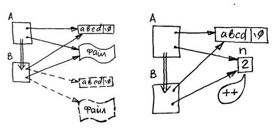

## Программирование методов и принцип модульности

Программирование методов – содержательное наполнение класса – позволяет использовать принципы модульного программирования и создавать эффективный программный код. Основной эффект модульности – многократное выполнение одного и того же кода в различных контекстах, обеспечивается различными способами:

- представление алгоритмической компоненты класса в виде множества мелких методов, вызывающих друг друга;

- создание вспомогательных (локальных) объектов при выполнении операций над основными объектами класса (текущим и передаваемым через параметры);

В классе степенных полиномов создание отдельных внутренних методов управления размерностью дает возможность использовать одни и те же средства при реализации всех операций. Например, в методе сложения полиномов (складываются коэффициенты при одинаковых степенях), производится выравнивание размерности текущего объекта до размерности второго операнда, а после выполнения сложения – нормализация с отбрасыванием лишних нулей.

```cpp
//-----------------------------------------------101-01.cpp

// Клас степенного полинома

class poly {

  int n; // степень полинома

  double * pd; // динамический массив коэффициентов

  public: …

    void add(poly & T) { // Сложение - добавление второго к текущему

      extend(T.n); // Увеличить до размерности второго

      for (int i = 0; i <= T.n; i++) pd[i] += T.pd[i];

      normalize();

    }
```

В методе умножения полиномов используется маленькая хитрость, показывающая, что принципам закрытости и независимости объектов не следует возводить в абсолют. Умножение полиномов производится по формуле

$a*b = Σa_ix^i Σb_jx^j= ΣΣa_ib_jx^i+j$

Необходимо просто попарно перемножить все коэффициенты полиномов, причем каждое частичное произведение aibj будет добавляться к сумме, соответствующей степени полинома i+j. Во время умножения содержимое объектов-операндов менять нельзя, поэтому приходится создавать локальный объект R размерность которого равна сумме размерностей операндов.

```cpp
//-----------------------------------------------101-01.cpp

void mul(poly & T) { // Умножение

  poly R(n + T.n); // Вспомогательный объект - сумма размерностей

  for (int i = 0; i <= n; i++) // Добавление частичных произведений всех пар

    for (int j = 0; j <= T.n; j++)

      R.pd[i + j] += pd[i] * T.pd[j];

  int c;
  double * d; // Обмен содержимым текущего и вспомогательного

  c = n;
  n = R.n;
  R.n = c; // Обмен размерностей

  d = pd;
  pd = R.pd;
  R.pd = d;
} // Обмен указателей на ДМ
```

Но результирующий локальный объект будет разрушен при выходе из метода и его содержимое будет потеряно. Выход очевиден: необходимо поменять содержимое текущего объекта и локального. Поскольку динамические массивы задаются указателями, то для их обмена нужно просто «перекинуть» их из одного объекта в другой. Такая «ересь» с точки зрения принципов ООП вполне корректна: объекты после выполнения указанных действий остаются независимыми.

Сравнение полиномов на больше-меньше – это сравнение «степени роста» соответствующих функций, что определяется коэффициентами при старших степенях x. Можно использовать и более общий принцип: если возможно реализация операции вычитания, то сравнение – это знак результата вычитания. При выполнении операции вычитания опять-таки создается локальный объект – копия текущего, чтобы сохранить неизменными значения операндов, затем инвертируется и к нему добавляется объект-второй операнд. Если полиномы равны, но в результате после нормализации получится «пустой» полином, иначе же знак старшего коэффициента и будет означать результат сравнения.

```cpp
//-----------------------------------------------101-01.cpp

int compare(poly & T) { // Сравнение полиномов

  int k = 0;

  poly R( * this); // Копия текущего

  for (int i = R.n; i >= 0; i--)

    R.pd[i] = -R.pd[i]; // Инвертирование коэффициентов

  R.add(T); // Вычитание из второго - текущего

  R.normalize();

  if (R.n == 0 && R.pd[0] == 0)

    return 0; // Результат - нулевой полином = равны

  if (R.pd[R.n] < 0) return 1;

  return -1;
} // Иначе - знак старшего коэффициента
```

## Способы передачи параметров в методы

Си++ является открытым в плане способов передачи формальных параметров в функции, то же самое касается и методов. Очень часто формальными параметрами и результатом являются объекты того же самого класса. Передача их возможна тремя способами: по значению (копия объекта), по ссылке и через указатель. В связи с этим может возникнуть путаница в преобразованиях. Сочетание явных (указатель) и неявных (ссылка) механизмов приводит к тому, что транслятор вынужден иногда выполнять фиктивные «преобразования» типов данных, а программист – делать то же самое, но в обратном направлении. Рассмотрим, что же происходит при выполнении всех возможных преобразований вида «объект (значение) – указатель - ссылка».

Вход

Выход

Операция

Действия транслятора

Значение (объект)

Указатель

&

Формирует адрес входного объекта

Значение (объект)

Ссылка

---

Формирует адрес входного объекта в качестве неявного указателя

Ссылка

Указатель

&

Фиктивная операция, превращение неявного указателя в явный

Ссылка

Значение

---

Производит косвенное обращение по неявному указателю, переходит от неявного указателя к объекту-прототипу

Указатель

Значение

-

Производит косвенное обращение по указателю, переходит от указателя к указуемому объекту

Указатель

Ссылка

-

## Фиктивная операция, превращение явного указателя в неявный

Перечисленные варианты преобразований и соответствующие им операции можно применять достаточно формально, обращая внимание по необходимости на механизмы реализации и их эффективность.

```cpp
struct xxx {

  xxx * copy() {
    xxx * q = new xxx;* q = * this;
    return q;
  }

};

void main() {
  xxx a;
  xxx * pp = a.copy();
  xxx * qq = pp -> copy();
}
```

Метод `copy` создает внутри себя динамический объект такого же класса, копирует в него содержимое текущего объекта (присваивание типа «объект-объект») и возвращает указатель на создаваемый объект, который запоминается в pp. Для этого объекта в свою очередь вызывается тот же самый метод, создающий еще одну динамическую копию объекта с запоминанием указателя в qq.

```cpp
struct xxx {
  xxx & copy() {
   return *this;
 }
};

void main() {
  xxx a, b, c;
  b = a.copy();
  c = a.copy().copy();
}
```

Метод `copy` возвращает ссылку на объект того же класса. В операторе return выражение _this понимается как «текущий объект». Операция _ используется потому, что ссылка должна иметь синтаксис объекта, а не указателя. Реально же данная операция перехода от указателя к ссылке является фиктивной. Содержательно метод следует понимать как формирование отображения (синонима) на объект, для которого вызывается метод. Повторный вызов того же самого метода применительно к результату-ссылке сопровождается преобразованиями «ссылка – объект – указатель на текущий объект», которые все без исключения являются фиктивными. Поэтому на самом деле по цепочке методов будет передаваться указатель на объект вплоть до последнего присваивания результата объекту с – присваивание «ссылка – объект» приведет к копированию из-под неявного указателя.

## Конструктор копирования

Прежде чем рассматривать стандартные схемы передачи операндов, необходимо разобраться с конструктором копирования (КК).

«ББ – Брижит Бардо, ММ – Мерлин Монро, КК – конструктор копирования». Известные аббревиатуры.



Конструктор копирования создает в текущем объекте независимые копии всех связанных с объектом динамических структур данных и ресурсов, обеспечивая тем самым независимость объекта от оригинала (в Java аналогичный процесс называется клонированием, только там создается еще и динамическая копия самого объекта).

Конструктор копирования имеет жесткий синтаксис, по которому его идентифицирует транслятор: он имеет параметр – ссылку на объект того же класса и внешне выглядит как конструктор вида «объект из объекта».

```cpp
//-----------------------------------------------102-01.cpp

// Клас степенного полинома - конструктор копирования

class poly {

  int n; // степень полинома

  double * pd; // динамический массив коэффициентов

  void load(int n0, double p[]) {

    n = n0; // закрытый метод загрузки массива

    pd = new double[n + 1]; // - не всегда корректно вызывается

    for (int i = 0; i <= n; i++)

      pd[i] = p[i];
  }

  public:

    poly(poly & T) { // конструктор "объект из объекта"

      load(T.n, T.pd); // вызов метода создания копии

      printf("copy %x->%x\n", & T, this); // трассировка адресов объектов

    } // (конструктор копирования)

  poly copy(poly X) // Вызов КК при входе и выходе

  {
    return X;
  }

  void main() {

    double A[] = {
      1,
      -2,
      3,
      -4
    }, B[] = {
      5,
      3,
      6
    };

    poly a1(3, A), a2(2, B);

    poly a3 = a1; // Синтаксис КК - определение с инициализатором

    poly a4(a2); // Явный вызов КК

    copy(a1).show(); // Вывод полинома - результата

  }
```

Конструктор копирования может вызываться явно, а также при определении объекта в сочетании с инициализатором:

```cpp
poly a3 = a1;                               // Синтаксис КК - определение с инициализатором

poly a4(a2);                               // Явный вызов КК
```

Но основная его задача – обеспечивать корректное копирование объектов при их передаче и возвращении в функцию (метод) по значению. Если конструктор копирования определен, то он автоматически вызывается транслятором еще в двух случаях:

- при использовании формального параметра, передаваемого по значению. Формальный параметр - объект, передаваемый по значению, создается в стеке в момент вызова функции и инициализируется копией фактического параметра (вызов КК);

- функция возвращает результат в виде объекта, передаваемого по значению. В вызывающем контексте транслятор формирует безымянный временный объект, в момент выполнения оператора return он инициализируется копией объекта в выражении, записанном для в операторе return (вызов КК).

> Замечание: деструкторы вызываются для всех объектов, в том числе и для формальных параметров – значений, и для временных объектов – результатов. Поэтому конструктор копирования «уравнивает» количество конструкторов и деструкторов и обязателен в перечисленных случаях, если объекты содержат динамические структуры данных или связанные ресурсы.

Конструктор копирования для случая разделения данных. В ряде случаев конструктором копирования может проводиться альтернативная политика – не динамическое копирование, а разделение общих данных несколькими объектами-копиями. Безусловно, пользователь класса должен быть в курсе этого и разрабатывать с учетом этого свою программу.

Конструктор копирования в этом случае будет дублировать указатель на динамические данные или идентификатор ресурса (например, номер открытого файла или окна), но объекты, связанные через эти данные, должны взаимодействовать друг с другом. Как минимум, они должны корректно разрушать эти общие данные, а для этого иметь общий счетчик ссылок объектов на эти данные. Счетчик ссылок также является динамической переменной. Обычный конструктор создает экземпляр динамических данных и динамическую переменную – счетчик (указатель pcnt), устанавливая ее в 1. Конструктор копирования просто дублирует указатели и увеличивает значение общего счетчика на 1. Деструктор, наоборот, уменьшает значение счетчика на 1 и разрушает экземпляр динамических данных только тогда, когда счетчик станет равным 0.

```cpp
//------------------------------------------------------102-02.cpp

//----- Класс " разделяемых" строк

class cstring {

  char * str; // Указатель на строку

  int * pcnt; // Указатель на счетчик ссылок

  public: cstring(char * s) { // Конструктор

    str = strdup(s); // Экземпляр разделяемых данных

    pcnt = new int; // Динамическая переменная - счетчик ссылок

    * pcnt = 1;
  } // Количество ссылок 1

  cstring(cstring & R) { // Конструктор копирования

      str = R.str; // копирует указатели и увеличивает счетчик

      pcnt = R.pcnt;

      ( * pcnt) ++;
    }

    ~cstring() { // Деструктор

      if (--( * pcnt) == 0) { // если последний - уничтожает

        delete[] str; // экземпляр данных и счетчик

        delete pcnt;

      }
    }

};

cstring copy(cstring S) {
  return S;
} // Создание копии на входе и выходе

void main() {

  cstring a("aaaaa"), b = a, c = b, * p; // Два явных КК

  p = new cstring(a); // Динамический объект с КК

  b = copy(a); // Два КК в функции и присваивание

  delete p;
}
```

> Замечание: принцип разделения должен быть отражен и в других переопределяемых операциях: например, присваивание таких объектов должно быть выполнено аналогично конструктору копирования. И хотя такие объекты будут передаваться по значению, копии тем не менее будут ссылаться на один и тот же оригинал.

```cpp
//------------------------------------------------------102-02.cpp

cstring & operator = (cstring & R) { // Переопределение присваивания

  // Уменьшение для левой части

  if (--( * pcnt) == 0) { // Если последний в левой части -

    delete[] str; // уничтожает экземпляр данных и счетчик

    delete pcnt;
  }

  str = R.str; // копирует указатели и увеличивает счетчик

  pcnt = R.pcnt; // правой части

  ( * pcnt) ++;

  return *this;
}
```

## Конвейер ссылок и конвейер значений

Из всего многообразия способов передачи формальных параметров и возвращения результата можно выделить две наиболее часто используемые схемы. В обоих из них возвращаемый результат является объектом того же класса, поэтому такие функции можно объединять в цепочки – «конвейеры». Разница состоит в том, что в одном случае «по конвейеру» передается ссылка, т.е. сам объект – операнд, а в другом случае – копия (значение). Соответственно, и называются они конвейером ссылок и конвейером объектов (значений).

В конвейере ссылок метод получает операнды по ссылке (или указателю, как, например, текущий объект). Он не создает «лишних» объектов и все необходимые действия производит над объектами-оригиналами по ссылке, изменяя их содержимое. В качестве результата возвращается ссылка на текущий объект или на объект – формальный параметр. В main передача ссылки выглядит как синтаксическая передача имени объекта со входа на выход, т.е. последовательность методов выполняется над одним и тем же объектом.

```cpp
//-----------------------------------------------101-01.cpp

// Класс степенного полинома

// операция - конвейер ссылок

poly & add1(poly & T) { // Сложение - добавление второго к текущему

  extend(T.n); // Увеличить до размерности второго

  for (int i = 0; i <= T.n; i++) pd[i] += T.pd[i];

  normalize();

  return *this; // Возвращение ссылки на текущий объект

}

void main() {

  double A[] = { 1, -2, 3, -4},
         B[] = { 5, 3, 6};

  poly a1(3, A), a2(2, B);

  a1.add1(a2).add1(a2).show();
} // a1+=a2  a1+=a2
```

Выражение `return *this` обозначает возврат ссылки на текущий объект (операция \* - фиктивный переход от указателя к ссылке). В `main` вся цепочка методов add1,add1 и show выполняется для объекта a1.

В конвейере значений результатом метода является значение объекта класса. На практике это означает, что в вызывающем коде транслятор создает временный объект, в который оператор return копирует значение объекта из внутреннего контекста. Цель такого копирования заключается в сохранении неизменными входных операндов (результат – новый объект, отличный от исходных). Поэтому в теле метода необходимы вспомогательные объекты, в которые помещаются копии входных. Копирование объектов сопровождается явным или автоматическим вызовом конструктора копирования, создающим независимую копию динамических данных объекта.

```cpp
//-----------------------------------------------101-01.cpp

// операция - конвейер значений (объектов)

poly add2(poly & T) { // Сложение - добавление второго

  poly R( * this); // к копии текущего - вызов КК

  R.extend(T.n); // Увеличить до размерности второго

  for (int i = 0; i <= T.n; i++) R.pd[i] += T.pd[i];

  R.normalize();

  return R; // Возвращение копии - вызов КК

}

void main() {

  double A[] = {
    1,
    -2,
    3,
    -4
  }, B[] = {
    5,
    3,
    6
  };

  poly a1(3, A), a2(2, B);

  a1.add2(a2).add2(a2).show();
} // x1=a1+a2  x2=x1+a2 x2.show()
```

В приведенном примере транслятором будет создано два временных объекта для копирования результатов и два локальных объекта при вызове метода. Способы создания копий могут быть разными. Например, передавая формальный параметр по значению, мы, тем самым, создает копию фактического параметра с неявным вызовом конструктора копирования.

```cpp
//-----------------------------------------------101-01.cpp
// операция - конвейер значений (объектов)
poly add3(poly T) { // Сложение - добавление текущего

  // к копии второго (вызов КК)

  T.extend(n); // Увеличить до размерности текущего

  for (int i = 0; i <= n; i++) T.pd[i] += pd[i];

  T.normalize();

  return T; // Возвращение копии - вызов КК
}
```

## Статические элементы класса

Иногда требуется определить данные, которые относятся ко всем объектам класса, проще говоря, определить переменные и функции, глобальные в классе. В средах программирования с «тотальным» ООП – это единственная возможность использовать глобальные данные и «обычные» функции (которых попросту там нет). Другой вариант – создание внутреннего скрытого механизма класса, осуществляющего контроль за всеми его объектами, либо обеспечивающих скрытое взаимодействие объектов между собой.

Статические данные класса представляют собой обычные с точки зрения времени жизни обычные статические переменные (см. 5.7). Они создаются в одном экземпляре на весь класс. Статический элемент в объекты класса не входит, кроме объявления в заголовке класса он должен быть явно определен в программе и инициализирован по полному имени имя*класса::имя*элемента.

Статическими могут быть объявлены также и встроенные в класс функции (методы). Их «статичность» определяется тем, что вызов их не связан с конкретным объектом и может быть выполнен по полному имени. Соответственно в них не используются неявный указатель на текущий объект this и вводятся они для выполнения действий, относящихся ко всем объектам класса.

В следующем примере объекты класса строк связаны в односвязный список, что позволяет в любой момент просмотреть их все при помощи статического метода. Заголовок списка – статическая переменная. В момент создания объекта конструктор помещает его в начало общего списка. Деструктор должен найти этот объект в общем списке и исключить его оттуда. Деструктор и статическая функция show, имея доступ ко всем объектам, могут использовать все их данные и вызывать для них любые методы.

```cpp
//------------------------------------------------------102-03.cpp

//-----Все объекты класса string связаны в односвязный список

class string {
  char * str;

  static string * fst; // Указатель заголовок списка ( статический )

  string * next; // Указатель на следующий элемент (обычный)

  public:

    static void show() { // Просмотр всех объектов - статическая функция

      string * p;

      for (p = fst; p != NULL; p = p -> next) p -> put();

    }

  void put() {
    puts(str);
  } // Вывод содержимого объекта обычная функция

  string(char * s) {
      str = strdup(s); // Конструктор

      next = fst;

      fst = this;
    } // Включение в начало статического списка

    ~string() { // Деструктор

      if (fst == this) // Удаление первого

        fst = fst -> next;

      else { // Поиск предыдущего в списке

        string * p;

        for (p = fst; p -> next != this; p = p -> next);

        p -> next = this -> next;

      } // и выкусывание текущего из списка

      delete[] str;
    }

};

string * string::fst = NULL; // Определение статического элемента данных

void main() {
  string a("aaa"), b("bbb"), * p = new string("ddd"), c("ccc");

  string::show();

  delete p;

  string::show();
} // Вызов статической функции по полному имени
```

## Лабораторный практикум

Для вариантов заданий из **10.1** разработать набор методов, реализующий стандартный набор арифметических и логических операций над объектами класса (сложение, вычитание, умножение (деление), сравнение и т.п.).

## Вопросы без ответов

Конструктор копирования. В следующих тестах конструктор копирования выполняет нестандартные действия (копирование с модификацией данных). Определить точки вызова конструктора копирования, значения переменных и содержимое объектов после выполнения операций.

```cpp
//----------------------------------------------------------------------102-04.cpp

// Общая часть для тестов 1-5

class string{

   char *str;

   void load(char *s)    { str=strdup(s); }

   void add(char *s)     { str=(char*)realloc(str,strlen(str)+strlen(s)+1); strcat(str,s); }

   int find(char *s)     { char *p=strstr(str,s); return p==NULL ? -1 : p-str; }

   int cmp(string &t)    { return strcmp(str,t.str); }

public:

   string(){ load(""); }

   string(char *s){ load(s); }

   ~string() { delete str; }

   string   &operator=(string &r) { delete str; load(r.str); return *this; }

//---------------------------------------------------1

   string(string &t){ load(t.str); add(t.str+1); }

   string   operator+(string &r) { string t(str); t.add(r.str); return t; }

   };

string EMPTY(string s) { return s; }

void main(){ string s1,s2("ab"),s3=s2;

s1=EMPTY(s2); }

//---------------------------------------------------2

   string(string &t){ load(t.str); add(t.str+1); }

   string   operator+(string &r) { string t(str); t.add(r.str); return t; }

   };

string &EMPTY(string &s) { return s; }

void main(){ string s1,s2("ab"),s3=s2;

   s1=EMPTY(s2); }

//---------------------------------------------------3

   string(string &t){ load(t.str); add("???"); }

   string   operator+(string &r) { string t(str); t.add(r.str); return t; }

   };

void main(){ string s1,s2("ab"),s3=s2;

   s1=s2+s2;

//---------------------------------------------------4

   string(string &t){ load(t.str); add("???"); }

   string   operator+(string &r) { string t=*this; t.add(r.str); return t; }

   };

void main(){ string s1,s2("ab"),s3=s2;

   s1=s2+s2; }

//---------------------------------------------------5

   string(string &t){ load(t.str); add("+"); }

   friend   string   operator+(string one, string &two) { one.add(two.str); return one; }

   };

void main(){ string s1,s2("ab"),s3=s2;

   s1=s2+s3; }

//---------------------------------------------------6

class S { int val;

public:

   S (int v0) { val = v0; }

   S(S &r) { val = r.val*2; }

   S operator+(S x) { x.val += val; return x; }

    };

void main(){  S a(5),b=a,c(0);  c=a+b; }

//---------------------------------------------------7

class S { int val;

public:

   S (int v0) { val = v0; }

   S(S &r) { val = r.val*2; }

   S operator-(S &x) { S tmp=*this; tmp.val -= x.val; return tmp; }

   };

void main(){ S a(5),b=a,c(0);  c=b-a; }
```

Статические элементы класса. Содержательно сформулировать назначение статических данных класса (счетчик объектов, сумма значений всех объектов и т.п.). Определить значения переменных после выполнения программы.

```cpp
//-----------------------------------------------------102-05.cpp

//---------------------------------------------------1

class A {

  int val;

  static int cnt, m;

  public: A(int n = 0) {
    val = n;
    cnt++;
    if (cnt > m) m = cnt;
  }

  A(A & r) {
      val = r.val;
      cnt++;
      if (cnt > m) m = cnt;
    }

    ~A() {
      cnt--;
    }

  A operator++() {
    A t = * this;
    val++;
    return t;
  }

  static int count() {
    return m;
  }
};

int F() {
  A c(14);
  c++;
  return A::count();
}

int A::m = 0, A::cnt = 0;

A gl(10);

void main() {

  int e, f, g;
  g = A::count();

  A a(10), b(12);

  a++;
  b++;
  f = A::count();
  e = F();
}

//---------------------------------------------------2

class A {

  int val;

  static int cnt;

  public: A(int n = 0) {
    val = n;
    cnt++;
  }

  A(A & r) {
      val = r.val;
      cnt++;
    }

    ~A() {
      /* Это исключено cnt--; */ }

  A operator++() {
    A t = * this;
    val++;
    return t;
  }

  static int count() {
    return cnt;
  }
};

int F() {
  A c(14);
  c++;
  return A::count();
}

int A::cnt = 0;

A gl(10);

void main() {

  int e, f, g;
  g = A::count();

  A a(10), b(12);

  a++;
  b++;
  f = A::count();
  e = F();
}

//---------------------------------------------------3

class A {

  int val;

  static int cnt;

  public: A(int n = 0) {
    val = n;
    cnt += val;
  }

  A(A & r) {
      val = r.val;
      cnt += val;
    }

    ~A() {
      cnt -= val;
    }

  A operator++() {
    A t = * this;
    val++;
    return t;
  }

  static int count() {
    return cnt;
  }
};

int F() {
  A c(4);
  c++;
  return A::count();
}

int A::cnt = 0;

A gl(1);

void main() {

  int e, f, g;
  g = A::count();

  A a(3), b(5);

  a++;
  b++;
  f = A::count();
  e = F();
}

//---------------------------------------------------4

class A {

  int val;

  static int cnt, m;

  public: A(int n = 0) {
    val = n;
    cnt++;
    m += val;
  }

  A(A & r) {
      val = r.val;
      cnt++;
      m += val;
    }

    ~A() {
      cnt--;
      m -= val;
    }

  A operator++() {
    A t = * this;
    val++;
    return t;
  }

  static int count() {
    return m / cnt;
  }
};

int F() {
  A c(6);
  c++;
  return A::count();
}

int A::m = 0, A::cnt = 0;

A gl(1);

void main() {

  int e, f, g;

  e = A::count();

  A a(3), b(2);
  a++;
  b++;
  f = A::count();
  g = F();
}

//-------------------------------------------------------------------------------

// Общая часть для 5,6

class A {

  int val;

  static A * all[10];

  public: A(int n = 0) {
    val = n;

    for (int i = 0; i < 10; i++)

      if (all[i] == NULL) {
        all[i] = this;
        break;
      }
  }

  A(A & r) {
      val = r.val;

      for (int i = 0; i < 10; i++)

        if (all[i] == NULL) {
          all[i] = this;
          break;
        }
    }

    ~A() {

      for (int i = 0; i < 10; i++)

        if (all[i] == this) {
          all[i] = NULL;
          break;
        }
    }

  static int count() {

    int v = 0;

    for (int i = 0; i < 10; i++)

      if (all[i] != NULL) v++;

    return v;
  }

  //---------------------------------------------------5

  static int sum() {

    int v = 0;

    for (int i = 0; i < 10; i++)

      if (all[i] != NULL) v += all[i] -> val;

    return v;
  }

};

A * A::all[10] = {
  NULL,
  NULL,
  NULL,
  NULL,
  NULL,
  NULL,
  NULL,
  NULL,
  NULL,
  NULL
};

int F() {
  A c(14), d(16);
  return A::count();
}

A gl(10);

void main() {

  int e, f, g, h;
  e = A::count();

  A a(10), b(12);
  f = F();

  g = A::count();
  h = A::sum();

}

//---------------------------------------------------6

static int max() {

  int v = 0;

  for (int i = 0; i < 10; i++)

    if (all[i] != NULL && all[i] -> val > v)

      v = all[i] -> val;

  return v;
}

};

A * A::all[10] = {
  NULL,
  NULL,
  NULL,
  NULL,
  NULL,
  NULL,
  NULL,
  NULL,
  NULL,
  NULL
};

int F() {
  A c(14), d(16);
  return A::max();
}

A gl(10);

void main() {

  int e, f, g, h;
  e = A::max();

  A a(10), b(12);
  f = F();

  g = A::max();
}

//---------------------------------------------------7

class A {

  char * str;

  static int cnt, m;

  public:

    A(char * p = "??????") {
      str = p;
      cnt++;
      m += strlen(str);
    }

  A(A & r) {
      str = r.str;
      cnt++;
      m += strlen(str);
    }

    ~A() {
      cnt--;
      m -= strlen(str);
    }

  A & operator = (A & R) {

    m -= strlen(str);

    str = R.str;

    m += strlen(str);

    return *this;
  }

  static int mid() {
    return m / cnt;
  }

};

int F() {
  A c;
  return A::mid();
}

int A::m = 0, A::cnt = 0;

A gl("abcd");

void main() {

  int e, f, g;
  e = A::mid();

  A a("a"), b("b");
  f = A::mid();

  g = F();
}
```
