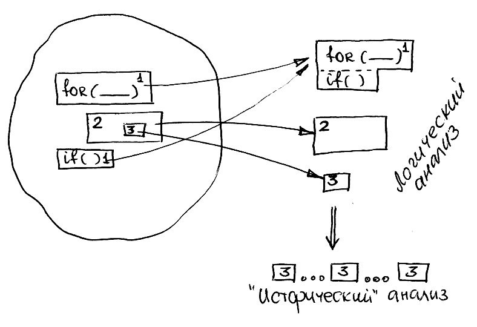

Назначение любой программы - давать определенный результат для любых входных значений. Результат же - это набор значений, удовлетворяющих некоторым условиям, или обладающий некоторыми свойствами. Если посмотреть на программу с этой точки зрения, то она имеет много общего с математической теоремой. Действительно, теорема утверждает, что некоторое свойство имеет место на множестве элементов (например, теорема Пифагора устанавливает соотношение для гипотенузы и катетов всех прямоугольных треугольников). Программа обладает тем же самым свойством: для различных вариантов входных данных она дает результат, удовлетворяющий определенным условиям. Поэтому анализ программы - это не что иное, как формулировка и доказательство теоремы о том, какой результат она дает.

> Анализ программы – формулировка и доказательство теоремы о том, какой результат она дает для всех возможных значений входных переменных.

Убедиться, что теорема верна, можно различными способами. (Обратите внимание - **убедиться, но не доказать**). Точно так же можно убедиться, что программа дает тот или иной результат:

- выполнить программу в компьютере или проследить ее выполнение на конкретных входных данных «на бумаге» (анализ методом единичных проб или «исторический» анализ);

- разбить программу на фрагменты с известным «смыслом» и попробовать логически соединить результаты их выполнения в единое целое (логический, полуформальный анализ). Обычно на таком уровне в математике и выполняется доказательство теорем: шаги доказательства – это аксиомы или уже доказанные теоремы;

- формально доказать с использованием логических и математических методов (например, метода математической индукции), что фрагмент дает заданный результат для любых значений входных переменных (формальный анализ).

Те же самые методы можно использовать, если результат и «смысл» программы не известен. Тогда при помощи единичных проб и разбиения программы на фрагменты с уже известным «смыслом» можно догадаться, каков будет результат. Такой же процесс, но в обратном направлении имеет место при разработке программы. Можно попытаться разбить конечный результат на ряд промежуточных, для которых уже имеются известные фрагменты.

## Исторический анализ

Первое, что приходит в голову, когда требуется определить, что делает программа, это понаблюдать за процессом ее выполнения и догадаться, что она делает. Для этого даже не обязательно иметь под рукой компьютер: можно просто составить на листе бумаги таблицу, в которую записать значения переменных в программе после каждого шага ее выполнения: отдельного оператора, тела цикла. Выскажу еще более кощунственную мысль: наличие отладчика для исторического анализа даже вредно: для улавливания закономерности в последовательности результатов их желательно одновременно видеть, а для этих целей лучше использовать прямой вывод необходимых значений в программе.

```c
int A[10] = {3,7,2,4,9,11,4,3,6,3};
int k, i, s;

for (i = 0, s = A[0]; i < 10; i++)
  if (A[i] > s) s = A[i];
```

Проследим за выполнением программы, записывая значения переменных до и после выполнения тела цикла.

| I   | A[i]  | s до if | s после if | Сравнение |
| --- | ----- | ------- | ---------- | --------- |
| 0   | 3     | 3       | 3          | Ложь      |
| 1   | 7     | 3       | 7          | Истина    |
| 2   | 2     | 7       | 7          | Ложь      |
| 3   | 4     | 7       | 7          | Ложь      |
| 4   | 9     | 7       | 9          | Истина    |
| 5   | 11    | 9       | 11         | Истина    |
| 6   | 4     | 11      | 11         | Ложь      |
| 7   | 3     | 11      | 11         | Ложь      |
| 8   | 6     | 11      | 11         | Ложь      |
| 9   | 3     | 11      | 11         | Ложь      |
| 10  | Выход |         | 11         |           |

Закономерность видна сразу: значение **s** все время возрастает, причем в переменную записываются значения элементов массива. Легко догадаться, что в результате она будет принимать максимальное. Чтобы окончательно убедиться в этом, необходимо поменять содержимое массива и проследить за выполнением программы.

Аналогичные действия можно произвести, используя средства отладки системы программирования: они позволяют выполнять программу «по шагам» в режиме трассировки и следить при этом за значениями интересующих нас переменных.

&nbsp;<Icon name="YinAndYang"/> В «историческом» анализе большое значение имеют неформальная составляющая. Он требует очень развитой интуиции, чтобы уловить зависимость, которая присутствует в обрабатываемых данных и определяет результат. Реально же интуитивное видение результата программы является следствием опыта программирования и тоже является результатом тренировки. Кроме того, многообразие входных данных, с которыми может работать программа, не гарантирует того, что вы сразу заметите закономерность. Перечислим случаи, когда используется «исторический» анализ:

- для сравнительно простых программ, которые невозможно проанализировать логически путем разложения на составные части. В этом случае «исторический» анализ позволяет высказать догадки и предположения о результате работы программы, которые потом доказываются или опровергаются методами логического анализа;

- если логический анализ позволяет разложить программу на составные части с известным результатом, а сформулировать логически результат их совместной работы не удается, то «исторический» анализ можно производить на высоком уровне, рассматривая результаты последовательного исполнения этих частей;

Несмотря на кажущуюся ограниченность «исторического» анализа, можно привести веский довод в его защиту: он является **источником новых знаний** о программе: если хотя бы предположительно неизвестен «смысл» программы, то получить его формальными методами соединения ее составных частей нельзя **(см.3.8)**.

Что же касается входных данных, то они должны быть выбраны на этапе анализа как можно более простыми, чтобы легко можно было уловить закономерность их изменения.

## Логический анализ: cтандартные программные контексты



Как это ни странно, программист при анализе программы не мыслит категориями языка: переменными или операторами, точно так же, как говорящий не задумывается над отдельными словами, а использует целые фразы разговорного языка. Точно так же, любая в меру оригинальная программа на 70-80% состоит из стандартных решений, которые реализуются соответствующими фрагментами – стандартными программными контекстами. Смысл их заранее известен программисту и не подвергается сомнению, поскольку находится для него на уровне очевидности и здравого смысла. Стандартные программные контексты обладают свойством **инвариантности**: они дают один и тот же результат, будучи помещенными в другие конструкции языка, причем даже не в виде единого целого, а по частям. Более того, их общий смысл не меняется, если меняется синтаксис входящих в них элементов. В программе, находящей индекс минимального элемента массива, исключая отрицательны, вы без труда заметите контекст предыдущего примера.

```c
int A[10] = {3,7,2,4,9,11,4,3,6,3};
int k, i, s;

for (i = 0, k = -1; i < 10; i++) {
  if (A[i]<0) continue;
  if (k == -1 || A[i] < A[k]) k=i;
}
```

Он состоит в том, что обязательно должен быть цикл по множеству элементов, сравнение текущего с теми данными, которые характеризуют минимум, и присваивание этому минимуму характеристик текущего элемента, если сравнение прошло успешно (в пользу очередного).
