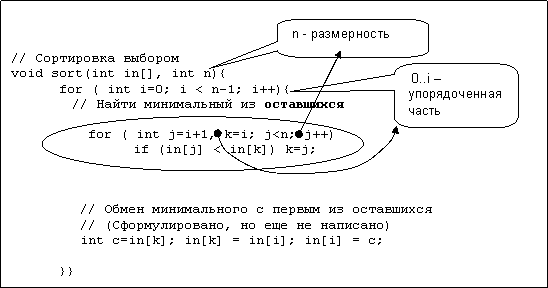

<Pre>
  Учитель: «Гоги, докажи, что треугольник равнобэдренный».<br />
  Ученик: «Мамой клянусь, равнобэдрэнный».
  <br />
  Анекдот.
</Pre>

&nbsp;<Icon name="YinAndYang"/>Прежде всего, уясним, а что, собственно говоря, мы будем доказывать и кому. То, что программа работает правильно на данном примере, или что она будет всегда работать правильно. Самому себе, если мы не окончательно уверены в ее правильности, или другому? В 70-е годы появилась область науки и технологии, которая называлась **верификация программ**. Верификация состоит в формальном доказательстве того, что программа работает правильно. Под понятием правильно понимается то, что при любых входных данных, удовлетворяющих заданным условиям, программа производит результат, также удовлетворяющий выходным условиям. Например, программа сортировки из исходных данных создает упорядоченные. Условие упорядоченности можно сформулировать формально в виде утверждения (предиката). Каждый оператор программы преобразует такие утверждения. Таким образом, программа представляет собой систему преобразований предикатов (систему логических уравнений). Решая ее, получаем требуемое доказательство правильности. Проблема состояла только в том, что само доказательство многократно превосходит по затратам написание самой программы.

На самом деле идей, заложенные в верификации, полезны в проектировании программы. Программист, разрабатывая программу, никогда не пишет ее сразу, целиком. Каждая более-менее независимая часть программы имеет свои входные данные и свой результат – содержательный «смысл» соответствующих переменных в программе. Программист имеет право **доверять самому себе**, используя результат выполнения еще не написанной (или давно уже написанной и позабытой части программы). Поэтому нет необходимости (на самом деле и физической возможности) держать в голове всю программу. Разрабатывая, отлаживая или анализируя один из фрагментов, программист использует все остальные только в виде касающегося их набора условий и утверждений.

Кроме закрепления «смысла» за каждой переменной в процессе проектирования имеет место еще один момент, связанный с формулировкой условий. **Инвариантом** повторяющегося в процессе выполнения фрагмента программы (цикла или рекурсивного вызова) называется условие или утверждение, сохраняющееся от начала любого шага до начала следующего за ним. Формулировка и доказательство сохранения инвариантов являются важной составляющей правильного программирования таких конструкций.

Второй вопрос в том, какими методами мы будем пользоваться. Любое доказательство – это доведение до уровня **очевидности**. Слово «доказать» имеет один корень с «показать», буквально «**до**-того-чтобы-**показать**». Поскольку мы не собираемся заниматься формальной верификацией программ, к строгости доказательства можно относиться лояльно. На практике используется сочетание различных методов:

- формальные математические методы: например, уже упомянутые инварианты циклов и рекурсивных вызовов позволяют обосновать результат выполнения цикла на основе **метода математической индукции**. Можно также привести пример преобразования сложных логических утверждений с использованием законов преобразования из булевой алгебры;

- полуформальная логика. В повседневной жизни мы не пользуемся исчислением предикатов или преобразованием логических выражений, когда решаем математические задачи или доказываем теоремы. И делаем это интуитивно верно. (Даже Шерлок Холмс, хотя и не изучал таких наук, всегда рассуждал логически безупречно). Поэтому тот уровень логики и доказательности, который используется в математике и других точных науках, вполне достаточен и в программировании. Здесь еще одна точка пересечения программирования и математики – в способе мышления и организации умственной деятельности;

- содержательное (образное) представление. Некоторые результаты работы программы можно принимать без доказательств, если они очевидны (буквально **оче-видны**). Графическая схема (рисунок, иллюстрация), либо пример работы программы тоже могут быть доводами в доказательстве правильности работы программы (поскольку и так все видно). Здесь, правда, есть один большой недостаток: рисунок, схема или пример отражают поведение программы для **конкретных** данных, т.е. это доказательство для **частного** случая. Поэтому необходимо рассматривать все возможные комбинации исходных данных (имеется в виду различные варианты и крайние случаи вида: пустой массив, массив из одинаковых элементов, массив без повторяющихся элементов, произвольный массив и т.п.).

Конечно, предъявление образного доказательства не везде принимается всерьез. Например, в геометрии не принято отвечать: «Отрезки равны, потому что это и так видно». Обычно образное представление используется при проведении доказательства – для того, чтобы «увидеть» в задаче элементы, подпадающие под известные теоремы или аксиомы. Аналогично, образная модель работы программы используется для того, чтобы «увидеть» в ней стандартные фрагменты.

И последнее. Доказательство, к сожалению, не дает нового знания. Доказать можно только то, что уже знаешь. Это имеет к анализу программ. При анализе нужно сначала догадаться, что делает или что может делать фрагмент, а потом уже убедиться (доказать). Если не знаешь, что делает программа, то и никакие доказательства здесь не помогут. Получается замкнутый круг. Выход из него основан на других формах умственной деятельности: интуиции, догадке, опыте.

## Метод математической индукции (ММИ)

&nbsp;<Icon name="Math"/>Утверждение справедливо для любого **i**, если оно справедливо при **i = 0**, а из справедливости его при любом произвольном **k** можно доказать его справедливость при **k+1**. Иначе говоря, некоторое условие выполняется на последовательности (возможно бесконечной) шагов, если оно выполняется на первом шаге, а из его выполнения на произвольном текущем шаге следует аналогичное его выполнение на следующем.

ММИ применяется, в основном, для доказательства правильности циклических и рекурсивных программ **(см. 3.7, 7.3)**. В самом методе есть одна тонкость. Утверждается справедливость условия на бесконечной последовательности **частных (конкретных)** шагов. И доказывается это путем сохранения справедливости утверждения от начала до конца одного **общего (абстрактного)** шага. А в этом и заключается один из элементов методики проектирования циклов. Процесс выполнения цикла – это последовательность его конкретных шагов, а описание тела цикла в программе – описание произвольного (абстрактного) шага. Поэтому при разработке тела цикла используются индуктивные утверждения: «Допустим, программа выполнила некоторое количество шагов цикла, сохранив утверждение **A** (вычислив значение **B** для **i** элементов). Необходимо так спроектировать тело цикла, чтобы это утверждение по окончании тела цикла сохранилось с учетом того, что шагов цикла стало на 1 больше (значение **B** вычислилось для **i+1** элементов)».

Рассмотрим ММИ как инструмент доказательства.

`for (i=1, s=A[0]; i<n; i++) if (A[i]>s) s=A[i];`

Почему приведенный фрагмент находит максимум? Согласно ММИ, если утверждение, что **s** - это максимальное значение, справедливо в начале **i**-го шага цикла, т.е. для **i-1** элементов массива, то следует доказать, что в конце шага оно будет справедливо уже для **i** элементов. На самом деле доказывать ничего и не надо, поскольку фраза **if (A[i]>s) s=A[i];** сохраняет свойство переменной **s быть максимумом**: если очередной элемент больше, чем максимальный из предыдущих элементов, то он и становится новым максимумом, иначе сохраняется старый. Обратите внимание на различную интерпретацию значения переменной **s**: при сравнении это – «старый» максимум, а при присваивании – «новый». Само же свойство «быть максимумом» является **инвариантом** цикла: условный оператор в теле цикла сохраняет его от начала шага до конца с учетом текущего элемента массива.

## Программные соглашения и инварианты

**Инвариант цикла**. Особенность цикла состоит в том, что во время выполнения он представляет собой последовательность однотипных шагов, а при проектировании рассматривается как единое целое. Точнее, программист видит **«очередной шаг цикла»**. Для его проектирования не следует «заглядывать» в предыдущий и последующий шаги, во-первых, потому что там будет то же самое, что и на текущем, а во-вторых, потому что это потребует аналогичного перехода назад и вперед и т.д. до бесконечности. Поэтому следует мыслить **индуктивно**, рассматривая текущий шаг как элемент процесса, сохраняющего определенное свойство – **инвариант цикла**. При этом тело цикла при любых условиях его выполнения должна сохранять этот инвариант.

Самый простой пример: пусть программа просматривает строку по словам. Тогда, если очередной шаг цикла получает начало слова, то закончиться он должен на начале следующего. В более сложных случаях, когда цикл выполняется с неравномерным шагом, либо меняет исходные данные, с которыми работает инвариантом является фрагмент, который обрабатывается за один шаг. Например, программа, которая заменяет в строке последовательности одинаковых символов на один такой символ, предваренный числом его повторений (например **srkkkkkkkttttttmk – sr7k6tmk**) за одни шаг обрабатывает либо одиночный символ, либо цепочку одинаковых. В любом случае после всех преобразований в конце текущего шага цикл должен находиться на начале следующего фрагмента.

```c
//----------------------------------------------------------------------23-01.cpp

// "Склеивание" повторяющихся символов

void F(char c[]){

int i=0,k;

while (c[i]!='\0'){           // 1 шаг цикла - 1 символ или цепочка одинаковых
  if (c[i]!=c[i+1]) i++;                                 // единичный символ
  else      {
    for(k=2; c[i]==c[i+k];k++);           // k - длина цепочки

    int j=i+k;                                   // Начало сдвигаемого хвоста

    if (k>=10) c[i++]=k/10+'0';           // Запись цифры десятков

    c[i++]=k%10+'0';                        // Запись цифры единиц

    i++;                                          // Оставить один символ из цепочки

    int m=i;                                     // i остается как начало сдвинутого хвоста

    do { c[m++]=c[j]; }                      // Сдвинуть "хвост"

    while(c[j++]!=0);                         //

  }}
}
```

Обратите внимание, что после записи двух цифр счетчика и пропуска одного символа текущей цепочки повторений мы оказываемся в начале следующего фрагмента строки, но только после того, как остаток фрагмента повторений будет удален путем переноса на его место последующей части строки («хвоста»).

В более широком смысле понятие инварианта можно рассматривать как **программное соглашение**. Это может быть соглашение о допустимых значениях данных, смысловая интерпретация переменных, свойство, сохраняемое программой в рамках определенного фрагмента. При таком взгляде на программу процесс ее разработки может и не быть «непрерывным», она распадается на отдельные фрагменты, которые связаны между собой программными соглашениями. Действительно, в процессе разработки программы программист не держит ее в голове целиком. Он актуализирует только некоторую ее часть, а в ней обеспечивает соблюдение указанных соглашений, устанавливаемых другими частями. Кстати, эти части могут быть еще не написаны (будут написаны позднее).


