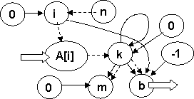
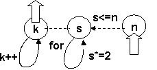

Анализ программы – это не только ответ на вопрос, что она дает в результате своей работы, но и каким образом она это делает. По большому счету – это процесс, обратный программированию: там, зная результат, нужно понять, как его достигнуть.

В основе анализа программы лежат два основных подхода:

- «исторический» (временной) анализ – развертка процесса выполнения программы во времени с целью «увидеть» результат ее работы. Это неформальный подход, основанный на интуиции, опыте, аналогии и т.п.;

- логический (структурный) анализ – формальный подход, разделение программы на части с уже известным результатом (стандартные программные контексты) с последующей попыткой логически объяснить их взаимодействие.

На практике эти два подхода могут сочетаться различным образом, характерные примеры будут рассмотрены ниже. Но для начала необходимо ответить на один риторический вопрос.

<pre>
Где у программы вход и выход?<br/>
«Ищу я выход из ворот, но нет его,<br/>
<br/>
Есть только вход, и то не тот»<br/>
<br/>
<b>В.Высоцкий. «Кругом пятьсот»</b>    
</pre>

Вопрос не так прост, как кажется, ибо отсылает нас к фундаментальным свойствам программы: потоку команд и потоку данных (см. 1.2, 3.8). В традиционной компьютерной архитектуре мы всегда имеем дело с явно заданной последовательностью действий (элементы блок-схемы, операторы языка программирования). Это – поток управления (поток команд). Но наряду с ним существуют причинно-следственные связи между данными по принципу «исходные данные – результат». Они отражают последовательность преобразования данных в программе и называются потоком данных. Описание потока данных представляет собой направленную систему связей между переменными (граф). Прежде всего, связи между значениями переменных бывают прямыми и косвенными:

- прямая связь между переменными устанавливается при присваивании, она направлена от переменных правой части к переменной левой;

- косвенные связи обусловлены тем, что изменения значений переменных могут производиться при выполнении некоторых условия (тогда присваиваемое значение косвенно связано с переменными условия), а также тем, что переменные могут одновременно изменяться внутри одной конструкции (например, тела цикла). Тогда они косвенно зависят от заголовка и взаимозависимы между собой.

```c
for (i=0,m=0,b=-1; i<n; i++)

            if (A[i]>0) k++;

            else      {

                        if (k>m) { m=k; b=i-k+1; }

k=0;

                        }
```



Рассмотрим небольшой пример, в котором попробуем расставить прямые и косвенные связи между переменными:

- переменным i,k,m в разное время присваивается значение 0;

- переменная m явно зависит от k, а b – от i и k. Это задано соответствующими присваиваниями m=k, b=i-k+1;

- заголовок цикла устанавливает косвенную связь между i  и n. В цикле элемент A[i] косвенно зависит от i. В условном операторе значение A[i] косвенно влияет на значение k, а также через следующее условие на m и b.

Граф прямых и косвенных связей позволяет определить, что в программе является входом и выходом:

- выходными данными являются те переменные, которые встречаются последними (по времени выполнения в программе) в левой части операции присваивания (т.е. которые не имеют явных выходных дуг).  В нашем случае на эту роль претендуют m и b;

- переменные, которым в начале выполнения присваиваются исходные значения (инициализация) не могут быть входными (в нашем примере i,k,m,b);

- входными данными программы (фрагмента) могут быть переменные, у которые значения либо не меняются (нет явных входных дуг), либо меняются после использования. В нашем случае – это A[i].

В любом случае для определения входных и выходных данных нужно учитывать не только факт их изменения, но и последовательность, в какой эти изменения происходят.

## «Исторический» поиск закономерностей

В следующем примере алгоритмическая составляющая сведена до минимума: это всего лишь один цикл, в котором используются три переменные. Поэтому логически здесь анализировать вроде бы и нечего.

`for (k=0, m=1; m <= n; k++, m = m * 2);`

Взаимосвязь переменных можно отследить путем «исторического» анализа. Отсюда же получим и результат. Но для начала необходимо установить «входы и выходы» программы:

- переменные k и m устанавливаются в начале цикла, поэтому не могут быть входными;

- между переменными k и m существует косвенная зависимость (взаимосвязь), обе они меняются в одном и том же цикле: первая увеличивается на 1, вторая – удваивается за каждый шаг;

- переменная n не меняется во время выполнения программы, следовательно, она является входной;

- переменные m и n связанные условием продолжения цикла, таким образом, на роль выходной переменной в большей степени претендует k, как наименее связанная со входом.

Затем нужно составить таблицу значений переменных на каждом шаге цикла, из которой видно, что между переменными k и m имеется соотношение 2k=m. Цикл завершается, когда значение m превысит n,  т.е. между входной и выходной переменной устанавливается соотношение 2k=m>n. Математическая формулировка: k –  первая степень двойки, превышающая заданное число. Или по другому (см.1.3): количество двоичных разрядов, необходимое для размещения заданного числа.


k

0

1

2

3

4

5

6

7

m

1

2

4

8

16

32

64

128

m<=n

да

да

да

да

да

да

да

нет


<pre>
Исключительно  логический анализ<br/>
«Музыку я разъял, как труп. Поверил<br/>
<br/>
Я алгеброй гармонию».<br/>
<br/>
<b>А.С.Пушкин «Моцарт и Сальери».</b>
</pre>

Используя перечисленный в 2.4 набор контекстов, можно анализировать достаточно сложные программы, руководствуясь только логическими рассуждениями. Попробует сделать это на следующем примере.

```c
void main(){

for (int a=100000; a<200000; a++){                      // 1

            int n,k,kp=10,m=1;                                 // 2,6    

            for(n=a;n!=0;n=n/10){                              // 3

                        k=n%10;                                   // 3

                        if (k>=kp){ m=0; break; }             // 2,5

                        kp=k;                                        // 4

                        }

            if (m!=0) printf("%d\n",a);             // 2,6

            }}
```

 

1. Основной цикл for формально перебирает значение переменной a в диапазоне от 100000 до 200000. Над этим числом в теле цикла делаются некие преобразования, а затем оно может быть выведено при выполнении неизвестного пока нам условия. Следовательно, программа ищет и выводит числа из заданного диапазона, удовлетворяющие некоторому условию.

2. Условием вывода является значение переменной m, не равное 0. Эта переменная  является признаком, которая в начале тела цикла устанавливается всегда в 1, а затем может быть сброшена (когда, пока не ясно).

3. Из стандартных контекстов арифметических задач (см. 4.2) – цикл последовательного деления на 10 отбрасывает по одной десятичной цифре справа от исходного числа (n), остаток от деления этого числа на 10 является очередной младшей цифрой. Таким образом, внутренний цикл дает в переменной k последовательно цифры числа, начиная с правой. Для тех, кто не до конца понял логику, можно «исторически» развернуть конкретный пример для произвольного значения a: a=24365, n=24365,2436,243,24,2,0,  k=5,6,3,4,2.

4. Переменная kp запоминает значение k перед переходом к следующему шагу. Таким образом, оно будет хранить предыдущее значение k, т.е. предыдущую цифру, но с учетом последовательности их получения – справа.

5. Теперь можно заняться «смыслом» признака m. Условие во внутреннем цикле можно прочитать так: если очередная цифра больше или равна предыдущей (стоящей справа), то признак сбрасывается и цикл прекращается. Обратное утверждение: если очередная цифра слева меньше, то цикл продолжается. Тогда признак сохранит значение 1, если последовательность цифр при просмотре справа налево будет убывающей (слева направо - возрастающей). В стандартных контекстах (2.4) этот технологический прием используется для проверки свойства всеобщности. Резюме: признак m=1 обозначает убывание последовательности цифр числа при просмотре их справа налево.

6. Первоначально признак m устанавливается в 1, а значение «предыдущей цифры» kp=10 (больше любой цифры). Это связано с тем, что на первом шаге у самой младшей цифры нет предыдущей. Таким образом, начальные условия подтверждают наше предположение: программы выводит числа из заданного диапазона, цифры которых находятся в порядке строгого возрастания.

Логический анализ дает положительные результаты, если составные части программы являются достаточно независимыми. В противном случае потребуется дополнительный анализ взаимодействия выделенных фрагментов в процессе их выполнения, т.е. «исторический» ее анализ с целью увидеть вещи, невидимые невооруженным глазом.

## Вещи, невидимые невооруженным глазом

Заключительный «исторический» анализ отличается от обычного: он выполняется «на высоком уровне», т.е. рассматривает взаимодействие не отдельных операторов, а целых фрагментов программы. Попытаемся «прочитать» и понять следующий пример.

```c
int F(int A[], int n) {

int s,k,I;

for (s=-1,m=0, k=0, i=1; i<n; i++)

            if (A[i-1]<A[i]) k++;

            else      {

if (k>m) { m=k; s=i-k-1; } 

k=0; }

return s; }
```

Для начала просто перечислим известные «ключевые фразы» и определим их смысл:

1. Смысл цикла for() - последовательный просмотр элементов массива, i- индекс текущего элемента.

2. Смысл переменной m из выражения if (k>m) m=k; - выбор максимального значения из последовательности получаемых значений k.

3. Параллельно с запоминанием максимального значения к запоминается выражение i-k-1, которое, очевидно, как-то связано с расположением искомого фрагмента или свойства в массиве, поскольку использует индекс в нем.

4. A[i] - текущий элемент массива, A[i-1] - предыдущий элемент массива, A[i-1]<A[i] имеет смысл - два соседних элемента массива (предыдущий и текущий) расположены в порядке возрастания.

5. Смысл переменной k из выражения if () k++; - переменная-счетчик.

6. Смысл фрагмента if (A[i-1]<A[i]) k++; - подсчет количества пар соседних элементов, расположенных в порядке возрастания.

Далее необходимо соединить фрагменты в единое целое. Поскольку все они включены в тело одного цикла, необходимо промоделировать поведение программы на нескольких его шагах, точнее попытаться оценить возможные сочетания их последовательного выполнения. В нашем примере необходимо ответить на вопрос, как поведет себя программа при разных сочетаниях возрастающих и убывающих пар.

6. После фиксации очередного значения k на предмет определения максимума в m, его значение сбрасывается, то есть процесс подсчета начинается сначала.

7. Очевидно, что процесс подсчета k связан каким-то образом с процессом  возрастания значений A[i]. Если несколько значений расположены подряд в порядке возрастания, то выполняется одна и та же ветка if , а k последовательно увеличивается. При появлении первого убывающего значения в последовательности счетчик сбрасывается. Таким образом счетчик k считает количество подряд расположенных возрастающих пар.

i=

0

1

2

3

4

5

6

7

8

A[]

3

4

5

2

1

3

4

6

2

k=0

 

k++

1

k++

2

k=0

0

k=0

0

k++

1

k++

2

k++

3

k=0

0

m=0

 

 

 

m=k

2

 

 

 

 

m=k

3

s=-1

 

 

 

s=i-k-1

0            

 

 

 

 

s=i-k-1

4             

 

8. Для понимания того, какое же значение фиксируется в качестве максимального, необходимо обратить внимание на место,  в котором находится этот фрагмент. Максимум фиксируется перед тем, как счетчик сбрасывается при обнаружении убывающей пары, то есть по окончании процесса возрастания. Таким образом, переменная m сохраняет значение максимальной длины последовательности возрастающих значений в массиве, а s – индекс ее начала.

9. Есть еще тонкость, которая не нарушает  получившийся идиллии. Если несколько пар расположены в порядке убывания, то фиксация максимума будет выполняться для каждой их них, но реально сработает только для первой, поскольку счетчик уже будет сброшен.

Еще один показательный пример связан с «историческим» анализом алгоритмов обменной сортировки. В исходном постановке принцип обменной сортировки формулируется так: при последовательном просмотре пар соседних элементов производится их обмен, если они не находятся в порядке возрастания. Ясно, что рано или поздно в массиве установится упорядоченность. Отсутствие обменов при просмотре его от начала до конца и является условием упорядоченности, т.е. завершения сортировки.

```c
// Простая обменная сортировка

void sort(int A[], int n){

int i,found;

do {       found =0;                                  // Сбросить счетчик обменов

             for (i=0; i<n-1; i++)                    // Просмотр массива от начала до конца

                        if (A[i] > A[i+1])              // Если пара в порядке возрастания,

                        { int cc; cc = A[i]; A[i]=A[i+1]; A[i+1]=cc;

                        found++;                       // перестановка и увеличение счетчика

                        }

              } while(found !=0); }                   // Просмотр повторяется, пока есть перестановки
```

Усовершенствовать сортировку можно, зная свойства алгоритма, которые можно установить только в результате его «исторического» анализа. Если рассмотреть несколько последовательных шагов цикла, то можно заметить, что элемент с большим значением будет перемещаться вслед за текущим индексом. Такой элемент назвали «пузырьком», а саму сортировку – «пузырьковой».




«Пузырек» перемещается вверх по массиву, пока не достигнет значения, большего себя. Тогда новое значение становится «пузырьком». Кажется, что в массиве отсутствует упорядоченная часть, он упорядочивается «одновременно везде». Однако, это не совсем так. В процессе «исторического» анализа можно увидеть еще одну особенность: часть массива, расположенная за местом последнего обмена, является упорядоченной.

Отсюда следует усовершенствование обменной сортировки:

- граница упорядоченной части b первоначально устанавливается по правой границе массива;

- при перестановке элементов запоминается индекс – место перестановки b1;

- по окончании цикла будет запомнено место последней перестановки;

- цикл является итерационным. Определенное на текущем шаге место последней перестановки становится новой границе упорядоченной части и просмотра – b=b1;

- при отсутствии перестановок начальное значение b1=0  сохраняется и сортировка завершается.

```c
// Сортировка с границей упорядоченной части –

// однонаправленная Шейкер-сортировка

 void sort(int A[], int n){                           // b – граница упорядоченной части

 int i,b,b1;                                              // b1 – место последней перестановки

              for (b=n-1; b!=0; b=b1) {            // становится новой границей

              b1=0;

              for (i=0; i<b; i++)

                        if (A[i] > A[i+1]) {

                        int cc = A[i]; A[i]=A[i+1]; A[i+1]=cc;

                        b1=i;                             // Запомнить место перестановки

                        }

              }}
```

Рассмотрим еще один случай анализа программы с «плохим» циклом (**см.3.7**). Цикл, в котором действия, выполняемые в теле цикла, влияют на условия его выполнения, трудно поддаются логическому анализу. Рассмотрим, например, следующую сортировку.

```c
// «Непонятная» сортировка

void sort(int in[],int n){

int i,j,k,c;

for (i=1; i<n; i++){

for (k=i; k !=0 && in[k] < in[k-1]); k--)

                        { c=in[k]; in[k]=in[k-1]; in[k-1]=c;}                        // Обмен соседей

            }}
```

Здесь уже содержится подсказка в том, что это именно сортировка. Но в ней мало пользы. Можно предположить, что она относится к обменной сортировке, поскольку в ней имеет место обмен соседей. Однако условие завершения цикла включает сравнение значений в этой же паре. А как мы уже видели, обменная сортировка выполняется в фиксированных границах.

Поэтому даже знание того, что это – сортировка, мало что дает для понимания ее сущности. Помочь может только исторический анализ – наблюдение за работой программы. Можно заметить, что часть массива от 0 до i-1 является уже упорядоченной (хотя практика показывает, что не все это видят, так что наука здесь бессильна). Тогда все становится на свои места: внутренний цикл «погружает» очередной элемент в упорядоченную часть путем последовательности обменов с предыдущим элементом, пока он не встретит меньшего себя, либо не достигнет «дна». В данном случае свойство упорядоченности является инвариантом внешнего цикла (см.3.7), а внутренний цикл его сохраняет. Таким образом, это  - не обменная сортировка, а вставка погружением очередного элемента в упорядоченную часть.

Все перечисленные примеры свидетельствуют еще об одном аспекте: свойства программы, «не видимые невооруженным глазом», наблюдаются в процессе «исторического» анализа на определенных сочетаниях данных. Вполне возможно, что на некоторых сочетаниях интересующие свойства программ могут не проявиться и не быть замеченными.

## Вопросы без ответов

Провести анализ программы в следующем порядке:

- оформить фрагмент в виде main. Определить переменные, их «смысл» и назначение (входные, выходные), инициализировать входные переменные константами (при наличии оператора return оформить фрагмент в виде функции с вызовом в main);

- провести анализ программы, выделить стандартные программные контексты, содержательно сформулировать результат;

- обосновать численное значение результата для заданных константами входных данных.

```c
//--------------------------------------------------------1

for ( int i=n1; !(n1 % i ==0 && n2 % i ==0); i--);

//--------------------------------------------------------2

for ( int n=a; n%a!=0 || n%b!=0; n++);

//--------------------------------------------------------3

for ( int n=2; n<a; n++)

      if (a%n==0) break;

if (n==a) return 1;

return 0;

//--------------------------------------------------------4

for ( int n=2; n<a && a%n!=0; n++);

if (n==a) return 1;

return 0;

//--------------------------------------------------------5

for ( int s=0,n=2; n<a; n++)

      if (a%n==0) s++;

if (s==0) return 1;

return 0;

//--------------------------------------------------------6

for ( int s=0,n=2; n<a; n++)

      if (a%n==0) { s=1; break; }

return s;

//--------------------------------------------------------7

int n=2; while(a%n!=0){

            n++;

            if (n==a) return 1;

            } return 0;

//--------------------------------------------------------8

for ( int i=0; i<n; i++)

      if (A[i]<0) break;

if (i==n) return 1;

return 0;

//--------------------------------------------------------9

for ( int i=0; i<n && A[i]>0; i++);

if (i==n) return 1;

return 0;

//--------------------------------------------------------10

for ( int s=0,i=0; i<n; i++)

      if (A[i]<0) s++;

if (s==0) return 1;

return 0;

//--------------------------------------------------------11

for ( int s=0,i=0; i<n; i++)

      if (A[i]<0) { s=1; break; }

return s;

//--------------------------------------------------------12

int i=0; while(A[i]>0){

            i++;

            if (i==n) return 1;

            } return 0;

//--------------------------------------------------------13

for (n=a, s=0; n!=0; n=n/10)

      { k=n%10; s=s+k;}

//--------------------------------------------------------14

for (n=a, s=0; n!=0; n=n/10)

      { k=n%10; if (k>s) s=k;}

//--------------------------------------------------------15

for (n=a, s=0; n!=0; n=n/10)

      { k=n%10; s=s*10+k;}

//--------------------------------------------------------16

for (i=0, n=a; n!=0; i++, n=n/10);

for (A[i--]=-1, n=a; n!=0; i--, n=n/10)

      A[i]=n % 10;

//--------------------------------------------------------17

for (j=0,a=10; a<30000; a++){

            for (n=a, s=0; n!=0; n=n/10)

           { k=n%10; s=s+k;}

            if (a==s*s*s) A[j++]=a;

}

//--------------------------------------------------------18

for (j=0,a=10; a<v; a++){

            for (n=a, s=0; n!=0; n=n/10)

           { k=n%10; s=s*10+k;}

            if (a==s) A[j++]=a;

            }

//--------------------------------------------------------19

for (i=0; i<n; i++){

            if (A[i]<0){

                        for (j=i; j<n-1;j++) A[j]=A[j+1];

                        n--;

                        i--;

                        }}

//--------------------------------------------------------20

for (i=1,k=0; i<n; i++)

            if (A[i]>A[k]) k=i;

for (j=k; j<n-1;j++) A[j]=A[j+1];

            n--;

//--------------------------------------------------------21

for (i=0,a=2; a<v; a++){

            for (n=2; n<a; n++)

           { if (a%n==0) break; }

            if (n==a) A[i++]=a;

            }

A[i]=0;

//--------------------------------------------------------22

for (i=0,a=2; a<v; a++){

            for (s=0,n=2; n<a; n++)

           if (a%n==0) { s=1; break; }

            if (s==0) A[i++]=a;

            }

A[i]=0;

//--------------------------------------------------------23

for (j=0,i=0; i<n ; i++){

            for (m=2; m<A[i]; m++)

           { if (A[i]%m==0) break; }

            if (m==A[i]) B[j++]=A[i];

            }

B[j]=0;

//--------------------------------------------------------24

for (j=0,i=0; i<n ; i++){

            for (s=0,m=2; m<A[i]; m++)

           if (A[i]%m==0) { s=1; break; }

            if (s==0) B[j++]=A[i];

            }

B[j]=0;

//--------------------------------------------------------25

for (i=0; i<n ; i++){

            for (m=2; m<A[i]; m++)

           { if (A[i]%m==0) break; }

            if (m==A[i]) {

                        for (j=i; j<n-1;j++) A[j]=A[j+1];

                        n--;

                        i--;                   

                        }}

//--------------------------------------------------------26

for (j=0,i=0; i<n ; i++){

            for (s=0,m=2; m<A[i]; m++)

           if (A[i]%m==0) { s=1; break; }

            if (s==0) {

                        for (j=i; j<n-1;j++) A[j]=A[j+1];

                        n--;

                        i--;                   

                        }}

//--------------------------------------------------------27

for (i=0; i<n-1 && val !=1; i++){

            for (m=2; val % m !=0; m++);

            val /= m; A[i] = m;

            }

A[i] = 0;

//--------------------------------------------------------28

v=A[0]+1;

do         {

            v--;

            for (i=0,s=0;i<n;i++)

                        if (A[i]%v!=0) { s=1; break; }

            } while(s==1);

//--------------------------------------------------------29

for (i=0; i<n; i++)

            if (A[i]%v!=0) { v--; i=-1; }

//--------------------------------------------------------30

for (i=0,a=2; a<v && i<m-1 ; a++){

            for (s=0,j=0; j<i; j++)

           if (a%A[j]==0) { s=1; break; }

            if (s==0) A[i++]=a;

            }

A[i]=0;

//--------------------------------------------------------31

for (i=0; i<n-1; i++)

for (j=i+1; j<n; j++)

           if (c[i]==c[j]) return i;

return -1;

//--------------------------------------------------------32

for (s=0,i=0; i<n; i++){

            for (k=0,j=0; j<n; j++)

                    if (c[i]==c[j]) k++;

            if (k>s) s=k,b=i;

            }

//--------------------------------------------------------33

for (s=0,i=0; i<n-1; i++)

    if (A[i]==A[i+1]){

            for (k=2; i+k<n && A[i]==A[i+k]; k++);

            if (k>s) s=k,b=i;

            }

//--------------------------------------------------------34

for (k=0, m=1; m <= n; k++, m = m * 2);

return k-1; }

//--------------------------------------------------------35

for (i=0,j=n-1; i < j; i++,j--)

      { k = c[i]; c[i] = c[j]; c[j] = k; }

//--------------------------------------------------------36

for (i=0; i<n; i++){

     for (j=k1=k2=0; j<n; j++)

            if (c[i] != c[j])

           { if (c[i] < c[j]) k1++; else k2++; }

     if (k1 == k2) return i;

     }

return -1;

//--------------------------------------------------------37

for (s=0, i=0; i<n-1; i++){

            for (j=i+1, m=0; j<n; j++)

            if (c[i]==c[j]) m++;

            if (m > s) s=m, b=i;

            }

//--------------------------------------------------------38

for (i=k=m=0; i<n-1; i++)

            if (c[i]==c[i+1]) k++;

            else      {

                        if (k > m) m=k, b=i-k-1;

                        k=0;

                        }

//--------------------------------------------------------39

for (s=0,i=0; i<n; i++){

            if (A[i]<0) continue;

            if (A[i]==0) break;

            s=s+A[i];

            }

//--------------------------------------------------------40

for (s=0,i=0; i<n && A[i]>0; i++)

            s=s+A[i];

//--------------------------------------------------------41

for (k=0,s=0,i=0; i<n && k==0; i++){

            if (A[i]<0) k=1;

            s=s+A[i];

            }

//--------------------------------------------------------42

for (s1=0,s2=0,i=0,j=n-1; i<=j;){

            if (s1<s2) s1+=A[i],i++;

            else s2+=A[j],j--;

            }

return i;

//--------------------------------------------------------43

for (s=0,i=0; i<n; i++){

            if (i%2==0)        s=s+A[i];

            else s=s-A[i];

            }

//--------------------------------------------------------44

for(j=0;n!=0;j++){

            for (k=0,i=1; i<n; i++)

                        if (A[i]<A[k]) k=i;

            B[j]=A[k];

            for (;k<n-1;k++) A[k]=A[k+1];

            n--;

            }

//--------------------------------------------------------45

for(j=0,max=A[0];j<n;j++)

            if (A[j]>max) max=A[j];

for(j=0;j<n;j++){

            for (k=0,i=1; i<n; i++)

                        if (A[i]<A[k]) k=i;

            B[j]=A[k];

            A[k]=max+1;

            }

//--------------------------------------------------------46

while(n!=0){

            for (k=0,i=1; i<n; i++)

                        if (A[i]<A[k]) k=i;

            c=A[k]; A[k]=A[n-1]; A[n-1]=c;

            n--;

            }

//--------------------------------------------------------47

for (j=0,a=10; a<v; a++){

            for (s=0,n=a, s=0; n!=0; n=n/10){

               k=n%10;

               if (k!=0 && a%k!=0) { s=1; break; }

               }

            if (s==0) A[j++]=a;

            }

//--------------------------------------------------------48

for (i=0; i<n-1; i++)

    if (A[i]==A[i+1]){

            for (j=i; j<n-2;j++) A[j]=A[j+2];

            n=n-2;

            i--;

            }

//--------------------------------------------------------49

for (i=0,k=-1; i<10; i++){

            if (A[i]<0) continue;

            if (k==-1) k=i;

            else

            if (A[i]<A[k]) k=i;

            }

//--------------------------------------------------------50

for (i=0,s=0,k=0; i<10; i++)

     if (A[i]<0) k=1;

     else {

            if (k==1) s++;

            k=0;

            }

//--------------------------------------------------------51

for (i=0,s=0; i<10; i++)

     if (A[i]>s) s=A[i];

//--------------------------------------------------------52

for (i=1,k=0; i<10; i++)

     if (A[i]>A[k]) k=i;

//--------------------------------------------------------53

for (i=0,k=-1; i<10; i++)

{ if (A[i]<0) continue;

if (k==-1) k=i;

else

     if (A[i]<A[k]) k=i;

}

//--------------------------------------------------------54

for (i=0,k=-1; i<10; i++)

{ if (A[i]<0) continue;

if (k==-1 || A[i]<A[k]) k=i;

}

//--------------------------------------------------------55

for (i=0,s=0; i<10; i++)

     if (A[i]>0) s++;

//--------------------------------------------------------56

for (i=1,s=0; i<10; i++)

     if (A[i]>0 && A[i-1]<0) s++;

//--------------------------------------------------------57

for (i=1,s=0,k=0; i<10; i++){

if (A[i-1]<A[i]) k++;

else{

if (k>s) s=k;

            k=0;

            }}

//--------------------------------------------------------58

for (i=0,s=0,k=0; i<10; i++)

     if (A[i]<0) k=1;

else

     { if (k==1) s++; k=0; }

//--------------------------------------------------------59

for (s=1, i=1; i<=n; i++) s = s * i;

//--------------------------------------------------------60

for (s=1, i=0; i<=n; i++) s = s * 2;

//--------------------------------------------------------61

for (s=0, i=0; i<n; i++) s = s + A[i];

//--------------------------------------------------------62

for (s=1, i=0; i<10; i++) s = s * A[i];

//--------------------------------------------------------63

for (n=2; n<a; n++)

     { if (a%n==0) break; }

if (n==a) puts("Good");

//--------------------------------------------------------64

for (s=0,n=2; n<a; n++)

     { if (a%n==0) s++; }

if (s==0) puts("Good");

//--------------------------------------------------------65

for (i=0; i<n; i++)

     if (A[i]<0) break;

if (i==n) puts("Good");

//--------------------------------------------------------66

for (i=2; i<a; i++)

     if (a%i==0) break;

if (i==a) puts("Good");

//--------------------------------------------------------67

for (s=A[0], i=1; i < 10; i++)

     A[i-1] = A[i];

A[9] = s;
```