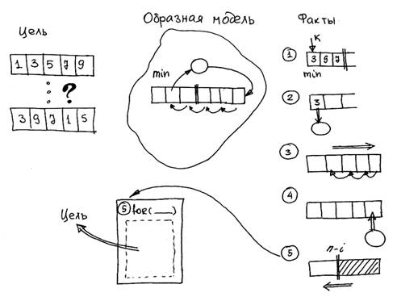

Допустим, Вы изучили синтаксис языка программирования, то есть знаете, как пишутся выражения, операторы, функции, и что значит каждое из них в отдельности. Допустим, Вы разобрались в стандартных программных контекстах и обладаете «джентльменским набором» программистских фраз и умеете «читать» чужие программы. Допустим, Вы слышали о технологии структурного программирования – модульного, нисходящего, пошагового, «без goto». И что же? Как правило, даже при понимании сущности программы, которую необходимо разработать, начинающий не знает, с чего начать  и как соединить воедино все известные ему факты, имеющие к ней отношение. Видимо, есть еще нечто, не имеющее отношение к перечисленному выше. Попытаемся очертить границы этой части процесса проектирования программы:

- то, что язык программирования, как таковой, не имеет отношения к процессу написания программ – это факт из  того же разряда, что столярный инструмент не гарантирует качества той же табуретки и не определяет последовательность технологических операций при ее изготовлении. Отсюда следует практическая бесполезность в этом плане многочисленной литературы по системам программирования;

- любая технология программирования имеет отношение прежде всего к формальной стороне проектирования. Так, структурное программирование предполагает последовательное движение от внешних программных конструкций к внутренним, но откуда берутся эти конструкции – не говорит;

- программы не создаются из набора заготовок путем их механического или случайного соединения. Даже если известны составные части программы, в какой последовательности их соединять?

## Образная и логическая стороны программирования

Все эти вопросы останутся без ответа, если мы ограничимся формальной стороной процесса т.е. исключительно технологией программирования. Но в самом начале на любом  шаге проектирования программы имеют место элементы образного представления программы. Попробуем взглянуть на все это с максимально широких позиций.

Мыслительная и творческая деятельность человека имеет две формы: образно-художественную и формально-логическую. Есть основания связывать их с различием функционирования правого (образного) и левого (логического) полушария головного мозга. Инженерному и научному подходам ближе формально-логическое мышление:  здесь человек оперирует ограниченным числом четко отделенных друг от друга объектов на основе строгих формальных или логических законов. Наоборот, образ является неделимой сущностью и всегда воспринимается как единое целое. Манипулирование над образом состоит в непосредственном «видении» процесса его изменения. К образному мышлению относятся также такие понятия как интуиция, опыт, аналогия и т.п.. Хотя образное мышление традиционно воспринимают как составляющую художественного творчества и необходимый элемент гуманитарных наук, в технических и технологических отраслях он тоже является важным элементом. Вообще, без него невозможно получение нового знания, ибо любая формальная система допускаем манипулирование только в собственных рамках, что, естественно, ограничивает ее сверху (**см. также 3.8**).

В процессе разработки программы образная сторона заключается в представлении программы в виде целостной «движущейся картинки», из которой очевидно, как выполняется процесс, приводящий к результату. Словесные формулировки алгоритма типа «переместить выбранный элемент к концу массива» уже сочетают в себе образное и формально-логическое (алгоритмическое) описание действия. Следовательно, программирование – это движение в направлении от образной модели к словесным формулировкам составляющих действий, а уже затем к формальной их записи на языке программирования.

Попробуем более подробно определить составляющие этого процесса.

1. Результат работы программы. Целью выполнения любой программы является получение результата, а результат – это данные с определенными свойствами. Например, целью программы сортировки является создание последовательности из имеющихся данных, расположенных в порядке возрастания. Точно так же любой промежуточный шаг программы имеет свою цель: получить данные с нужными свойствами в нужном месте. Как правило, постановка задачи начинается с формулировки результата. Для простого случая он может быть задан в самой постановке задачи, а в сложных случаях, особенно если речь идет о заказчике, не очень хорошо владеющим формальной стороной проблемы, его требования к исполнителю (программисту) могут звучать как «Сделайте мне красиво».

2. Образная модель программы. Формальное проектирование программы не продвинется ни на шаг, если программист «не видит», как это происходит. То есть первоначально действующая модель программы должна присутствовать в голове. Понятно, что к формальной логике это не имеет никакого отношения. Это – область образного мышления, (правого полушария). Изобразительные средства здесь уместны любые – словесные, графические. Здесь работают интуиция, аналогия, фантазия и другие элементы творческого процесса. На этом уровне справедлив тезис, что программирование – это искусство. Насколько подробно программист «видит» модель в движении и насколько он способен описать это словами – настолько он близок к следующему этапу проектирования.

3. Факты, касающиеся программы. Формальная сторона проектирования начинается с перечисления фактов, касающихся образной модели программы. К таковым относятся: переменные и их смысловая интерпретация, известные программные решения и соответствующие им стандартные программные контексты. Сразу же надо заметить, что речь идет не об окончательных фрагментах программы, а о фрагментах, которые могут войти в готовую программу. Иногда при их включении потребуется доопределить некоторые параметры (например, границы выполнения цикла, которые не видны на этапе сбора фактов). Иногда они могут быть эквивалентно преобразованы (то есть иметь другой синтаксис). Умение видеть в алгоритме известные частные решения тоже приобретается с опытом: для этого и нужно учиться «читать» программы.

По поводу этого пункта следует указать на важнейшую роль в  этом процессе естественного языка (речи). Человек мыслит образами, а речь его представляет собой уже формально-логическую структуру. Она состоит из отдельных единиц – слов, их взаимосвязь – синтаксис и смысл – семантика, также подчинены определенным законам. Понятно, что естественный язык многообразен, словами в нем могут быть выражены как образные (например, поэзия), так и формально-логические системы (например, математика). Для программирования как раз важно, что переход от образной модели к ее известным составляющим состоит в словесных формулировках. Если Вы не способны сформулировать свои образные представления о процессе работы программы в виде словесных формулировок отдельных действий, дальше двигаться бесполезно. Поэтому вопреки науки о том, что этого пока нельзя сделать, программирование уже давно ведется на естественном языке!!!

4. Выстраивание программы из набора фактов.  Эта часть процесса программирования вызывает наибольшие затруднения, ибо здесь начинается то, что извне обычно и воспринимается как «программирование»: написание текста программы. Особенность заключается в том, что обычно фрагменты взаимосвязаны друг с другом прямо по структуре алгоритма или косвенно через данные. Различие подходов состоит в том, в какой последовательности в программу включаются фрагменты (по отношению к гипотетической готовой программе), с какой стороны начать этот процесс и в каком направлении двигаться.

«Историческое» проектирование  соответствует естественному ходу рассуждений по линии наименьшего сопротивления. Программист просто записывает очередной оператор, который по его мнению должен выполняться программой в процессе ее работы. Ошибочность такого принципа состоит в том, что текст программы и последовательность ее выполнения - это не одно и то же и расхождение между ними рано или поздно обнаружится. Хорошо, если это случится, когда большая часть программы уже написана, и проблема будет скорректирована несколькими «заплатками» в виде операторов goto. Заметим, что «историческим» подходом грешны не только программы, но и любые другие структурированные тексты (например, магистерская диссертация), если автор не уделяет должного внимания логике их построения.

Восходящее проектирование - проектирование программы «изнутри», от самой внутренней конструкции к внешней. Привлекательность этого подхода обусловлена тем, что внутренние конструкции программы - это частности, которые всегда более «на виду», чем внешние конструкции, реализующие обобщенные действия. Частности составляют большую часть фактов в образной модели программы и, что самое ценное, могут быть непосредственно записаны на языке программирования. Поэтому программа в процессе своего написания не нуждается, как и в «историческом» подходе, в иных средствах описания, кроме самого языка программирования. Недостатки тоже очевидны:

- не факт, что программу удастся «свести» в единое целое, особенно сложную;

- поскольку параметры внутренних конструкций могут зависеть от внешних (например, диапазон поиска минимального значения во внутреннем цикле зависит от шага внешнего цикла), то внутренние конструкции - не есть «истины в последней инстанции» и по мере написания программы тоже должны корректироваться.

Нисходящее проектирование - проектирование программы, начиная с самой внешней ее конструкции. Самое трудное, но самое правильное движение в  направлении от общего к частному. Первая трудность заключается в неочевидности выбора самой внешней (общей, объемлющей) конструкции – частности всегда виднее. Вторая, менее очевидная: ненаписанная часть программы  (внутреннее содержимое конструкции) также должна быть сформулирована в общем виде, т.е. словесно. Отсюда следует, что нисходящее проектирование должно сочетать в тексте программы формальное (то есть записанное на языке программирования) и неформальное (то есть словесное или даже образное) представление.

«Грязное» программирование – заключается в создании макета, воспроизводящего основные свойства проектируемой программы. В дальнейшем все изменения/дополнения сохраняют эти первоначальные соотношения.

5. Последовательное приближение к результату. Сложную программу не всегда удается спроектировать за один этап. Цикл «результат – образная модель – факты – выстраивание программы» может повторяться. При выстраивании программы может оказаться, что ненаписанная часть программы нуждается в дополнительном осмыслении, начиная с образной модели. При этом само направление выстраивания программы, т.е. собственно технология программирования, имеют большое значение: она в большей или меньшей степени гарантируется правильность и неприкосновенность уже написанного.