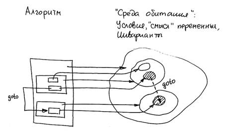

<pre>
«ГЛАВА I. СУТЬ ДЕДУКТИВНОГО МЕТОДА ХОЛМСА. <br/>

Шерлок Холмс взял с камина пузырек и вынул<br/>

из аккуратного сафьянового несессера…».<br/>
<br/>
<b>Артур Конан-Дойль. «Знак четырех».</b>
</pre>

## От общего к частному

Технология структурного программирования в самой краткой формулировке есть нисходящее проектирование, т.е. выстраивание текста программы, точнее алгоритмической компоненты, от общего к частному, от внешней конструкции к внутренней. Естественно, что надо знать, из чего выстраивать. В идеале, у опытного программиста действительно очередная нужная конструкция появляется «из головы». Но это не значит, что он не имеет общего плана действий и обобщенного представления процесса, который реализуется проектируемой программой.

Именно поэтому в 3.1 технология программирования была обозначена как заключительный этап выстраивания программы из имеющегося набора фрагментов. Перед этим необходимо пройти другие этапы:

- формулировка целей (результатов) работы программы;

- образное представление  процессы ее работы (образная модель);

- выделение из образной модели фрагментов: определение переменных и их смыслового наполнения, стандартных программных контекстов.


Попробуем теперь встроить в общую схему процесса проектирования самое трудное направление «движения» при построении программы – от общего к частному. И тогда получим примерно такую картину.


1. Исходным состоянием процесса проектирования является более или менее точная формулировка цели алгоритма, или результата, который должен быть получен при его выполнении. Формулировка, само собой, производится на естественном языке.

2. Создается образная модель происходящего процесса, используются графические и какие угодно способы представления, образные «картинки», позволяющие лучше понять выполнение алгоритма в динамике;

3. Выполняется сбор фактов, касающихся любых характеристик алгоритма, и попытка их представления средствами языка. Такими фактами является наличие определенных переменных и их «смысл», а также соответствующих им программных контекстов. Понятно, что не все факты удастся сразу выразить в виде фрагментов программы, но они должны быть сформулированы хотя бы на естественном языке;

4. В образной модели выделяется наиболее существенная часть – «главное звено», для которой подбирается наиболее точная словесная формулировка;

5. Производится определение переменных, необходимых для формального представления данного шага алгоритма и формулируется их «смысл»;

6. Выбирается одна из конструкций - простая последовательность действий, условная конструкция  или цикл. Составные части выбранной формальной конструкции (например, условие, заголовок цикла) должны быть переписаны в словесной формулировке в виде цели или результата, которые должны давать эти части алгоритма.

7. Для оставшихся неформализованных частей алгоритма (в словесной формулировке) - перечисленная последовательность действий повторяется. Обычно разработка образного представления программы опережает ее «выстраивание», поэтому следующим этапом для неформализованной части алгоритма может быть п.4 (в лучшем случае, при его проработке в образной модели) или п.1-3. В любом случае для вложенных конструкций мы возвращаемся на предыдущие этапы проектирования.

Здесь мы видим много непривычного:

- на любом промежуточном шаге программа состоит из смеси конструкций языка, соответствующих пройденным шагам проектирования, и словесных формулировок, соответствующих еще не раскрытым вложенным конструкциям нижнего уровня;

- процесс заключается в последовательной замене словесных формулировок конструкциями языка. На каждом шаге в программу добавляется всего одна конструкция, а содержимое ее составных частей снова формулируется в терминах «цель» или «результат»;

- «свобода выбора» ограничена тремя управляющими конструкциями языка: последовательностью действий, ветвление или цикл. При этом даже не принципиален конкретный синтаксис оператора, важен лишь вид конструкции, например, что это цикл, а не последовательность действий.

Как и любая технология, структурное проектирование задает лишь «правила игры», но не гарантирует получение результата. Основная проблема – выбор синтаксической конструкции и замена формулировок -  все равно технологией формально не решается. И здесь находится камень преткновения начинающих программистов. «Главное звено» - это не столько особенности реализации алгоритма, которые всегда на виду и составляют его специфику, а действие, которое включает в себя все остальные. То есть все равно программист должен «видеть» в образной модели все элементы, отвечающие за поведение программы, и выделять из них главный, в смысле – самый внешний или объемлющий. Единственный совет: постараться извлечь из образной модели как можно больше фактического материала.

И, наконец, на практике

## Заповеди структурного программирования

Обычно технология структурного программирования формулируется в виде «заповедей», о содержательной интерпретации которых мы уже догадываемся.

1. нисходящее проектирование;

2. пошаговое проектирование;

3. структурное проектирование (программирование без goto);

4. одновременное проектирование алгоритма и данных;

5. модульное проектирование;

6. модульное, нисходящее, пошаговое тестирование.

Одним словом, структурное программирование - модульное нисходящее пошаговое проектирование и отладка алгоритма и структур данных .

Нисходящее пошаговое структурное проектирование. В структурном программировании достаточно сложно отделить друг от друга принципы нисходящего, пошагового и структурного проектирования, поскольку каждый из них по отдельности является достаточно тривиальным, а весь эффект состоит в их совместном использовании в рамках процесса проектирования:

- нисходящее проектирование программы состоит в процессе формализации от самой внешней синтаксической конструкции алгоритма к самой внутренней, в движении от общей формулировки алгоритма к частной формулировке составляющего его действия;

- структурное проектирование заключается в замене словесной формулировки алгоритма на одну из синтаксических конструкций - последовательность, условие или цикл. При этом синтаксическая вложенность конструкций соответствует  последовательности их проектирования и выполнения. Использование оператора перехода goto запрещается из принципиальных соображений;

- пошаговое проектирование состоит в том, что на каждом этапе проектирования в текст программы вносится только одна конструкция языка, а составляющие ее компоненты остаются в неформальном, словесном описании, что предполагает аналогичные шаги в их проектировании.

Нисходящее пошаговое структурное проектирование алгоритма состоит в движении «от общего к частному» в процессе формулировки действий, выполняемых программой. В записи алгоритма это соответствует движению от внешней (объемлющей) конструкции к внутренней (вложенной). Конкретно в структурном программировании это выражается в том, что любая словесная формулировка действий (алгоритма) может быть заменена на одну из трех формальных конструкций языка программирования:

- простая последовательности действий (блок);

- конструкция выбора (выбора) (условный оператор);

- конструкция повторения (оператор цикла).

Выбранная формальная конструкция представляет собой часть процесса перевода словесного описания алгоритма на формальный язык. Естественно, что эта конструкция не определяет полностью всего содержания алгоритма. Поэтому составными ее частями остаются словесные формулировки более конкретных (вложенных) действий. В результате проектирования получается программа, в которой принципиально отсутствует оператор перехода goto, поэтому структурное программирование иначе называется как программирование без goto.

Другое достоинство нисходящего проектирования: при обнаружении «тупика», то есть ошибки в логических рассуждениях можно вернуться на несколько уровней вверх и продолжить процесс проектирования в другом направлении.

Одновременное проектирование алгоритма и структур данных. При нисходящей пошаговой детализации программы необходимые для работы структуры данных и переменные появляются по мере перехода от неформальных определений к конструкциям языка, то есть процессы детализации алгоритма и данных идут параллельно. Однако это касается, прежде всего, отдельных локальных переменных и внутренних параметров. С самой общей точки зрения предмет (в нашем случае - данные) всегда первичен по отношению к выполняемым с ним действиям (в нашем случае -алгоритм). Поэтому способ организации данных в программе более существенно влияет на ее структуру алгоритма, чем что-либо другое, и процесс проектирования структур данных должен опережать процесс проектирования алгоритма их обработки.

Нисходящее пошаговое модульное тестирование. Кажется очевидным, что отлаживать можно только написанную программу. Но это далеко не так. Разработка программы по технологии структурного программирования может быть произведена не до конца. На нижних уровнях можно поставить «заглушки», воспроизводящие один и тот же требуемый результат, можно обойти в процессе отладки еще не написанные части, используя ограничения во входных данных. То же самое касается модульного программирования. Можно проверить уже разработанные функции на тестовых данных. Сказанное означает, что отладка программы может производиться в некоторой степени параллельно с ее детализацией.

## Одно из трех

Обратим внимание на некоторые особенности процесса, которые остались за пределами «заповедей» и которые касаются содержательной стороны проектирования.

Цель (результат) = действие + цель (результат). Каждый шаг проектирования программы заключается в том, что словесная формулировка алгоритма заменяется на одну из трех возможных конструкций языка, элементы которой продолжают оставаться в неформальной, словесной  формулировке. Если же с каждым фрагментом программы связать результат ее работы (или цель), то каждый шаг детализации должен сопровождаться преобразованием формулировок: цель (результат)  = выбранная конструкция + цель (результат) вложенной конструкции.


**Последовательность действий,  связанных результатом**. Многие почему–то считают, что основа логики сложной программы – условные и циклические действия. Понятно, что они определяют лицо программы.  Но на самом деле наиболее часто используемой программной конструкцией является простая последовательность действий. Поэтому первое, что необходимо сделать на очередном шаге детализации алгоритма – проверить, нельзя ли его представить в виде последовательности шагов «делай раз, делай два…». Во-вторых, между различными шагами существуют связи через общие переменные: предыдущий шаг формирует значение переменной, придавая ей определенный «смысл», последующие шаги ее используют. Это является обязательным элементом проектирования, без него нельзя продвигаться дальше в детализации выделенных шагов.

Последовательность действий, связанных результатом является предпочтительной конструкцией еще и потому, что она обеспечивает синтаксическую независимость (отсутствие вложенности) выполняемых действий. Если в алгоритме выполняется проверка условий (в виде нетривиального действия), а также действия, являющиеся следствием этой проверки, то лучше использовать связующую переменную (например, признак). Например, при проверке и сохранении простого числа лучше использовать признак, а сохранение вынести за пределы цикла проверки.

```c
//------------------------------------------------------------------------------

// Запоминание простого числа в виде

// последовательности действий, связанных признаком

int pr=0;

for (int n=2; n<v; n++)                             // Проверка - Установить признак делимости

            if (v%n==0) { pr=1; break; }

if (pr==0) A[i++]=v;                                 // Признак не установлен - запоминание

//-----------------------------------------------------------------------------

// Неструктурированный вариант – запись внутри цикла

n=2;

while (v%n!=0){

n++;

            if (n==v) { A[i++]=v; break; }

}
```

 

О том, какая конструкция должна быть выбрана на следующем шаге детализации, можно судить и по внешнему виду формулировки. Другое дело, что эта формулировка должна как можно точнее отражать сущность алгоритма и, что самое главное, «покрывать» его целиком, не оставляя не оговоренных действий:

- если в формулировке присутствует набор действий, объединенных соединительным союзом И, то речь, скорее всего, идет о последовательности действий. Например, шаг сортировки выбором: выбрать минимальный элемент И перенести его в выходную последовательность И удалить его из входной путем сдвига «хвоста» последовательности влево;

- когда в формулировке присутствует слово ЕСЛИ, речь идет о условной конструкции (конструкции выбора);

- если в формулировке присутствуют обороты типа «для каждого… выполнить» или «повторять…пока», речь идет о циклической конструкции.

И последнее достоинство: шаги последовательности действий, после того как они определены, могут конкретизироваться в любом порядке, например «по линии наименьшего сопротивления» от простых к более сложным.


## Программирование без goto.

«Среда обитания» программы. Каждая конструкция языка не просто встраивается в программу, а определяет свойства используемых ею данных, «смысл» переменных, которые появились в программе одновременно с ней. Поэтому при использовании исключительно вложенных конструкций мы получим в каждой точке программы определенный набор выполняемых условий, своего рода «среду обитания» алгоритма. Эти переменные являются исходными данными для очередного шага детализации алгоритма.




Почему «программирование без `goto»`? Нисходящее пошаговое проектирование исключает использование оператора `goto`, более того, запрещает его применение как нарушающего структуру программы. И дело здесь не в том, что «бог любит троицу» и три основных логических конструкции являются достаточными. Goto страшен не тем, что «неправильно» связывает разные части алгоритма, а в том, что переводит алгоритм из одних «условий обитания» в другие: в точке перехода они  составлены без учета того, что кто-то сюда войдет «не по правилам».

Допустимые случай использования `goto`. Чрезвычайными обстоятельствами, вынуждающими прибегнуть к помощи оператора `goto`, являются глобальные нарушения логики выполнения программы, например грубые неисправимые ошибки во входных данных. В таких случаях делается переход из нескольких вложенных конструкций либо в конец программы, либо к повторению некоторой ее части. В других обстоятельствах его использование свидетельствует скорее о неправильном проектировании структуры программы - наличии неявных условных или циклических конструкций (см. 1.4 «историческое программирование»). Пример правильного использования `goto`.

 
```c
retry: for(...)   { for (...)

                                    {...

                  if () goto retry;... // Попытаться сделать все сначала

                                    if () goto fatal; }  // Выйти сразу же к концу

                                    }

fatal:
```

 

Все равно при использовании оператора перехода нужно изменить условия текущего выполнения программы применительно к точке перехода, например, переоткрыть файлы, установить начальное (заключительное) значение переменных.

Операторы continue, break и return.  Чаще встречаются случаи более «мягкого» нарушения структурированной логики выполнения программы, не выходящие за рамки текущей синтаксической конструкции: цикла или функции. Они реализуются операторами continue, break, return, которые рассматриваются как ограниченный вариант `goto`:

- continue - переход завершающую часть цикла;

- break - выход из внутреннего цикла;

- return - выход из текущего модуля (функции).

 
```c
void       F(){

for (i=0; i<n; m1: i++)

            {

            if (A[i]==0)  continue;      //goto m1;

            if (A[i]==-1) return;          //goto m2;

            if (A[i] <0)  break;           //goto m3;

            }

m2:       ... продолжение тела функции

m3:   }
```

Хотя такие конструкции нарушают чистоту подхода, все они имеют простые структурированные эквиваленты c с использованием дополнительных переменных – признаков.

```c

for (i=0; i<n; i++)                                    // Выход по break при обнаружении

            { if (..a[i]...) break; ... }                // элемента с заданным свойством

if (i==n) A else B                                    // Косвенное определение причин выхода

 

int found;                                               // Эквивалент с признаком обнаружения элемента

for (found=0, i=0; i<n && !found; i++)

            { if (..a[i]..) found++; ... }

if (!found) A else B
``` 

При отсутствии в массиве элемента с заданным свойством выполняется A, в противном случае - B. Во втором фрагменте используется специальный признак для имитации оператора break.