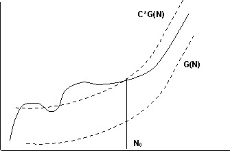
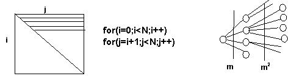
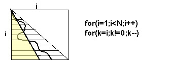

<pre>
«Для решения любой сколь угодно простой задачи<br/> 
можно написать программу, которая будет работать<br/> 
сколь угодно медленно».<br/>
<br/>
<b>Афоризм, рожденный из практики приема курсовых работ.</b><br/>
</pre>

Скорость выполнения программы (или производительность) зависят от многих факторов: языка программирования, способа реализации транслятора (компилятор, интерпретатор), производительности процессора. Поэтому заранее оценить производительность еще не написанной программы сложно. Наша задача скромнее. Для уже разработанного алгоритма и написанной программы оценить перспективы ее использования с различными объемами данных. Для этого и вводится понятие трудоемкости.

> **Трудоемкость программы (алгоритма)** – это зависимость количества массовых операций (сравнения, обмены, сдвиги, повторения цикла и т.п.) от объема (размерностей) обрабатываемых данных.

Самое важное, что трудоемкость напрямую не связана со временем выполнения программы, но является мерой затрат на ее выполнение. Отметим наиболее важные свойства трудоемкости:

- трудоемкость определяется отдельно для каждого вида операций;

- трудоемкость может зависеть от входных данных. Поэтому оценка трудоемкости дается для лучшего и худшего случая, а также в среднем $T_{min}$, $T_{max}$, $T_{ср}$ . Свойство программы – иметь различную трудоемкость для разных данных, называется чувствительностью к данным;

- на практике обычно используется грубая оценка трудоемкости, основанная на понятии скорости (степени) роста функции.

Для грубой оценки трудоемкости есть свои основания. Дело в том, что размерности исходных данных ($N$) меняются в программах в широких пределах: на несколько порядков при отладке программы и ее работе в реальных условиях. Поэтому для функции трудоемкости важно ее асимптотическое поведение при достаточно больших $N$. Говорится, что функция $T(N)$ имеет степень роста $G(N)$, если $\exists C,N0 : \forall N>N_0 \hspace{2mm} C*G(N) > T(N)$, то есть начиная с некоторого $N_0$ функция $G(N)$ всегда превышает $T(N)$ с некотором коэффициентом пропорциональности.



Оценка степени роста для T(N) обозначается O(G(N)). Если трудоемкость можно выразить в виде степенной функции от размерности обрабатываемых данных N как T(N)=AmNm+Am-1Nm-1+…+ A2N2+ A1N+A0, то можно показать T(N) => O(Nm). То же самое можно сказать и о других видах функции трудоемкости – экспоненциальная, логарифмическая, линейная: наиболее быстро возрастающая составляющая «подавляет» все остальные, а коэффициенты пропорциональности игнорируются.

## Трудоемкость - откуда она берется

Естественно, что «источником трудоемкости» программы являются циклы. Рассмотрим наиболее часто встречающиеся случаи вычисления трудоемкости, связанные с различными видами циклов.

Из общего ряда выпадает единичная трудоемкость T(N) = >O(1), т.е. фиксированная, не зависящая от размерности данных. Она встречается среди простых действий, например, извлечение элемента массива. В более сложных случаях единичная трудоемкость является «чудом», которое может иметь скрытый подвох. Например, средняя трудоемкость размещения и поиска данных методом хеширования Tср близка к единице, в то же время максимальная Tmax является линейной;

Обычный цикл вида `c±for(i=0;i<N;i++)` дает линейную трудоемкость вида $T(N)=N \Rightarrow O(N)$. Вложенный (двойной) цикл вида `c±for(i=0;i<N;i++)for(j=0;j<N;j++)` дает квадратичную трудоемкость $T(N)=N2 \Rightarrow O(N^2)$. В то же время для цикла `c±for(i=0;i<N;i++) for(j=i+1;j<N;j++)` трудоемкость приближенно можно оценить $T(N)≈ \frac{N^2}{2} \Rightarrow O(N2)$. Для этого можно привлечь графическую интерпретацию: в каждом цикле индекс «перемещается» по независимой координате, поэтому «пройденной» оказывается половина квадрата («влияние» диагонали `c±i=j` при этом игнорируется, поэтому оценка оказывается приближенной). Само собой, $m$-кратный вложенный цикл имеет оценку трудоемкости $O(N^m)$.



Если цикл устроен так, что на каждом его шаге происходит удвоение некоторого значения, начиная с 1 (или же деление его пополам), то в момент достижения размерности данных $N$ между числом повторений цикла $L$ и размерностью будет соотношение $2L=N$, откуда $T(N)=L=log_2(N)$. Логарифмическая функция по основанию 2 имеет в сравнении с линейной функцией значительно меньшую скорость роста. При увеличении $N$ в 103 (порядки кило-мега-гига-тера) она увеличивается приблизительно на $10$. Поэтому, если вместо линейного алгоритма удается предложить алгоритм, основанный на делении рабочего интервала пополам, при этом на каждом шаге делается постоянное количество операций, то получается логарифмическая зависимость. Как правило, такой алгоритм устанавливает качественную границу трудоемкости, которую нельзя преодолеть без дополнительных затрат (например, памяти).

Если задача состоит из $m$ шагов, каждый из которых порождает аналогичную задачу, а те, в свою очередь, делают то же самое, возникает «цепная реакция», на каждом уровне которой число подзадач возрастает в $m$ раз. Такой процесс называется рекурсивным, и если глубина рекурсии соответствует размерности задачи $N$, то оценка трудоемкости будет $O(m^N)$, т.е. экспоненциальная. Другие процессы подобного рода могут иметь трудоемкости $O(2N), O(N!)$ и т.д.. К ним, в частности, относятся поисковые алгоритмы, основанные на полном комбинаторном переборе вариантов. Подробнее о трудоемкости рекурсивных алгоритмов см. **7.1**.

## Примеры оценки трудоемкости

Вставка погружением. Вставку очередного элемента в упорядоченную последовательность можно проводить путем его последовательных обменов с предыдущим, пока не встретится элемент, меньший вставляемого, либо пока не будет достигнуто начало массива.

```c
//------------------------------------------------------46-08.cpp
//----- Вставка погружением, подозрительно похожая на обмен
void sort(int in[], int n) {
  for (int i = 1; i < n; i++)  // Пока не достигли " дна" или меньшего себя

    for (int k = i; k != 0 && in[k] < in[k - 1]; k--) {
      int c = in[k];
      in[k] = in[k - 1];
      in[k - 1] = c;
    }
}
```



Из графической интерпретации двойного цикла видно, что среднее количество обменов и сравнений можно оценить как половину от половины квадрата: $T_{сравн} (ср) ≈ T_{обм} (ср) ≈ \frac{N^2}{4}$. Сортировка является чувствительной к данным. Если данные прямо упорядочены, то обменов вообще не будет, в трудоемкость сравнений будет линейной (внутренний цикл будет выполняться по одному разу): $T_{сравн} (min)  = N-1, T_{обм} (min) = 0$. При обратном упорядочении очередной элемент будет погружаться «до самого дна», т.е. $T_{сравн} (ср) ≈ T_{обм} (ср) ≈ \frac{N^2}{2}$.

**Сортировка выбором**. Выбирается минимальный элемент из последовательности и меняется с первым из них. Процесс повторяется для оставшихся (без первого) и т.д.. Сортировка является нечувствительной к данным, даже при наличии упорядоченности она все равно будет выполнять одни и те же действия (внутренний и внешний цикл являются безусловными): $T_{сравн} (ср) = T_{сравн} (мах)= T_{сравн} (мин) \approx \frac{N^2}{2}$. Обмены производятся внешним циклом, поэтому $T_{обм}  = N-1$.

```c
//------------------------------------------------------46-05.cpp
//---- Сортировка выбором
void sort(int in[], int n) {
  for (int i = 0; i < n - 1; i++) {  // Для очередного i

    for (int j = i + 1, k = i; j < n; j++)  // k - индекс минимального

      if (in[j] < in[k])
        k = j;  // в диапазоне i..n-1

    int c = in[k];
    in[k] = in[i];
    in[i] = c;  // Три стакана для очередного
  }
}  // и минимального
```
