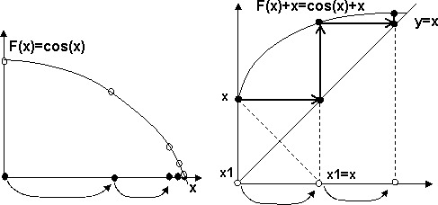

## Итерационный цикл

Итак, любой цикл как процесс можно охарактеризовать четырьмя составляющими:

- начальное состояние;

- ограничение цикла (условие продолжения или завершения):

- переход к следующему шагу:

- повторяющееся действие – тело цикла.

В большинстве циклов действия, производимые в теле цикла, не влияют на параметры его протекания: количество шагов, характеристики шага. В таких «хороших» циклах параметры заголовка цикла не зависят от значений переменных, вычисляемых в теле цикла, и цикл имеет постоянное количество повторений, например:

`for (i=0; i<n; i++) { ...A[i]... }`

Если же поведение программы на некотором шаге цикла может зависеть от результатов выполнения тела цикла на предыдуших шагах, либо число повторений цикла зависит от результатов выполнения шага, такие циклы и программируемые ими процессы называются итерационными. Наиболее широко они применяются в вычислительной математике, когда для получения численного результата используется итерационный цикл последовательных приближений к нему.

Если изобразить общую схему итерационного цикла, то в нем обязательно будут переменные, сохраняющие результат предыдущего (x1) и еще более ранних (x2,...) шагов, а также переменная x - результат текущего шага:

`for (x1=...,x2=...; условие(x1,x2); x2=x1,x1=x) { ...x =…x1…x2…;...}`

Образно говоря, если x – «сегодняшнее» значение, то x1 – вчерашнее, а x2 – позавчерашнее. При переходе к следующему шагу «вчерашнее» становится «позавчерашним», «сегодняшнее» – «вчерашним». Особенность итерационного цикла состоит в том, что

Если в итерационном цикле гарантируется выполнение одного шага, тo может быть использован цикл do...while.

```c
x=...; x1=...; // Начальное значение текущего шага

do {
  x2 = x1; x1 = x; // Следующий шаг
  x = …x1…x2…;     // Результат текущего шага

} while (условие(x2,x1,x)); // Условие завершения
```

Если использовать результат только текущего шага, который зависит от результата предыдущего, то схему цикла можно упростить.

`for (x=...; условие(x); ) { ...x = …x…;... }`

## Рекуррентные последовательности

Из математики известны рекуррентные последовательности, в которых очередной элемент вычисляется из нескольких предыдущих. Например, числа Фибоначчи – последовательность, в которой очередной элемент равен сумме предыдущих:

`Fn = Fn-1 + Fn-2, F0=1, F1=1`

При прямом вычислении элементов последовательности необходимы три переменные для хранения текущего, предыдущего и «позавчерашнего» значений.

```c
//------------------------------------------------------43-01.cpp

//--- Числа Фибоначчи

int FIBO(int n) {
  int Fn, Fn1 = 1, Fn2 = 1;

  for (int i = 2; i <= n; i++) {
    Fn = Fn1 + Fn2;

    Fn2 = Fn1;  // Переход к следующему шагу:

    Fn1 = Fn;  // текущий становится предыдущим
  }

  return Fn;
}
```

Другой пример, синусы или косинусы кратных углов sin(nx), cos(nx), которые потребуются нам при вычислении суммы гармонического ряда (см. «Лабораторный практикум»). Вместо того, чтобы каждый раз вычислять функции для кратных аргументов, достаточно вычислить один раз начальные значения sin(x), cos(x), а затем использовать рекуррентную формулу:

sin(nx) = sin((n-1)x)cos(x) + cos((n-1)x)sin(x)

cos(nx) = cos((n-1)x)cos(x) - sin((n-1)x)sin(x)

> При реализации формулы в программе необходимо обозначить отдельными переменными значения sin и cos от текущего аргумента nx, от предыдущего (n-1)x и от начального x. При переходе к следующему шагу цикла текущие копируются в предыдущие.

```c
//------------------------------------------------------43-02.cpp

//--- sin, cos кратных углов

void main() {
  int FI = 30;

  double pi = 3.1415926;

  double Cn, Cn1, C0, Sn, Sn1, S0;  // S0=sin(x), Sn1=sin((n-1)x), Sn=sin(nx)

  Cn1 = C0 = cos(FI * pi / 180);  // при n=2  sin((n-1)x)=sin(x)

  Sn1 = S0 = sin(FI * pi / 180);

  printf("sin(%d*%d)=%lf cos(%d*%d)=%lf\n", 1, FI, S0, 1, FI, C0);

  for (int n = 2; n <= 10; n++) {
    Sn = Sn1 * C0 + Cn1 * S0;  // Рекуррентная формула

    Cn = Cn1 * C0 - Sn1 * S0;

    printf("sin(%d*%d)=%lf cos(%d*%d)=%lf\n", n, FI, Sn, n, FI, Cn);

    Cn1 = Cn;  // Переход к следующему шагу

    Sn1 = Sn;  // текущий становится предыдущим
  }
}
```

## Приближенные вычисления

Пока что итерационные циклы давали нам «экономию вычислений», избавляя от повторения одних и тех же действий. В вычислительной математике работает другая идея. В методе последовательных приближений координаты очередной точки в пространстве поиска вычисляются через координаты предыдущих точек, а сама последовательность бесконечно приближается (сходится) к некоторой точке с заданным свойством. Число шагов цикла определяется точностью приближения к предельной точке, а оно, в свою очередь, оценивается расстоянием между текущей и предыдущей.

Сама идея, на каких принципах организовать движение от точки к точке, к программированию, как таковому, не относится. Она лежит в предметной области, откуда и ведутся все доказательства работоспособности метода. Для практического программирования важно следующее:

- число шагов цикла (скорость сходимости) определяется самим методом (функцией, вычисляющей следующую точку), а также начальной точкой;

- возможны случаи, когда процесс, наоборот, расходится, т.е. «уходит» от исходной точки, увеличивая значения координат до бесконечности (в программе – переполнение).

Рассмотрим простейший способ нахождения корня функции методом последовательных приближений Для того, чтобы найти корень функции f(x)=0, решается эквивалентное уравнение x = f(x) + x. Если в него подставить точное значение корня, то правая и левая части совпадут. Если же поставить в правую часть любое «постороннее» значение x1, то в левой части получим значение, отличающееся от x1, например x: x=f(x1)+x1.

Если значение x в правой части считать результатом итерационного цикла на предыдущем шаге (x1), а значение x в левой части - результатом текущего шага цикла, то такой процесс последовательного приближения к результату является итерационным.

```c
x = x0;

do {
  x1 = x;
  x = f(x1) + x1;
} while ( условие(x,x1) );
```

То, что это будет последовательность значений x (точек на числовой оси) – это ясно. Если эта последовательность будет сходиться, то она будет сходиться к корню функции – также очевидно. Остается открытым один вопрос, а будет ли она сходиться вообще?



Графическая иллюстрация, хотя и не является доказательством, но все-таки объясняет, как это работает. Корнем уравнения является пересечение графика функции F(x)+x с диагональю (функция y=x). Когда мы вычисляем очередное значение x=F(x1), мы берем точку на графике функции, соответствующую x1. При присваивании x1=x точка графика проецируется с оси y на ось x, зеркально отражаясь относительно диагонали. Затем от нее берется значение функции на графике. На рисунке мы видим, что такой переход от одной точки на графике к следующей точке можно сделать проще: проводится горизонтальная линия от текущей точки до диагонали, а затем – вертикальная до пересечения с графиком функции. Такая последовательность движения по горизонтами – до пересечения с диагональю и по вертикали – до пересечения с графиком и приводит нас к корню.

Окончательный вид программы включает еще и проверку качественного характера (сходимости) процесса. Дело в том, что данный метод успешно работает не для всех видов функций f() и начальных значений x0. В принципе итерационный процесс может приводить, наоборот, к бесконечному удалению от значения корня. Тогда говорят, что процесс расходится. Для проверки сходимости приходится запоминать разность значений x и x1 предыдущего шага.

```c
//------------------------------------------------------43-03.cpp

//---- Корень функции по методу последовательных приближений

// начальное значение, точность и указатель на внешнюю функцию (см. 9.3)

double find(double x, double eps, double (*pf)(double)) {
  double x1, dd;

  int n = 0;  // Счетчик шагов

  dd = 100.;  // Предыдущий интервал

  do {
    x1 = x;
    n++;

    x = (*pf)(x1) + x1;

    printf("n=%d x=%lf y=%lf dx=%lf\n", n, x1, (*pf)(x1), fabs(x1 - x));

    if (fabs(x1 - x) > dd)
      return 0.;  // Процесс расходится

    dd = fabs(x1 - x);

  }

  while (dd > eps);

  return x;
}  // Выход - значение корня

void main() {
  printf("cos(x)=0 x=%lf\n", find(0, 0.01, cos));
}
```

## Вычисление степенных рядов

Сначала рассмотрим простой вариант с «экономией вычислений». При вычислении значения полинома вида f(x,n) = a0 + a1x + a2x2 + a3x3 +…+ anxn можно избежать многократного вычисления степеней, если представить полином в виде:

f(x,n)= ((…((anx+an-1)x+an-2)x+…)x+a1)x+a0

Обозначив накопленную частичную сумму, заключенную в скобках, через s, получим рекуррентную формулу s=s\*x+ai, i=n…0.

```c
//------------------------------------------------------43-04.cpp

//-----Степенной полином

double poly(double A[], double x, int n) {
  int i;
  double s;

  for (s = A[n], i = n; i >= 0; i--)
    s = s * x + A[i];

  return s;
}

void main() {
  double B[] = {4, 0, 3, 1, 8};
  printf("%lf\n", poly(B, 2., 4));
}
```

Многие стандартные математические функции вычисляются путем их разложения в степенные ряды (ряды Тейлора []). Точное значение функции определяется как сумма бесконечного ряда f(x)=S0+S1+S2+…Sn+…, слагаемые которого, как правило, содержат степени и факториалы от текущего порядкового номера элемента. Иногда он может содержать другие регулярные выражения (например, произведение четных чисел 2*4*6\*…2n, нечетный коэффициент вида 2n-1 и т.п.).

Например, функцию sin(x) можно разложить в такой ряд:

sin(x) = x-x3/3!+x5/5!-x7/7!+…+(-1)n+1x2n+1/(2n+1)!+…

Выражение для n-го слагаемого имеет вид Sn=(-1)n+1x2n-1/(2n+1)!, ряд начинается с n=0, S0=x.

Одним из свойств «хороших» степенных рядов является то, что любое слагаемое превышает оставшуюся бесконечную сумму «хвоста» ряда. На этом основании точность вычисления может быть оценена значением очередного слагаемого.

Для «экономии вычислений» степеней, факториалов и других регулярных выражений выводится рекуррентная формула, позволяющая вычислить текущее слагаемое через предыдущее. Это можно сделать аналитически, разделив в общем виде выражение Sn на Sn-1

K(x,n)=Sn/Sn-1=((-1)n+1x2n+1/(2n+1)!)/((-1)nx2n-1/(2n-1)!)

K(x,n)=-x2/(2n(2n+1))

Формулу можно вывести индуктивно, рассматривая подряд несколько пар соседних слагаемых. Для каждой пары выводится коэффициент перехода, который потом приводится к общему виду:

| **n**    | **0**                | **1**         | **2**        | **3**        |     | **n**               |
| -------- | -------------------- | ------------- | ------------ | ------------ | --- | ------------------- |
| $S_n$    | **x**                | $-{x^3}/{3!}$ | $x^5/5!$     | $-x^7/7!$    |     | $-x^{2n-1}/(2n-1)!$ |
| **k(x)** | Домножить предыдущий | $-x^2/(2*3)$  | $-x^2/(4*5)$ | $-x^2/(6*7)$ |     | $-x^2/(2n*(2n+1))$  |

В таблице записывается, на что нужно умножить предыдущее слагаемое, чтобы получить текущее. Обратите внимание, что значение n берется для текущего столбца, например, 3 и 7 находятся в таком же соотношении, что и n с 2n+1.

```c
//------------------------------------------------------43-05.cpp

//--- Вычисление значения функции sin через степенной ряд

double sum(double x, double eps, int& n) {
  double s, sn;  // Сумма и текущее слагаемое ряда

  for (s = 0., sn = x, n = 1; fabs(sn) > eps; n++) {
    s += sn;

    sn = -sn * x * x / (2. * n * (2. * n + 1));
  }

  return s;
}

// Вычисление степенного ряда для x в диапазоне от 0.1 до 1 с шагом 0.1

void main() {
  double x, y;

  int nn;

  for (x = 0.1; x <= 1.; x += 0.1) {
    y = sum(x, 0.0001, nn);

    printf("n=%d x=%0.1lf\t sum=%0.4lf\t sin=%0.4lf\n", nn, x, y, sin(x));
  }
}
```

В программе текущее слагаемое sn каждый раз умножается на переходный коэффициент для получения следующего значения. Перед этим текущее значение добавляется к сумме s. В цикле легко ошибиться «на один шаг», поэтому необходимо обратить внимание на начало его выполнения: значение sn=x устанавливается для слагаемого при n=0, а на первом шаге вычисляется значение sn уже для n=1.

## Лабораторный практикум

Для заданного варианта написать функцию вычисления суммы ряда:

- стандартный диапазон значений x =0.1...0.9, шаг 0.1. Убедиться, что на этом диапазоне элемент суммы ряда стремится к 0, при необходимости скорректировать диапазон;

- вычислить значения суммы ряда и контрольной функции, к которой он сходится, с точностью до 4 знаков после запятой;

- исходя из полученного значения n и формулы ряда объяснить различную скорость сходимости для разных x;

Для вариантов 13-17 реализовать рекуррентное вычисление значений sin и cos для кратных значений аргумента nx. При оценке сходимости ряда учесть, что он не является монотонно убывающим ввиду периодического характера функций sin и cos. Для оценки граничного значения слагаемого ряда заменить в формуле sin и cos на 1.

| **№**  | **Ряд**                                                                                                   | **функция**         |
| ------ | --------------------------------------------------------------------------------------------------------- | ------------------- |
| **1**  | **1 - x^2/ 2! + x^4/4! + ...+ (-1)^n x^2n/(2n)!**                                                         | **cos(x)**          |
| **2**  | **z=((x-1)/(x+1))   f(x)= (2/1)z + (2/3) z^3 + ...+ (2/2n-1)z^2n-1**                                      | **ln(x)**           |
| **3**  | **1+ x ln3 + (x ln3)^2/2! +...+(x ln 3)^n/n!**                                                            | **3^x**             |
| **4**  | **(x-1)/x+(x-1)^2/2x^2+(x-1)^3/3x^3 +...+(x-1)^n/nx^n**                                                   | **ln(x)**           |
| **5**  | **x + x^3/3! + x^5/5! +...+ x^2n-1/(2n-1)!**                                                              | **sh(x)**           |
| **6**  | **1 + x^2^/2! + x^4^/4! +...+ x^2n^/(2n)!**                                                               | **ch(x)**           |
| **7**  | **x - x^3^/3 + x^5^/5 +...+ (-1)^n+1^x^2n-1^/(2n-1)**                                                     | **arctg(x)**        |
| **8**  | **π\*\***/2 - 1/x + 1/3x^3^  - 1/5x^5^ + (-1)^n^(2n-1)x^2n-1\*\*                                          | **arctg(x)**        |
| **9**  | **1 - 2x + 3x^2- 4x^3+...+ (-1)^n^(n+1)x^n**                                                              | **1/(1+x)^2**       |
| **10** | **x + x^3^*1/(2*3) + x^5^*(1*3)/(2*4*5) +...** <br/> **+x^2n+1^(1*3*...*2n-1)/(2*4\*...2n(2n+1))**        | **arcsin(x)**       |
| **11** | **1+x(1/2)+x^2^(1*1)/(2*4)-x^3^(1*1*3)/(2*4*6)+...** <br/> **(-1)^n^x^n^(1*1*3*...*2n-3)/(2*4*6*...*2n)** | **(1+x)^0.5^**      |
| **12** | **1-x(1/2)+x^2^(1*3)/(2*4)-x^3^(1*3*5)/(2*4*6)+...** <br/> **(-1)^n^x^n^(1*3*...*2n-1)/(2*4*...*2n)**     | **1/(1+x)^0.5^**    |
| **13** | **sin(x)-sin(2x)/2+sin(3x)/3+...+(-1)^n+1^sin(nx)/n**                                                     | **x/2**             |
| **14** | **-cos(x)+cos(2x)/2^2^-cos(3x)/3^2^+...+(1)^n^cos(nx)/n^2**                                               | **(x^2^- π^2/3)/4** |
| **15** | **cos(x)+cos(3x)/3+cos(5x)/5+...+cos(2n-1)/(2n-1)**                                                       | **ln(ctg(x/2))/2**  |
| **16** | **cos()-cos(2x)/2+cos(3x)/3+...+(-1)^n+1^cos(nx)/n**                                                      | **ln(2cos(x/2)**    |
| **17** | **sin(x)+sin(3x)/3^3^+sin(5x)/5^3^+...+sin((2n-1)x)/(2n-1)^3^**                                           | **x(π -x)(π /8)**   |

## Вопросы без ответов

Восстановить в общем виде формулу степенного ряда, вычисляемого в данной функции.

```c
for (s = 0, sn = 1 n = 2; fabs(sn) > eps; n += 2) {
  s += sn;

  sn = sn * x * x / (n * (n + 1));
}
```

Для получения аналитической зависимости необходимо восстановить последовательность значений степеней x и произведений целых коэффициентов, составляющих факториалы, либо сокращающихся при переходе от шага к следующему. После получения явно наблюдаемой зависимости необходимо перевести ее в аналитический вид от натурального n.

| **n**   | $s_n$ до            | **коэффициент**    | $s_n$ после              |
| ------- | ------------------- | ------------------ | ------------------------ |
| **2**   | **1**               | **  x^2 / (2\*3)** | **x^2 / (2\*3)**         |
| **4**   | **x^2 / (2\*3)**    | **  x^2 / (4\*5)** | **x^4 / (2*3*4\*5)**     |
| **6**   | **x^4 /(2*3*4\*5)** | **  x^2 / (6\*7)** | **x^6 / (2*3*4*5*6\*7)** |
| **...** | **...**             | **...**            | **...**                  |
| **m**   | **x^2m / (2m+1)!**  |                    |                          |

В данном примере накапливаются четные степени x и нечетные факториалы (обратите внимание, что n в самой программе меняется через 2, а ряд выражен через натуральное m).

```c
//------------------------------------------------------43-06.cpp
//-----------------------------------------------1
double s, sn;
int n;

for (s = 0, sn = 1, n = 1; fabs(sn) > eps; n++) {
  s += sn;

  sn = -sn * x / n;
}

//-----------------------------------------------2
for (s = 0, sn = x, n = 1; fabs(sn) > eps; n++) {
  s += sn;

  sn = -sn * x / n;
}

//-----------------------------------------------3
for (s = 0, sn = x; n = 1; fabs(sn) > eps; n += 2) {
  s += sn;

  sn = sn * x * x / (n * (n + 1));
}

//-----------------------------------------------4
for (s = 0, sn = x, n = 1; fabs(sn) > eps; n += 2) {
  s += sn;

  sn = sn * x / (n * (n + 1));
}

//-----------------------------------------------5
for (s = 0, sn = x, n = 1; fabs(sn) > eps; n++) {
  s += sn;

  sn = sn * x * (2 * n) / (2 * n - 1);
}

//-----------------------------------------------6

for (s = 0, sn = x, n = 1; fabs(sn) > eps; n += 2) {
  s += sn;

  sn = sn * x * x * n / (n + 1);
}

//-----------------------------------------------7
for (s = 0, sn = x, n = 1; fabs(sn) > eps; n++) {
  s += sn;

  sn = sn * x * x * (2 * n - 1) / (2 * n + 1);
}

//-----------------------------------------------8
for (s = 0, sn = x, n = 2; fabs(sn) > eps; n += 2) {
  s += sn;

  sn = sn * x * x * (n - 1) / (n + 1);
}

//-----------------------------------------------9
for (s = 0, sn = 1, n = 1; fabs(sn) > eps; n++) {
  s += sn;

  int nn = 2 * n - 2;
  if (nn == 0) nn = 1;

  sn = sn * x * x * nn / (2 * n);
}

//-----------------------------------------------10
for (s = 0, sn = 1, n = 1; fabs(sn) > eps; n += 2) {
  s += sn;

  int nn = n - 1;
  if (nn == 0) nn = 1;

  sn = sn * x * x * nn / (n + 1);
}
```
