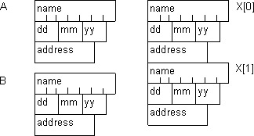
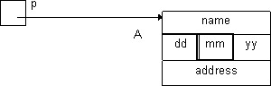

<pre>
«Здесь вам не тут…»<br/>
Из армейского фольклора
</pre>

Структурированную переменную можно определить как прямую противоположность массива. Действительно, «массив – это множество переменных одного типа, имеющих общее имя, доступ к которым осуществляется по номеру (индексу)». Формально изменив некоторые свойства на противоположные, получим, что «**структура – это множество разнотипных переменных с общим именем, доступ к которым осуществляется по имени**». Структура требует описания всех ее элементов по отдельности (имена и типы), в то время как для массива оно является общим.

```c
struct man {     // Определение структурированного типа
  char name[10]; // Элементы структуры  - поля (имена и типы)
  int  dd,mm,yy; //
  char *address; //
  //----------------------------------------------------------
} A, B, X[10];   // Определение структурированных переменных
```
                       
В описании структуры появляется еще одно нововведение: раздельное описание структуры как типа данных (формы представления) – **структурированного типа**, и непосредственно данных - **структурированных переменных**.

Определение структурированного типа начинается с имени `man`, которое идентифицирует структуру как тип данных. Это имя может использоваться во всех контекстах аналогично любому базовому типу (например, `int`). Это значит, что в языке имеется возможность манипулировать структурированными переменными как базовыми: определять переменные, массивы и указатели, копировать, передавать по ссылке и по значению, использовать в качестве формальных параметров и результата функции (в отличие от массивов, возможности оперирования которыми как единым целым ограничены).
 
```c
man C,D[20],*p;  // Структурированная переменная C, массив переменных D и указатель p
man *create() { ... } // Функция возвращает указатель на структуру
void f(man *q) { ... }// Функция получает параметр - указатель на структуру
```

Составляющие структуру «переменные» имеют различные типы и имена, по которым они идентифицируются. Их называют **элементами структуры** или **полями**, и они имеют синтаксис определения обычных переменных. Но они не имеют самостоятельного статуса и могут использоваться только по отношению к какой-либо структурированной переменной (аналогично индексам в массиве). В данном примере структура состоит из массива 10 символов `name`, целых переменных `dd`, `mm` и `yy` и указателя на строку `address`.

После определения структурированного типа следует список структурированных переменных. Каждая из них имеет внутреннюю организацию описанной структуры, то есть полный набор перечисленных полей. Имя структурированной переменной идентифицирует всю структуру в целом, имена элементов – составные ее части. В данном случае мы имеем переменные `А`, `B` и массив `X` из 10 структурированных переменных.



Структурированный тип может быть определен и сам по себе, то есть без конкретных структурированных переменных.
 
```c
struct man {                        
  char name[10]; 
  int dd,mm,yy;
  char *address;
};
```

При определении структурированной переменной или массива таких переменных они могут быть инициализированы списками значений элементов, заключенных в фигурные скобки и перечисленных через запятую. Типы инициализирующих констант должны совпадать с типами инициализируемых полей.

```c
man A = { "Петров",1,10,1969,"Морская-12" };
man X[10] = { 
  { "Смирнов",12,12,1977,"Дачная-13" },
  { "Иванов" ,21,03,1945,"Северная-21" },
  { .................................. }
};
```

Способ работы со структурированной переменной вытекает из ее аналогии с массивом. Точно так же, как нельзя выполнить операцию над всем массивом, но можно над отдельным его элементом, структуру можно обрабатывать, выделяя отдельные элементы (поля). Для этой цели существует операция `.` (точка), аналогичная операции `[]` в массиве. В структурированной переменной она выделяет элемент с заданным именем.

```c
A.name // элемент name структурированной переменной A
B.dd   // элемент dd структурированной переменной B
```

Если поле структурированной переменной является не простой переменной, а массивом или указателем, то для него применимы соответствующие ему операции ( `[]`, `*` и адресная арифметика):

```c
A.name[i] // i-й элемент массива name, который является 
          // элементом структурированной переменной A
*B.address // косвенное обращение по указателю address, 
           // который является элементом структурированной 
           // переменной B
B.address[j] // индексация по указателю address, 
             // который является элементом структурированной 
             // переменной B
```
 
## Свойства структурированного типа

Различие между массивом и структурированной переменной имеет исторические и технологические корни. Исторически массив в языках программирования появился еще тогда, когда понятия типа данных не было и в помине (языки  Алгол, Фортран, первоначальный Бейсик). Он является более архитектурно-ориентированным элементом, работа с ним в большей степени соответствует работе процессора с областью памяти (например, передача по ссылке соответствует получению функцией адреса массива). Структура – более позднее и более абстрактное образование.

Кроме того, структурированная переменная технологически ассоциируется с понятием «объект» (а ее описание – с классом). Это приводит к более свободному манипулированию ею в программе. Структурированные переменные можно присваивать друг другу, передавать в качестве формальных параметров и возвращать как результат функции по значению, а не только через указатель. При этом происходит копирование всей структурированной переменной «байт в байт».

```c
void FF(man X) { … }

void main() {
  man A, B[10], *p;
  A=B[4];  // Прямое присваивание структур
  p=&A;    // Присваивание через косвенное обращение по указателю
  B[0]=*p; // B[0]=A
  FF(A);   // Присваивание при передаче по значению X=A
} 
```

**Указатель на структурированную переменную**. То, что указатели на структурированные переменные имеют широкое распространение, подтверждается наличием в Си специальной операции `->` («минус-больше»), которая понимается как выделение элемента в структурированной переменной, адресуемой указателем. То есть, операндами здесь являются указатель на структуру и имя элемента структуры. Операция имеет полный аналог в виде сочетания операций `*` и `.`:



```c
man *p,A;
p = &A;
p->mm; // эквивалентно (*p).mm
```

**Структурированная переменная  - формальный параметр и результат функции**.  В отличие от массива, передаваемого только по ссылке (либо явно через указатель), структура может быть передана и возвращена функции всеми возможными способами: по значению, по ссылке и через указатель. Поскольку Си является языком, приближенным к архитектуре компьютера, программисту известны механизмы передачи параметров и он может оценивать затраты времени и памяти в различных вариантах, особенно если размер структурированной переменной достаточно велик:

- при передаче указателя или ссылки и возвращении их в качестве результата через стек передается адрес структурированной переменной (, имеющий размерность машинного слова. Сама структурированная переменная доступна через указатель (ссылку) «по записи»;

```c
void proc(man *p){ p->dd++; } // Для доступа к структуре через указатель
                                                // используется операция ->
void proc1(man &B){ B.dd++; } // Структура-прототип через ссылку
                              // доступна «по записи»

void main() { 
  man A = {…,12,5,2001,…};     
  proc(&A); 
  proc1(A); 
}
```

- при передаче по значению в стек помещается копия структурированной переменной – фактического параметра, которая может занимать в нем «довольно много места», а копирование – «довольно много времени»;

```c
struct man { …int dd,mm,yy;… }; 

void proc(man B) { // Копия структуры – фактического параметра
  x = B.dd; // читается, а при изменении не влияет
  B.dd++;   // на оригинал (A.dd не меняется) 
}

void main() {
  man A = {…,12,5,2001,…};          
  proc(A); // Эквивалент B=A 
} 
```

- при возвращении в качестве результата указателя или ссылки передается адрес структурированной переменной, для которого не требуется «много места» (передается обычно в регистрах процессора). О характере указуемой переменной уже упоминалось в 5.2. Она не может быть локальной переменной или формальным параметром-значением, но может быть динамической переменной, создаваемой функцией (см.5.6). Она может быть также указателем на глобальные переменные, либо на переменные, переданные на вход функции через указатель (ссылку);

- при возвращении структуры по значению в вызывающей функции транслятором создается временная структурированная переменная, а вызываемая функция получает указатель на эту переменную. При выполнении операции return происходит копирование возвращаемой переменной во временную переменную через указатель, что может занимать «довольно много времени», а временная переменная – «довольно много места».

```c
struct man { …int dd,mm,yy;…}; // Эквивалент программы
man proc( man X) { // man proc(man *out, man X){
  X.dd++;   // X.dd++;
  return X; // *out = X;
} 

void main() { // man tmp;
  man A = {…,12,5,2001,…}; // X=A; out = &tmp;
  y = proc(A).dd;          // выполнить тело proc
}                          // y=tmp.dd;
```

## Структурированный тип как класс

Структурированная переменная в программе может выступать как «изображение» внешнего объекта, к которым работает программа. Это может быть физический объект внешнего мира, а может быть логический (программный) объект (например, файл). Структурированный тип в таком случае выступает как описание внешней **сущности**  (или **класса**). Элементы (поля) структуры выступают как **свойства** объекта.

В такой интерпретации объект содержит только данные и ему не хватает алгоритмической компоненты. По аналогии с полями, в структурированный тип встраиваются функции, которые по умолчанию работают с некоторой «текущей» структурированной переменной (объектом). «Официально» они называются **элементами-функциями** или **функциями-членами** класса. Рассмотрим правила их определения и использования:

```c
struct man {  // Определение структурированного типа
  char name[10];  // Элементы структуры  - поля (имена и типы)
  int dd, mm, yy;  //
  char* address;   //
                   // Вариант 1
  void setData(int d0, int m0, int y0) {
    dd = m0;
    mm = m0;
    yy = y0;
  }
  void incData();         // Вариант 2
  void plusData(int);     // Вариант 2
  void plusData(int k) {  // Вариант 1
    while (k-- != 0)
      incData();
  }
} A, B, X[10]; // Определение структурированных переменных

void man::plusData(int k) { // Вариант 2
  while (k-- != 0)
    incData();
}
void man::incData() { // Вариант 2
  dd++;
  if (dd == 32)
    dd = 1;
  if (dd == 31 && mm…)
    …
} 

void main() {
  A.setData(5, 12, 1986);
  A.plusData(16);
}
```

- в текст определения структурированного типа можно включить заголовок (а, возможно, и тело) функции;

- в теле функции работает **контекст структуры (класса)**. Это означает, что имена элементов (полей) структуры, а также других встроенных функций можно использовать непосредственно, без указания каких-либо путей, префиксов и т.п.. Все они имеют отношение к **текущему** объекту (текущей структурированной переменной), с которой в данный момент работает функция;

- тело функции может быть включено непосредственно в определение структурированного типа вслед за заголовком (вариант 1);

- тело функции может быть синтаксически вынесено за пределы определения структурированного типа. Тогда в определении остается только заголовок - объявление. Определение функции (заголовок и тело) дается отдельно, причем в заголовке имя функции присутствует в виде `man::incData` – т.е. включает в себя имя структурированного типа. Этим обозначается, что функция не является самостоятельной, а  принадлежит к этому типу (классу);

- вызов встроенной функции производится только в «связке» со структурированной переменной в виде `переменная.функция()`,  при этом переменная интерпретируется как «текущая», с контекстом которой работает функция.

Механизм реализации встроенных функций достаточно прозрачен. На самом деле – это обычные функции, которые имеют неявный параметр – указатель на текущую структурированную переменную того типа, в который встроена функция. В Си++ этот указатель может быть использован явно и обозначается в контексте любой такой функции служебным словом `this`. При вызове такой функции ей передается адрес переменной, с которой она будет работать. Вот так будет выглядеть эквивалент приведенного выше примера при использовании «обычных» функций.

```c
void man_setData(man *this, int d0, int m0, int y0)
{ this->dd=m0; this->mm=m0; this->yy=y0;  }

void man_plusData(man *this, int k)
{ while(this->k--!=0) man_incData(this); }

void man_incData(man *this,)                
{  this->dd++; if (this->dd==32) this->dd=1; if (this->dd==31 && this->mm…)… }}

void main() {
  man_setData(&A,5,12,1986); man_plusData(&A,16);  
}
```

Из примера видно, что использование встроенных функций дает более компактную запись программы благодаря использованию контекста класса, а по своей сути представляет собой программирование и использованием указателей на структурированные переменные. Здесь мы сознательно не вторгаемся в область объектно-ориентированного программирования и ограничиваемся использованием встроенных функций как средством «экономии синтаксиса».

## Объединение

Объединение представляет собой структурированную переменную с несколько иным способом размещения элементов в памяти. Если в структуре (как и в массиве) элементы расположены последовательно друг за другом, то в объединении «параллельно». То есть для их размещения выделяется одна общая память, в которой они перекрывают друг друга и имеют в ней общий адрес. Размерность ее определяется максимальной размерностью элемента объединения. Синтаксис объединения полностью совпадает с синтаксисом структуры, только ключевое слово `struct` заменяется на `union`.

Назначение объединения заключается не в экономии памяти, как может показаться на первый взгляд. На самом деле оно является одним из инструментов управления памятью на принципах, принятых в Си. В **9.2** мы увидим, как использование указателей различных типов позволяет реализовать эти принципы. Здесь же, не вдаваясь в подробности, отметим одно важное свойство: если записать в один элемент объединения некоторое значение, то через другой элемент это же содержимое памяти можно прочитать уже в другой форме представления (как переменную другого типа). Естественно, что при таком манипулировании внутренним представлением данных, необходимо знать их форматы и размерность.
