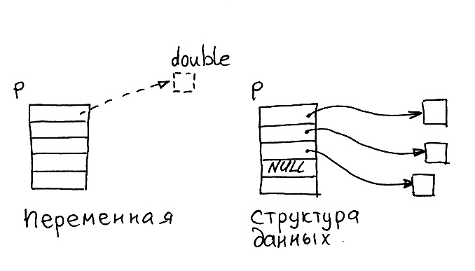
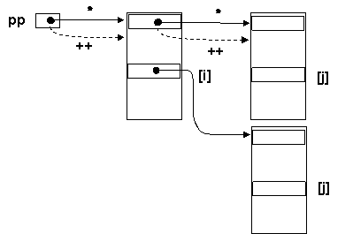
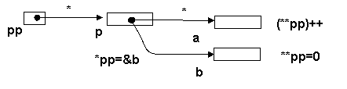
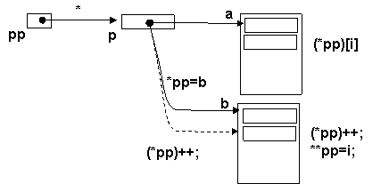
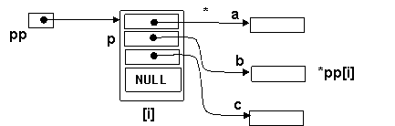
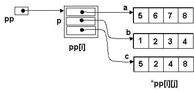
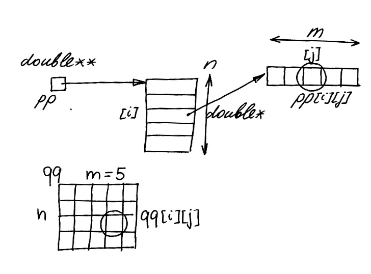
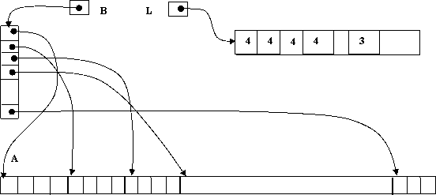

<Pre>
  «Не в совокупности ищи единства, но в единообразии разделения».<br />
  <br />
  <b>Козьма Прутков</b>.
</Pre>

## Массив указателей как тип данных и как структура данных

Массив указателей (МУ) – простейшая структура данных, в которой проявляется различие между **физическим и логическим порядком** следования элементов. Способ организации данных ясен уже из самого определения: это массив, каждый элемент которого содержит указатель на переменную (объект).



Если это записать в терминах контекстного определения переменных, то получим, например

`double *p[20];`

Переменную `p` следует понимать как массив (операция `[]`), каждым элементом которого является указатель на переменную типа `double` (операция `*`). Переменная `p` является массивом указателей как тип данных, но не является таковой как структура данных. Чтобы превратиться в структуру данных, она быть дополнена указуемыми переменными и указателями (связями).

Многообразие вариантов реализации массивов указателей возникает по нескольким причинам:

- cам массив указателей, указуемые переменные и ссылки (указатели) могут быть заданы статически (в тексте программы), либо динамически созданы во время ее выполнения;

- двоякая интерпретация указателя как указателя на отдельную переменную и на массив переменных (строку), позволяет создавать одномерные СД – массивы указателей на переменные и двумерные – массивы указателей на массивы (строки) таких переменных;

- указуемые переменные могут быть «собственностью» структуры данных, однако массив указателей может ссылаться и на переменные (объекты), являющиеся составными частями других структур данных.

Основная сложность заключается в том, что во всех случаях используются одни и те же типы данных, а конкретный вид структуры данных определяется контекстом их использования в тексте программы.

## Типы данных, используемые при работе с массивами указателей

Один тип данных уже был нами упомянут – это массив указателей, переменная вида `int *p[]`. Кроме нее используется еще одни тип вида `int **pp`, который можно определить в общем виде как указатель на указатель.



Напомним, что в Си имеют место две интерпретации указателя, различить которые в тексте программы можно только по виду применяемых к указателю операций (т.е. только в контексте его использования):

- традиционной интерпретации указателя как ссылки на отдельную переменную соответствует операция косвенного обращения по указателю `*pp`;

- согласно концепции адресной арифметики любой указатель может ссылаться на неограниченный массив (память) с относительной адресацией от текущего положения указателя, что поддерживается операциями индексации `pp[i]` и добавления целого к указателю – `p++`, `p+=n`.

Указатель на указатель таким образом допускает целых четыре интерпретации. При этом для каждой из них должна быть создана (инициализирована) своя структура данных. Положение усугубляется еще и тем, что за соответствием структуры данных и операциями над ней должен следить программист (компилятор этого не делает).

```c
int a = 5, b = 10;
int *p = &a; int **pp = &p;

(**pp)++;  *pp=&b;  **pp=0;
```



Первый вариант – указатель на указатель на отдельную переменную, имеет довольно специфическое применение. Обычно от используется для передачи **адреса заголовка** какой-либо структуры данных при необходимости его изменения. В формальных параметрах для этой цели предпочтительнее использование **ссылки на указатель (см. 6.3)**.

```c
int a[10] = 5, b[10] = 10;  int *p = a; int **pp = &p;

for (int i = 0; i < 10; i++) (*pp)[i] = 0;

*pp = b;

for (int i = 0;i < 10; i++) { (*pp)++; **pp = i; }
```



Второй вариант также довольно экзотичен – указатель на указатель на линейный массив переменных. В выражениях, которые используются в такой структуре данных присутствуют приоритетные скобки, поскольку операция косвенного обращения на первом уровне предшествует операции индексации на втором.

В остальных вариантах тип данных `int**` применяется для работы с массивами указателей. Классическая интерпретация - указатель на массив указателей на отдельные объекты использует естественный порядок операций `*p[i]` для доступа к указуемым объектам.



```c
int a = 5, b = 10, с = 15;
int *p[] = { &a,&b,&c,NULL };
int **pp=p;

for (int s = 0, i = 0;i < 10; i++)  s = s+*pp[i];
```

Массив указателей на линейные массивы переменных является двумерной структурой данных и использует двойную индексацию. Функционально она является эквивалентом двумерного массива.

```c
int a[] = {5,6,7,8}, b[]={1,2,3,4}, с[]={5,2,4,8};
int *p[] = {a,b,c}; int **pp = p;

for (int s = 0, i = 0; i<3;i++)

for (int j = 0; j < 4; j++)  s = s+pp[i][j];
```



## Статические и динамические массивы указателей

Другой источник разнообразия – способ формирования перечисленных структур данных. Статический массив указателей формируется при трансляции: переменные (сам массив указателей и указуемые переменные) определяются статически, как обычные именованные переменные, а указатели инициализируются. Структура данных включена непосредственно в программный код и «готова к работе».

`int a1,a2,a3, *pd[] = { &a1, &a2, &a3, NULL};`

Промежуточные варианты массива указателей могут содержать как статические, так и динамические компоненты. В следующем примере статический массив указателей программно заполняется адресами элементов статического же массива (динамически формируются только сами указатели).

```c
int d[19], *pd[20];

for (i=0; i<19; i++) pd[i] = &d[i];

pd[i] = NULL;
```

Указуемые переменные могут создаваться динамически, их адреса заполняют статический массив указателей.

```c
int *p, *pd[20];

for (i=0; i<19; i++){ p = new int; *p = i;  pd[i] = p; }

pd[i] = NULL;
```

Наконец, если массив указателей формируется как динамическая структура данных, то динамический массив указателей создается в процессе работы программы. Операция new в качестве результата возвращает указатель на область памяти, содержащую указатели, т.е. тип int\*\*, который запоминается в переменной того же типа.

```c
int **pp, *p;

pp = new int *[20];   // память под массив указателей

for (i=0; i<19; i++) {// из 20 указателей типа int*
      p = new int;
      *p = i;

      pp[i] = p; // можно pp[i] = new int; *pp[i] = i;
}

pp[i] = NULL;
```

Массив указателей. Физический и логический порядок
При работе с массивом указателей используются два контекста:

- `pp[i]` -i-й указатель в массиве;

- `*pp[i]` -значение i-ой указуемой переменной.

Алгоритмы работы с массивом указателей и обычным массивом внешне очень похожи. Разница же состоит в том, что размещение данных в обычном массиве соответствует их **физическому порядку** следования в памяти, а массив указателей позволяет сформировать **логический порядок** следования элементов в соответствии с размещением указателей на них. Тогда изменение порядка следования (включение, исключение, упорядочение, перестановка), которое в обычном массиве заключается в перемещении самих элементов, в массиве указателей должно сопровождаться операциями над указателями на них. Очевидные преимущества возникают, когда сами указуемые переменные являются достаточно большими, либо перемещение их невозможно по каким-либо причинам (например, на них ссылаются другие части программы). Для сравнения приведем функции сортировки массива и массива указателей.

```c
//------------------------------------------------------62-01.cpp
//--- Сортировка массива и массива указателей
void sort1(double d[], int sz) {
  int i, k;

  do {

    for (k = 0, i = 0; i < sz - 1; i++)

      if (d[i] > d[i + 1])

    {
      double c;
      c = d[i];
      d[i] = d[i + 1];
      d[i + 1] = c;
      k = 1;
    }

  } while (k);
}

void sort2(double * pd[]) {
  int i, k;

  do {
    for (k = 0, i = 0; pd[i + 1] != NULL; i++)

      if ( * pd[i] > * pd[i + 1]) // Сравнение указуемых переменных

    {
      double * c; // Перестановка указателей

      c = pd[i];
      pd[i] = pd[i + 1];
      pd[i + 1] = c;
      k = 1;
    }

  } while (k);
}
```

## Динамический массив указателей на переменные (объекты)

Если динамический массив указателей ссылается на множество «уже известных», т.е. не им созданных и не ему принадлежащих переменных (объектов), то его уместно рассматривать как коллекцию, имеющую собственный логический порядок. В качестве примера рассмотрим функцию, которая создает массив указателей на упорядоченные по возрастанию положительные значения, взятые из массива. Как и для любого динамического массива, для массива указателей справедливы все выводы о его размерности: в данном случае она может быть вычислена заранее. Результат функции имеет тип `double **` - указатель на динамический массив указателей, созданный внутри функции.

```cpp
//------------------------------------------------------62-02.cpp
//-------- Динамический массив указателей
// на упорядоченные положительные элементы исходного массива
double ** create(double in [], int n) {
  int i, j, m; // Вычислить размерность

  for (i = 0, m = 0; i < n; i++)
    if ( in [i] > 0) m++;

  double ** pp = new double * [m + 1]; // Создать ДМУ

  pp[m] = NULL;

  for (i = 0, j = 0; i < n; i++) // Запомнить указатель на

    if ( in [i] > 0) pp[j++] = & in [i]; // положительный элемент

  sort2(pp);

  return pp;
}
```

## Динамический массив указателей на массивы переменных

Указуемым объектом в массиве указателей может быть как отдельная переменная, так и массив таких переменных. В последнем случае мы имеем функциональный аналог двумерного массива: первый индекс выбирает указатель на массив, второй – элемент этого массива. Более того, аналогия здесь даже синтаксическая: выражение `p[i][j]` приемлемо в обоих случаях и с точки зрения логической организации данных обозначает одно и то же – j-ый элемент i-ой строки. Преимущество массива указателей проявляется, если речь идет о переменной размерности. Двумерный массив в Си всегда должен иметь фиксированную вторую размерность (для вычисления адресов транслятор должен знать длину строки матрицы). Для массива указателей – это излишне.



```c
//-------------------------------------------------------------------------------------62-03.cpp
//--- Матрица произвольной  размерности - массив указателей на массивы
double ** load(char nm[], int & n, int & m) { // Размерности матрицы – по ссылке
  FILE * fd = fopen(nm, "r");

  if (fd == NULL) return NULL;

  fscanf(fd, "%d%d", & n, & m); // Чтение размерностей

  double ** pp = new double * [n]; // Создание ДМУ по первой размерности

  for (int i = 0; i < n; i++) {

    pp[i] = new double[m]; // Создание линейных ДМ (строк)

    for (int j = 0; j < m; j++) fscanf(fd, "%lf", & pp[i][j]);

  }

  fclose(fd);

  return pp;
}

double sum(double ** p, int n, int m) {
  double s = 0;

  for (int i = 0; i < n; i++)

    for (int j = 0; j < m; j++) s += p[i][j];

  return s;
}

void main() {
  int n1, m1;
  double ** pp = load("62-03.txt", n1, m1);

  if (pp != NULL) {
    printf("sum(%d,%d)=%2.0lf\n", n1, m1, sum(pp, n1, m1));
    destroy(pp, n1);
  }
}
```

В данном представлении указуемые объекты – строки матрицы являются «собственностью» структуры данных. Процедура освобождения памяти из-под такой полностью динамической структуры данных происходит в два этапа: сначала в цикле уничтожаются динамические массивы – строки, а затем – сам массив указателей.

```c
//------------------------------------------------------------------62-03.cpp
void destroy(double **pp, int n) {
  for (int i = 0; i < n; i++) delete []pp[i];
  delete []pp;
}
```

В следующем примере динамический массив указателей ссылается на компоненты уже существующей структуры данных. С его помощью мы получаем логическое представление структуры данных, отличное от ее исходного физического представления.



```cpp
//------------------------------------------------------62-04.cpp
// Простое однократное слияние - массив указателей
// на линейные массивы (части линейного массива)

void sort(int a[], int n); // любая сортировка одномерного массива

void big_sort(int A[], int N){

int max=A[0],i,j,k,n=sqrt(N)+1;

int **B=new int*[n];

int *L=new int[n],*C=new int[N]; // массив размерностей частей

for (i=0; i<n; i++) B[i]=&A[i*n];

for (i=0; i<n-1; i++) L[i]=n;

L[n-1]=N-n*(n-1);                // Размерность последнего массива

for (i=0; i<n; i++) sort(B[i],L[i]); // Сортировка частей

for (i=0; i<N; i++) { // Слияние
  for (k=-1, j=0; j<n; j++) { // k - индекс строки с минимальным
    if (L[j]==0) continue; // Пропуск слитых строк

    if (k==-1 || *B[j] < *B[k]) k=j;
  }

  C[i] = *B[k]; // Перенос элемента
  B[k]++;       // Сдвиг k-го указателя
  L[k]--;
}

for (i=0; i<N; i++) A[i]=C[i]; // Возвратить обратно

delete []B;

delete []C;}
```

Динамический массив указателей создает эффект двумерности над обычным линейным массивом, не меняя его физической структуры. Сортировка однократным слиянием (**см. 4.6**) разбивает линейный массив на части, которые сортируются независимо. Для создания такого представления достаточно заполнить динамический массив указателей B адресами групп по n элементов (`B[i]=&A[i*n]`) исходного линейного массива. Для последующего слияния частей дополнительно создается массив счетчиков длин этих частей L. В процессе слияния полученных упорядоченных последовательностей после чтения выбранного элемента указатель на него смещается на следующий за ним, а счетчик уменьшается (`C[i]=*B[k]; B[k]++; L[k]--;`).

## Представление текста. Динамический массив указателей на строки

Массив указателей вида `char*p[]` можно интерпретировать как массив указателей на строки символов, т.е. строчный текст. Варианты его создания в программе могут быть различными. В полностью статической структуре данных массив указателей создается статически и инициализируются строковыми константами - вся структура данных включается в программный код. Напомним, что строковая константа во всех контекстах понимается как указатель на сформированный транслятором массив, инициализированный символами строки.

`char *pc[] = { "aaa", "bbb", "ccc", NULL};`

Массив указателей может ссылаться на строки, для размещения которых используется двумерный массив символов (массив строк).

```c
char **pc, cc[100][80];

pc = new char*[101]; // Динамический массив указателей

for (i=0; i<19; i++) pc[i] = cc[i]; // на строки статического массива

pc[i] = NULL;
```

Здесь используются две особенности организации двумерных массивов. Во-первых, двумерный массив интерпретируется как массив элементов первого индекса, состоящих из элементов второго индекса, в данном случае -100 массивов символов по 80 символов в каждом. Во-вторых, идентификатор двумерного массива с одним индексом интерпретируется как указатель на начало соответствующего массива элементов второго индекса, в данном случае - указатель на i-й массив из 80 символов (строку).

Синтаксис операции извлечения символа из массива указателей на строки идентичен синтаксису двумерного массива символов, т.е. имеет место отмеченный выше функциональная идентичность массива указателей и двумерного массива. Первая индексация извлекает из массива i-ый указатель, вторая извлекает j-ый символ из строки, адресуемой указателем.

```c
char      *p[]={“aaa”,“bbb”,“ccc”,NULL};

char      A[][20]={“aaa”,“bbb”,“ccc”};

p[i]                    // указатель на i-ю строку в массиве указателей

A[i]                   // указатель на начало i-ой строки в двумерном массиве

p[i][j]                 // j-й символ в i-ой строке массива указателей

A[i][j]                // j-й символ в i-ой строке двумерного массива
```

Отмеченное свойство означает единство логической организации двух структур данных. Но при этом не следует забывать, что на самом деле физическая их реализация различна. Вообще-то массив указателей на строки не обязательно может ссылаться на независимые текстовые строки. Это могут быть и указатели на начала некоторых фрагментов в одной (или нескольких) строках, например слова. В следующем примере функция возвращает динамический массив указателей на упорядоченные по длине слова исходной строки.

```cpp
//------------------------------------------------------62-05.cpp
//--- Массив указателей на отсортированные по длине слова
int my_strlen(char * p) {
  for (int i = 0;* p != 0 && * p != ' '; p++, i++);

  return i;
}

char ** SortedWords(char * p) {

  int nw = 0, k;
  char * q;

  for (q = p;* q != 0; q++) // Подсчет количества слов по концам слов

    if (q[0] != ' ' && (q[1] == ' ' || q[1] == 0)) nw++;

  char ** qq = new char * [nw + 1]; // Создать ДМУ на строки (символы строки)

  nw = 0;

  if ( * p != ' ') qq[nw++] = p; // Строка начинается со слова

  for (p++;* p != 0; p++) // Если начало слова -

    if (p[0] != ' ' && p[-1] == ' ') // запомнить текущий указатель в строке

      qq[nw++] = p;

  qq[nw] = NULL;

  do { // Сортировка массива указателей

    k = 0; // с использование собственной функции

    for (int i = 0; i < nw - 1; i++) // сравнения слов (до пробела)

      if (my_strlen(qq[i]) > my_strlen(qq[i + 1])) {

        k++;

        char * g = qq[i];
        qq[i] = qq[i + 1];
        qq[i + 1] = g;

      }

  } while (k);

  return qq;
}
```

## Проблема размерности динамического массива указателей

Для динамических массивов указателей существуют те же самые проблемы размерности, что и для обычных динамических массивов, и решаются они аналогично (см.5.6). При заранее неизвестной его размерности можно периодически перераспределять память под массив указателей функцией низкого уровня realloc, удваивая каждый раз его размерность. Если же сами строки загружать в достаточно большой статический буфер, а затем снимать с них динамические копии (функция strdup), то получил наиболее экономичное построчное представление текста в памяти в виде полностью динамической структуры данных.

```cpp
//------------------------------------------------------62-06.cpp
//------- Создание ДМУ из строк файла

char ** loadfile(FILE * fd) {

  char str[1000];

  int n, sz = SIZE0; // Кол-во строк и размерность ДМУ

  char ** pp = new char * [sz]; // Создать ДМУ

  for (n = 0; fgets(str, 1000, fd) != NULL; n++) {

    pp[n] = strdup(str); // Копия строки в ДМ

    if (n + 1 == sz) { // Будет переполнение -

      sz *= 2; // удвоить размерность

      pp = (char ** ) realloc(pp, sizeof(char * ) * sz);

    }
  }

  pp[n] = NULL; // Ограничитель массива указателей

  return pp;
}
```

При вычислении размерности нового массива указателей в функции realloc используется размерность типа хранимого элемента – указателя sizeof(char\*), а возвращаемый адрес приводится к типу – указатель на указатель char\*\*.

## Лабораторный практикум

1. Функция получает линейный массив целых, находит в нем последовательности подряд возрастающих значений и возвращает их в динамическом массиве указателей на линейные массивы (аналог двумерного массива). В каждом из линейных динамических массивов содержится копия возрастающей последовательности, начиная с индекса 1, а под индексом 0 содержится его длина. Невозрастающие значения включаются в отдельный массив, добавляемый в конец (или начало) массива указателей.

2. Функция получает строку текста и возвращает динамический массив указателей на слова. Каждое слово копируется в отдельный массив в динамической памяти.

3. Функция получает строку, находит самый внутренний фрагмент в скобках и вырезает его. Операция повторяется до тех пор, пока не останется скобок. Полученные фрагменты и остаток строки вернуть в динамическом массиве указателей.

4. Функция находит в строке фрагменты, симметричные относительно центрального символа, длиной 7 и более символов (например, "abcdcba") и возвращает динамический массив указателей на копии таких фрагментов.

5. Функция находит в строке пары фрагментов, содержащих последовательность одинаковых символов длиной более 3 (кроме пробела) и возвращает динамический массив указателей на копии таких фрагментов.

6. Стек моделируется при помощи динамического массива указателей на линейные массивы размерности N целых. Указатель стека – два индекса – в массиве указателей и линейном массиве. В операции push при переполнении текущего линейного массива в массив указателей добавляется новый, если операция pop переходит к предыдущему массиву, то текущий утилизуется.

7. Очередь моделируется при помощи динамического массива указателей на линейные массивы размерности N целых. Указатели на первый и последний элементы очереди – два индекса – в массиве указателей и линейном массиве. В операции добавления при переполнении текущего линейного массива в массив указателей добавляется новый, в операции извлечения – при переходе к следующему линейному массиву текущий утилизуется (указатели в массиве указателей смещаются к началу).

8. Функция читает из файла текст по словам и возвращает двухуровневый динамический массив указателей на строки, содержащие слова из исходного файла (тип данных char \*\*\* - см. 87. иерархические структуры данных). Размерность массива указателей нижнего уровня задана, каждый массив указателей ограничен NULL. Затем сортирует массивы указателей нижнего уровня, затем производит окончательную сортировкупутем однократного слияния (см. 4.6 Сортировка и поиск).

9. Функция читает из файла текст по словам и возвращает двухуровневый динамический массив указателей на строки на строки, содержащие слова из исходного файла, упорядоченные по алфавиту (тип данных char \*\*\* - см. 87. иерархические структуры данных). Размерность массива указателей нижнего уровня задана, каждый массив указателей ограничен NULL. Очередная строка вставляется с сохранением порядка, в первом цикле просматривается массив указателей первого уровня и в каждом – элемент с индексом 0 второго уровня. Если его значение больше нового, то выполянется вставка в предыдущий массив указателей нижнего уровня. Если при вставке происходит переполнение, массив создается новый массив указателей, в который копируется половина указателей текущего.

## Вопросы без ответов

Содержательно сформулируйте действие, производимое функцией над массивом указателей. Напишите вызов функции для статических данных.

**Пример выполнения задания**.

```c
//------------------------------------------------------62-07.cpp
double * F(double * p[], int k) {

  for (int i = 0; p[i] != 0; i++); // Текущая размерность массива указателей

  if (k >= i) return NULL; // Больше текущей размерности - неудача

  double * q = p[k]; // Запомнить k- ый указатель

  for (; k < i; k++) p[k] = p[k + 1]; // Сдвинуть " хвост" на 1 к началу - удалить

  return q;
} // k-ый и вернуть его

double a1 = 4, a2 = 7, a3 = 5, a4 = 1, * pp[] = {
  & a1,
  & a2,
  & a3,
  & a4,
  NULL
};

void main() {
  printf("\nУдален по n=2 ...%2.0lf\n", * F(pp, 2));

  for (int i = 0; pp[i] != NULL; i++) printf(" %2.0lf", * pp[i]);

} // Выведет 5 ... 4,7,1.
```

Функция возвращает указатель на double. Поскольку она получает массив указателей, можно предположить, что он берется оттуда. Действительно, из массива копируется указатель, номер которого задан формальным параметром. То есть функция возвращает указатель по заданному логическому номеру. Первоначально подсчитывается текущая размерность структуры данных – количество указателей в массиве. Если логический номер его превышает, возвращается NULL. И последнее. После запоминания k-го указателя все последующие указатели сдвигаются на 1 к началу, таким образом, выделенный указатель «затирается». То есть функция исключает указатель по логическому номеру и возвращает его в качестве результата. Для задания статической структуры данных сначала определяются указуемые переменные типа double, а замет массив указателей инициализируется их адресами.

```c
//------------------------------------------------------62-08.cpp
//------------------------------------------------------- 1

int F1(double * p[]) {

  int n;

  for (n = 0; p[n] != NULL; n++);

  return n;
}

//------------------------------------------------------- 2

void F2(double * p[]) {

  int i, k;

  for (k = 1; pd[k] != NULL; k++)

    for (i = k; i > 0 && * pd[i] < * pd[i - 1]; i--) {

      double * q = pd[i];
      pd[i] = pd[i - 1];
      pd[i - 1] = q;

    }
}

//------------------------------------------------------ 3

void F3(double * p[], double * q) {

  int i, n;

  for (i = 0; p[i] != 0; i++)

    if ( * p[i] > * q) break;

  for (n = i; p[n] != NULL; n++);

  for (; n >= i; n--) p[n + 1] = p[n];

  p[i] = q;
}

//------------------------------------------------------ 4

int F4(char * p[]) {

  int k, i, j;

  for (k = i = 0; p[i] != NULL; i++)

    for (j = 0; p[i][j] != 0; j++, k++);

  return k;
}

//------------------------------------------------------ 5

char ** F5(char a[][80], int n) {

  int i;
  char ** p;

  p = new char * [n + 1];

  for (i = 0; i < n; i++) p[i] = a[i];

  p[n] = NULL;

  return p;
}

//------------------------------------------------------ 6

char * F6(char * p[]) {

  int i, sz, l, k;

  for (i = sz = k = 0; p[i] != NULL; i++)

    if ((l = strlen(p[i])) > sz) {
      sz = l;
      k = i;
    }

  return (p[k]);
}

//------------------------------------------------------ 7

char ** F7(char c[]) {

  char ** p;
  int i, n, cnt;

  p = new char * [20];

  for (i = n = cnt = 0; c[n] != 0; n++) {

    if (c[n] == ' ')

    {
      c[n] = '\0';
      cnt = 0;
    } else

    {
      cnt++;

      if (cnt == 1) p[i++] = & c[n];

      if (i == 19) break;

    }
  }

  p[i] = NULL;
  return (p);
}

//------------------------------------------------------ 8

char * F8(char * p[], int m) {

  int n;
  char * q;

  for (n = 0; p[n] != NULL; n++);

  if (m >= n) return (NULL);

  q = p[m];

  for (n = m; p[n] != NULL; n++) p[n] = p[n + 1];

  return q;
}

//------------------------------------------------------ 9

int F9(char * p[], char * str) {

  int h, l, m;

  for (h = 0; p[h] != NULL; h++);

  for (h--, l = 0; h >= l;) {

    m = (l + h) / 2;

    int k = strcmp(p[m], str);

    if (k < 0) l = m + 1;

    else h = m - 1;
  }

  return -1;
}

//----------------------------------------------------- 10

char ** F10() {

  int n;
  char ** p, s[80];

  p = new char * [100];

  for (n = 0; n < 99 && (gets(s), s[0] != '\0'); n++)

    p[n] = strdup(s);

  p[n] = NULL;
  return (p);
}

//----------------------------------------------------- 11

void F11(char * p[], int m) {

  int n;
  char * q;

  for (n = 0; p[n] != 0; n++);

  if (m >= n) return;

  for (; n > m; n--) p[n + 1] = p[n];

  p[m + 1] = strdup(p[m]);
}

//----------------------------------------------------- 12

double F12(double * p[], int n) {

  double s = 0;

  for (int i = 0; p[i] != NULL; i++)

    for (int j = 0; j < n; j++) s += p[i][j];

  return s;
}
```
