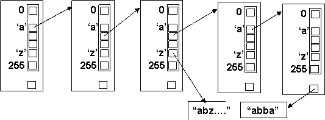

До сих пор мы рассматривали отдельно структуры данных, отдельно – алгоритмы. В 7.7 прозвучал тезис о том, что эффективность алгоритмов может быть существенно увеличена за счет дополнительной памяти. А теперь посмотрим на это дело с другой стороны. Можно ли за счет оригинальной организации данных более эффективно решать традиционные задачи?

Вернемся к тому, с чего начали: к сортировке и поиску (4.6). Все известные нам структуры данных обеспечивают линейную трудоемкость на неупорядоченных данных и логарифмическую – на упорядоченных. При этом сами хранимые значения никак не влияют на «внешний вид» структуры данных – массив остается массивом, а список – списком. Попробуем сделать наоборот, чтобы структура данных «участвовала» в размещении хранимых в ней значений, чтобы затем их проще было бы найти.

## Распределение по разрядам ключа

В лексикографической сортировке и распределяющем подсчете (7.7) мы уже видели, как работает идея распределения: очередное значение перемещается в одном из выбранных направлений в зависимости от всего значения или отдельной его части (символа, цифры, разряда). Но это использовалось в процессе сортировки, после чего данные опять сливались в «единое целое».



Попробуем совместить процедуры размещения и поиска, используя древовидную структуру, в которой выбор очередного потомка обусловлен значением очередного разряда сохраняемого значения (ключа). Например, если размещать в дереве слова, то в качестве разряда можно использовать очередной символ (вернее, его код), что для типа char даст нам 256 возможных значений и 256 потомков. (Замечание: для составления словаря достаточно использовать только символы букв, но это усложнить иллюстрацию).

Каждая вершина такого дерева хранит слово, а также содержит 256 указателей на потомков в соответствии с возможным значением очередного символа. Алгоритм размещения очередного слова линейно-рекурсивен: очередной символ слова является селектором для выбора потомка (при отсутствии потомков они создаются в процессе ветвления по дереву). Когда символы слова заканчиваются, процесс прекращается и слово размещается в достигнутой им вершине.

```cpp
//-------------------------------------------------87-01.cpp

// Дерево с распределением по разрядам ключа

struct node{

            char *data;        // Текущее слово

            int cnt;              // Счетчик повторений

            node *pr[256];    // Вершины - потомки по разрядам ключа

void create(){                                          // Создание вершины

            for (int i=0;i<256;i++) pr[i]=NULL;

            cnt=0; data=NULL;

            }                                               // Рекурсивное включение нового слова

void insert(unsigned char *wd, int lv){        // lv – номер символа

            if (wd[lv]==0 || wd[lv]==' ' || wd[lv]=='\t'){

                        cnt++;                           // Конец слова – если первое, поместить

                        if (cnt==1) data=strdup((char*)wd);

                        }

            else{     unsigned k=wd[lv];         // Очередной символ – селектор потомка

                        if (pr[k]==NULL) {           // Потомка нет - создать

                                    pr[k]=new node();

                                    pr[k]->create(); }

                        pr[k]->insert(wd,lv+1);  // Рекурсивный вызов для потомка и

                        }}                                  // следующего символа
```

Вершины дерева реализованы структурированным типом со встроенными функциями (аналогичные приемы см. в 10.5). Рекурсивная функция, примененная к структурированной переменной, берет указатель на вершину потомок и вызывает в ней эту же встроенную функцию. Рекурсивный обход дерева и подсчет количества вершин, содержащих слова, в комментариях не нуждаются. Функция поиска группы слов, имеющих общее начало (образец), состоит из уже известных фрагментов. При окончании символов образца она выполняет обход поддерева, которого достигла, а иначе – выбирает потомка в соответствии с очередным символом – селектором.

```cpp
//-------------------------------------------------87-01.cpp

void scan(int lv){                         // Обход поддерева

            if (cnt!=0) { char c2[80];              // Есть слово – вывести его

                        CharToOem(data,c2);

                        printf("n=%d:%s\n",cnt,c2); }

            for (int i=0;i<256;i++)                  // Обход непустых потомков

                        if (pr[i]!=NULL) pr[i]->scan(lv+1); }

int count(){                                             // Подсчет количества слов в поддереве

            int i,n=(data!=NULL);                  // Есть слово в этом узле – n=1

            for (i=0; i<256;i++)                     // Суммирование счетчиков от потомков

                        if (pr[i]!=NULL) n+=pr[i]->count();

            return n;}

void find(char wd[], int lv){                        // Поиск группы слов по общему началу

            if (wd[lv]==0) {                            // Общее начало закончилось

                        printf("[%d]\n",count());   // Обход поддерева, в котором оказались

                        scan(lv); }

            else {    unsigned char c1=wd[lv];// Иначе – рекурсивный переход к потомку

                        if (pr[c1]!=NULL) pr[c1]->find(wd,lv+1);

                        else puts("No words");    // по очередному символу - селектору

                        }

            }}
```

Замечание: поскольку все типы данных можно так или иначе привести в двоичное представление, то можно предложить для размещения любых данных дерево с двумя потомками, в котором каждая вершина «отвечает» за очередной двоичный разряд ключа, а левый и правый потомки используются для размещения значений, содержащих в очередном разряде 0 или 1 соответственно.

## Хеширование

Если части (разряды) размещаемого значения (ключа) можно использовать для определения места его включения, то почему нельзя для этих целей использовать все значение? Тогда древовидная структура, а вместе с ней и цикл (линейная рекурсия) исчезнут, а на их месте должен возникнуть процесс преобразования (отображения) значения в адрес его размещения в линейной структуре данных (например, индекс в массиве). Если для такого преобразования использовать вычисляемую функцию, то трудоемкость операции поиска теоретически будет равна 1: каждое значение сразу же попадает в ту ячейку, где и должно храниться.

![рис. 87-2. Хеширование – размещение вычислением адреса.]./assets/087-02.png)

Возникает вопрос: а если все так просто, то почему хеширование не стало «единственно правильным методом» организации данных? Не вдаваясь в подробности, перечислим основные особенности и «подводные камни» этого метода:

- для преобразования значения в адрес используется функция (в обычном, математическом смысле этого слова, преобразующая размещаемое значение в адрес – индекс в таблице). Она должна обеспечивать псевдо-случайное, хаотическое разбрасывание значений по ячейкам. Для этого используются всяческие способы «перемешивания» разрядов размещаемых данных (отсюда hash – кромсать, перемешивать);

- при размещении данных возможны столкновения (коллизии), когда два разных значения получают от функции один и тот же адрес размещения;

- коллизии разрешаются либо за счет размещения «лишних» значений в соседних свободных ячейках, либо путем создания из них линейных цепочек, например, списков;

- частота коллизий зависит от степени заполнения таблицы, чтобы метод работал эффективно, она должна содержать достаточно свободного места;

- существует вероятность, что все значения попадут в одну и ту же ячейку и тогда структура выродится в неупорядоченную последовательность с линейным поиском.

Таким образом, принципиальным «пороком» метода является отсутствие гарантий: в целом он имеет трудоемкость, близкую к 1 (точнее, она равна средней длине получающихся списков), но может на определенном наборе значений стать линейной.

Для создания простейшей хеш-таблицы воспользуемся динамическим массивом указателей на заголовки списков. В качестве хранимых значений будем использовать целые числа с количеством разрядов (цифр) KSIZE и диапазоном 10KSIZE. Поскольку индексом в таблице является значение хеш-функции, то размерность таблицы также определим как кратную степени 10, sz=10POW . Для «перемешивания» размещаемых значений найдем первое простое число, превышающее sz, остаток от деления на него будем использовать для адресации в таблице.

```cpp
//--------------------------------------------------------------87-02.cpp

struct cell{                                 // Ячейка хеш-таблицы - элемент списка

            int ckey;                        // Значение ключа

            cell *next; };                   // Ссылка в списке

struct HASH{                             // Структура со встроенными функциями

            cell **hash;                    // Хеш-таблица - массив указателей на списки

            int POW,sz;                  // Размерность таблицы sz=10^POW

            int KSIZE,w;                  // Размерность ключа (кол-во цифр) w=10^KSIZE

            int s1;                           // Простое число, следующее за sz

void reset(){                               // Разрушение хеш-таблицы

            cell *p,*q;

            for (int i=0;i<sz;i++)        // Разрушение списков

                        for (p=hash[i];p!=NULL;){

                                    q=p; p=p->next; delete q; }

            delete []hash; }              // Разрушение ДМУ

void init(int p0, int ksz0){             // Создание хеш-таблицы

            srand(time(NULL));

            POW=p0; sz=pow(10,POW);

            KSIZE=ksz0; w=pow(10,KSIZE);

            for(s1=sz+1;1;s1++){      // Простое число, следующее за sz

                        for (int i=2;i<s1 && s1%i!=0;i++);

                        if (i==s1) break; }

            hash=new cell*[sz];        // Создание ДМУ на списки

            for (int i=0;i<sz;i++) hash[i]=NULL;

            }

int hash_fun(int key)                   // Хэш-функция – остаток от деления на s1

{ return (key%s1) %sz; }

void insert(int val){                      // Вставка в хеш-таблицу

            int v=hash_fun(val);         // Вызов хеш-функции

            cell *q;

            for (q=hash[v];q!=NULL;q=q->next)

                        if (q->ckey==val) break;  // Поиск в списке этого значения

            if (q==NULL){                             // Значения в таблице нет

                        q=new cell;                    // Вставка в начало списка

                        q->ckey=val;

                        q->next=hash[v];

                        hash[v]=q;}

            }

void load_rand(double proc){                    // Добавление случайных значений

            for (int i=0;i<sz*proc;i++)            // по заданному проценту заполнения

                        insert(rand()%w);            // таблицы

            }};
```

Хеш-таблица реализована в структурированном типе с набором встроенных функций для выполнения операций над ней. Усредненную эффективность поиска в такой таблице легко вычислить: она будет равна средней длине всех получившихся списков.

> Замечание: хеширование являет собой классический пример решения задачи методом «а нужно ли ее вообще решать?». В упорядоченных данных мы сначала «боремся» за размещение данных, чтобы они сохраняли порядок, а потом ищем их на основании имеющегося порядка. Здесь же нет ни того, ни другого.

## Иерархические структуры данных

«Лучшее - враг хорошего». Пословица.

При возрастании объема хранимых данных затраты на выполнение операций над отдельными элементами сильно возрастают. Уменьшить их можно, введя в структуру данных иерархию. Для этого можно вложить в элемент одной структуры данных заголовок другой структуры. Соответственно, вложенными будут определения используемых типов данных, а алгоритмы работы будут содержать вложенные один в другой циклы для работы с каждым уровнем. Приведем некоторые примеры:

- список, элемент которого содержит массив указателей.

```cpp
struct elem{                   // Элемент односвязного списка

elem *next;

void *pp[20]; };               // Массив указателей на элементы данных

// Подсчет количества элементов в структуре данных

int         count(elem *p) {

elem *q; int cnt;             // Цикл по списку

for (cnt=0, q=p; q!=NULL; q=q->next) {

            int i;                  // Цикл по массиву указателей

            for (i=0; q->pp[i]!=NULL; i++)

                        cnt++;

            } return cnt; }
```

- массив, каждый элемент которого является заголовком списка

```cpp
struct list {

list *next;

void *data; };

int         count(list *p[]) {

int k,cnt;                       // Цикл по массиву заголовков списков

for (cnt=0, k=0; p[k]!=NULL; k++) {

            list *q;               // Цикл по списку

            for (q=p[k]; q!=NULL; q=q->next)

                        cnt++;

            } return cnt; }
```

- двухуровневый массив указателей

```cpp

void **p[20];                   // массив указателей на массивы указателей

int         count(void **p[]) {

int k,cnt;                       // Цикл по массиву верхнего уровня

for (cnt=0, k=0; p[k]!=NULL; k++) {

            int i;                  // Цикл по массиву нижнего уровня

            for (i=0; p[k][i]!=NULL; i++)

                                    cnt++;

            } return cnt; }

```

Любая иерархия имеет целью повышение эффективности и управляемости системы. Посмотрим, как это воплощается в иерархической структуре данных.

Логическая нумерация элементов. Логическая нумерация в иерархической структуре данных, как и везде, определяется последовательностью обхода хранимых в ней элементов. Обратите внимание, что внутренние индексы и номера (элементов массивов, списков, вершин деревьев) не имеют к этому никакого отношения. Это тем более важно, что резервирование памяти для массивов производится однократно с учетом последующего их заполнения (то есть любой массив заполнен всегда «частично»).

Локальность изменений. Любая иерархия хороша тем, что изменение отдельных ее частей в большинстве случаев происходят локально, то есть не затрагивают системы в целом. Применительно к иерархической структуре данных это означает, что возможные перемещения объектов или перераспределение памяти должны осуществляться в компонентах нижнего уровня, не затрагивая ни соседей, ни вышележащей структуры данных. Например, в двухуровневом массиве указателей указатель на новый объект включается в массив нижнего уровня, размерность которого ограничена. При отсутствии переполнения перемещение указателей будет производиться только в границах этого массива. При переполнении же должна быть выполнена более сложная процедура, сохраняющая логическую организацию структуры данных и ее возможность к расширению. Для двухуровнего массива указателей в качестве одного из вариантов возможно создание динамического массива указателей нижнего уровня и перенесение в него половины указателей из заполненного. Естественно, что новый массив указателей должен быть связан со структурой данных верхнего уровня – его адрес помещается в массив указателей вслед за адресом переполнившегося.

Сбалансированность структур данных. Необходимой платой за перечисленные достоинства является поддержка необходимой сбалансированности – размерности структур данных нижнего уровня должны быть примерно одинаковы. Алгоритмы, выполняющие эту процедуру при каждой операции включения и исключения, могут быть достаточно громоздкими. Альтернатива – периодическое «утрясание» всей структуры данных (например, путем переписывания всех ее элементов в аналогичную новую структуру) при значительном нарушении сбалансированности.

В качестве примера рассмотрим двухуровневый массив указателей. Массив указателей верхнего уровня является статическим. Массивы указателей нижнего уровня являются динамическими уже потому, что создаются они в процессе заполнения структуры данных. Однако размерность их фиксирована и при переполнении память под них не перераспределяется.

```cpp

//------------------------------------------------------87-03.cpp

//----- Двухуровневый массив указателей на целые

 #define N 4

 int **p[20]={NULL};                    // Исходное состояние структура данных пуста

 //--- Вспомогательные функции для нижнего уровня

 int size(int *p[])                         // Количество элементов в массиве указателей

 { for (int i=0; p[i]!=NULL; i++); return i; }

 //--- Включение в массив указателей нижнего уровня по номеру

 int F3(int *p[], int *q, int n) {

 int i,m=size(p);

 for (i=m; i>=n; i--) p[i+1] = p[i];

 p[n] = q;

 return m+1==N; }                      // Результат - проверка на переполнение
```

В структуре данных применяется сквозная нумерация элементов, то есть логический номер определяется в процессе обхода структуры данных. При этом индексы элемента в массивах верхнего и нижнего уровня значения не имеют;

![рис. 87-3. Двухуровневый массив указателей]./assets/087-03.png)

```cpp
//------------------------------------------------------87-03.cpp

//----- Обход структуры данных со сквозной нумерацией

 void show(int **p[])

 { int i,j,k;

 for (i=0,k=0; p[i] != NULL; i++)

      for (j =0; p[i][j] != NULL; j++,k++)

               printf("A[%d(%d,%d)]=%d\n",k,i,j,*p[i][j]);

 }
```

В алгоритме включения по логическому номеру из логического номера вычитается количество указателей в текущем массиве нижнего уровня, пока не будет найден тот, в который попадает новый указатель. При включении указателя в массив нижнего уровня соседние массивы не меняются, то есть структура данных модифицируется локально. И только при его переполнении создается дополнительный массив, в который переписывается половина указателей из исходного. Указатель на новый массив также включается в массив верхнего уровня.

```cpp
//------------------------------------------------------87-03.cpp
//------ Включение по логическому номеру

void Insert_Num(int **p[],int *q, int n) {
     int i,j,l,sz;

      if (p[0]==NULL){      // Отдельно для пустой структуры данных

      p[0]=new int*[N+1];

      p[0][0]=q; p[0][1]=NULL; return;

      }                     // Поиск места включения

      for (i =0; p[i] != NULL; i++,n-=sz) {

      sz=size(p[i]);        // Количество указателей в массиве

      if (n<=sz) break;     // Номер попадает в текущий массив

      }

 if (p[i]==NULL)            // Не найден включить последним

      { i--; n=size(p[i]); }

 if (F3(p[i],q,n))                           // Вызов функции включения для нижнего уровня

      {                     // Переполнение создание нового массива

      for (int ii=0; p[ii] != NULL; ii++);

      for(int h=ii;h>i;h--) // Раздвижка в массиве указателей

      p[h+1]=p[h];          // верхнего уровня

      p[i+1]=new int*[N+1]; // Создание массива нижнего уровня

      for(j=0;j<N/2;j++)    // Перенос указателей

      p[i+1][j]=p[i][j+N/2];

      p[i][N/2]=NULL;

      p[i+1][N/2]=NULL;

      }}
```
