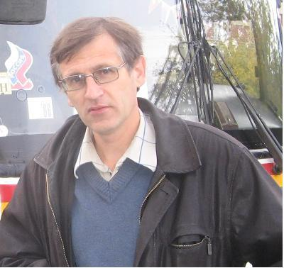

# CPROG - о программировании вообще, в том числе на Си/Си++

**Все материалы взяты с сайта** [http://ermak.cs.nstu.ru/cprog/html/](http://ermak.cs.nstu.ru/cprog/html/)

**"Спят подружки вредные  
 Безмятежным сном,  
Снятся мышкам хлебные  
 Крошки под столом,  
Буратинам - досточки,  
 Кошкам - караси,  
Всем собакам - косточки,  
 Программистам - Си".**

Евгений Романов.  
"Колыбельная".  
\("Болдинская осень", 1996 г.\)

<Grid fluid>
  <Row>
    <Col lg={8} md={8} sm={6} xs={12}>

**Здесь размещены методические материалы по дисциплинам "Информатика",
"Программирование", "Технология программирования" для направления
"Информатика и ВТ". Автор:** [**Романов Евгений
Леонидович**](http://ciu.nstu.ru/kaf/persons/91/?page=182)**, к.т.н, доц.
кафедры Вычислительной техники, факультет Автоматики и вычислительной
техники** [**Новосибирского государственного технического
университета**](http://www.nstu.ru/) **\(НГТУ\)**
    </Col>
    <Col lg={4} md={4} sm={6} xs={12}>

    </Col>
  </Row>
</Grid>